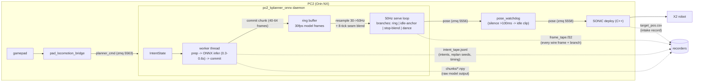

# The replan-seam rewind bug — root cause, fix, and the observability that found it

**Status: fixed and hardware-validated (walk 3, run `20260719_222216_walk3_fulltape`
— first clean kplanner walk of the investigation). Operator-confirmed visually.**

The walk symptom ("smooth for a step or two, then stumbles / freezes") was three
stacked deploy-runtime defects in `pc2_kplanner_onnx.py` — the generative models
were innocent. The final and decisive one was a **reference rewind at every
replan seam**, latent since the daemon was ported, exposed and amplified by
fixing the first two.

## 1. Architecture (with the recorder taps added during this work)



Key property exploited throughout: with tape + chunk + frame + intake records,
every pipeline stage is **measured**, so a defect can be attributed by stream
comparison instead of hypothesis. (Three plausible hypotheses — model idle
collapse, ref-smoother, watchdog substitution — were each falsified by exactly
these records before the real mechanism was found.)

## 2. The rewind (the decisive defect)

Replans are split so the 0.3–0.6 s ONNX inference runs without blocking the
50 Hz publisher: `prepare` (snapshot context) → `infer` (unlocked) → `commit`
(swap buffer). The new chunk **continues from the prep-time context**, but the
publisher keeps serving the old buffer during inference:

```
model frames -->  0    8    16   24   32   40   48   56   64
old buffer:       [============ serving =============>
                                 ^ prep (context = frames ~28-31)
                                 |---- inference 0.5s ---->
                                        (publisher serves on: 32 ... ~50)
                                                            ^ commit

BEFORE (rewind):  new buffer starts serving at ITS frame 0  == old frame ~31
                  ==> wire jumps BACK ~18 frames (0.6s = half a gait cycle);
                      8-tick blend then averages ANTIPHASE leg poses.
                      At 1-2 seams/second the reference re-treads and
                      self-interferes instead of progressing.

AFTER  (fix):     commit fast-forwards new buffer by frames consumed
                  since prep (read_pos = consumed) ==> the wire is
                  CONTINUOUS through the seam; the blend sees a small
                  in-phase delta.  (tape: "commit_ff consumed=10.8-18")
```

## 3. All three defects, in discovery order

| defect | mechanism | fix | evidence |
|---|---|---|---|
| double-replan race | 50 Hz loop re-armed `replan_event` on every below-threshold tick, incl. during inference → a stale event fired a redundant replan 10–20 ms after every commit → overlapping seam blends | worker re-checks buffer state after clearing the event; explicit `_force_replan` flag preserves IDLE→PLAYING replans | session-1 tape: every mid-walk replan paired; both stumbles sat on pair seams |
| starvation | threshold 16 frames = 0.53 s ≈ inference latency → ring drained to empty at every seam; publisher served frozen last frame at healthy 50 Hz — invisible to the silence-based watchdog | threshold default 32 (~0.4 s commit margin at worst-case latency) + `starved` telemetry (log + tape) | session-1: 134 fell-behind events; session-3: zero starvation |
| **seam rewind** | commit restarted the new buffer at frame 0 (= prep-time position), discarding frames served during inference → wire rewound ~0.6 s per seam | commit fast-forwards by frames consumed since prep (`commit_fastforward`, default on) | session-2 (rewind at 2× seam rate): walk broke after step 1; session-3 (only functional change = this fix): clean walk |

Session progression: **1** = race+starvation+rewind → stumbles at seam pairs.
**2** = race+starvation fixed, but threshold doubled seam frequency → rewind
fired 2× more → worse (freeze after first step). **3** = rewind fixed → first
clean walk (6/7 swing events in 6.5 s, tilt ≤ 7.4°, leg vel ≤ 8.1 rad/s,
liveness gate 0 firings, wire pacing median 20.0 ms with zero gaps).

## 4. Also shipped (defense in depth, both inert when healthy)

- **Chunk liveness gate**: while a walk is commanded, a statistically-still
  chunk (hip-pitch std < 0.045; walking ≈ 0.12–0.22) is rejected *before*
  commit and re-rolled with a fresh seed — the old, still-walking buffer keeps
  streaming, so a standing sample can never contaminate the context.
- **Starvation telemetry**: serving a clamped end-of-buffer frame while
  PLAYING screams in the log and the tape.

## 5. Observability infrastructure (the part to reuse)

- `intent_tape.jsonl` — intents (recv + applied), replan **seeds** (bit-exact
  offline replay), per-commit fast-forward amounts, ticks; monotonic + wall time.
- `frame_tape.f32` — every published frame: `[tm, branch, root, quat, jpos]`,
  40×f32/tick. Branch attribution: ring / idle-anchor / stop-blend / dance.
- `chunks/*.npy` — every committed chunk, raw model output.
- `capture_robot_run.py` harvests all of it next to the deploy telemetry;
  `replay_intent_tape.py` replays a tape through the deployed graph offline
  (with simulated inference latency and a `--no-fastforward` repro mode).
  **Known limit**: the replay drives the ring directly and does not replicate
  the full serve state machine — its falsifications are weaker than its
  reproductions.

## 6. Lessons paid for

- Windowed peak metrics hide sustained events (a freeze is not a spike; a peak
  at the window edge means the window is wrong). Full-session scans first,
  windows only for attribution.
- Cross-clock alignment by single anchor failed three times (append-logs span
  daemon sessions; deploy logs span ritual restarts). Prefer self-referenced
  or alignment-free analyses; better, record everything on one clock.
- A metric is trusted only after scoring known-good AND known-bad exemplars
  (`swing_events()` calibration table in `kplanner_frame_eval.py`).
- The operator's eyes beat every number they disagreed with, all three times.
- "The code passes the frames" is not "the frames are recorded." Blind links
  in a pipeline turn debugging into hypothesis roulette; taps end the game.
