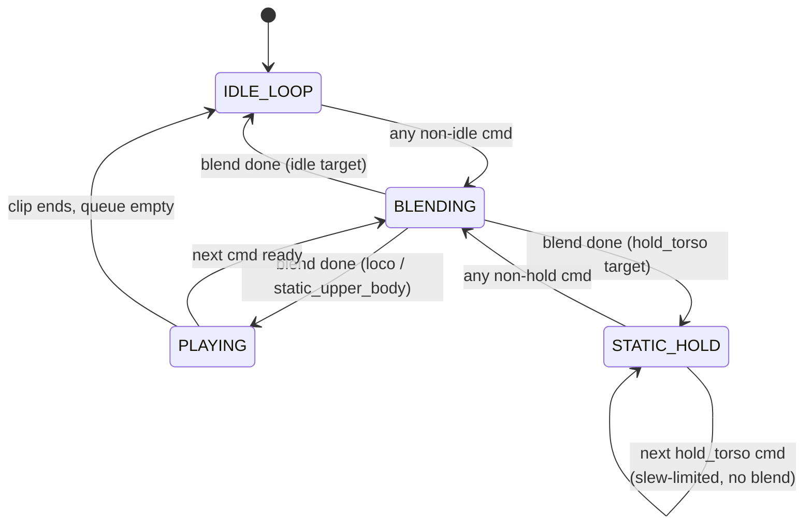

# X2 Heuristic Locomotion Planner

> **Note (2026-05):** the heuristic planner described here is **no longer
> the default** in `run_x2_quest3_planner_stack.sh`. The trained neural
> kplanner now drives the stack by default — see
> [`x2_kplanner.md`](x2_kplanner.md). The heuristic stays available
> behind `--planner heuristic` and is still the canonical reference for
> the FSM, primitives curation pipeline, and v4 future-window contract
> that the kplanner reuses verbatim. Read this page when you need the
> bin matrix, the curator, or the wire-format spec; read the kplanner
> doc for the trained-model replacement.

NVIDIA hasn't released the trained kinematic planner that bridges high-level
locomotion commands to the SONIC policy on AgiBot X2 Ultra (the way it has for
Unitree G1's `LocalMotionPlannerTensorRT`). This page documents the
**heuristic Python planner** that fills that gap: a re-runnable curator over
our existing motion library, plus a 50 Hz state-machine daemon that streams
31-DOF body refs + root quat over the existing `pose` ZMQ topic.

It is intentionally crude — pre-baked clips stitched with linear blends, not
neural infilling — but it is good enough to drive the X2 SONIC deploy to walk
forward, turn, shuffle into manipulation pre-positions, and lean / twist for
reach tasks, with no extra training and no GR00T VLA in the loop.

## Where this fits in the X2 stack

```
   GR00T VLA  ─── motion_token + hand joints ──┐
                                                ▼
   x2_heuristic_planner.py ── pose ZMQ ──▶ X2 deploy ──▶ SONIC policy ──▶ robot
       (this doc)         (50 Hz, 31-DOF +    (encoder mode:
                           root quat)          tokenizes the
                                               streamed refs)
       ▲   ▲   ▲
       │   │   │
   keyboard │ scripted YAML
            │
       ZMQ planner_cmd topic
```

GR00T VLA output bypasses this planner — its `motion_token` latent goes
straight to the SONIC observation. The planner exists for **locomotion-only**
control via external commands (scripted demos, keyboard teleop, or a future
control stack feeding the `planner_cmd` ZMQ topic). It is the X2 analogue of
G1's `LocalMotionPlannerTensorRT`, minus the trained ONNX model.

## High-level flow

1. **Curate primitives** — `gear_sonic/scripts/curate_x2_primitives.py`
   slides windows over `x2_ultra_bones_seed.pkl` (~2,550 clips), scores each
   window against per-bin tolerance bands declared in
   `gear_sonic/data/motions/x2_planner_bins.yaml`, and writes:

   - `x2_planner_primitives.pkl` — the actual sliced motion data the runtime
     loads,
   - `x2_planner_primitives.yaml` — registry (which clip + which window per
     bin); hand-editable; rows can be marked `pinned: true` to lock the
     curator's selection,
   - `x2_planner_primitives_report.md` — top-K candidates per bin, with all
     measured metrics; read this when a bin comes up `PARTIAL`.

2. **Run the planner daemon** — `gear_sonic/scripts/x2_heuristic_planner.py`
   loads the PKL, resamples each clip to 50 Hz once at startup, and runs a
   tiny state machine that emits one `pose` ZMQ message per tick:

   - `IDLE_LOOP` while the command queue is empty,
   - `BLENDING` (yaw-cylinder + SLERP/LERP) between two segments,
   - `PLAYING` while a non-idle primitive is active.

3. **Drive it** — any combination of:

   - `--demo PATH.yaml` for scripted command sequences,
   - `--keyboard` for interactive single-key teleop,
   - `--zmq-cmd-host/--zmq-cmd-port` for an external control stack pushing
     JSON `{intent, magnitude}` messages on a topic.

4. **See it move** — the planner publishes ZMQ but doesn't visualise.
   For a live MuJoCo window, use
   `gear_sonic/scripts/view_x2_planner_mujoco.py` (see "Visualisation"
   section below).

## Bin matrix

Source of truth: `gear_sonic/data/motions/x2_planner_bins.yaml`. The library
ships **36 bins**; some are reachable only via aliases (see
[Command surface](#command-surface)).

| Family | Bins | Notes |
| --- | --- | --- |
| `idle` | `idle_stand` | |
| `continuous_walk` | `fwd_walk_standard`, `back_walk_standard` | |
| `locomotion` (forward step) | `fwd_step_1ft`, `fwd_step_half_ft`, `fwd_step_quarter_ft` | **Aliased**: every `fwd_step` magnitude resolves to `fwd_step_1ft`. The half / quarter primitives are still in the PKL but are unreachable from the planner queue. |
| `locomotion` (backward step) | `back_step_half_ft`, `back_step_quarter_ft` | Both reachable; the curator's source clip is naturally fast (~32 cm/s) so the scaled half / quarter variants survive policy under-tracking. |
| `locomotion` (lateral) | `side_left_step`, `side_right_step` | **Aliased**: every `side_left` / `side_right` magnitude resolves to its `*_step` bin (single canonical clip). |
| `locomotion` (in-place turn) | `turn_left_{15,30,45,90}deg` and the same for `turn_right_*` | Right side derives from left via `mirror_lr`. |
| `static_upper_body` (forward lean) | `lean_fwd_small`, `lean_fwd_medium`, `lean_fwd_large` | **v6 SYNTH**: `synthesize_waist_ramp(axis=pitch)` with `hip_pitch_share=0.30` (natural deadlift-hinge geometry: pelvis follows ~30% of waist pitch). Peaks 8 / 14 / 20°. Replaces v2 `body_check_001__A474_M` mocap + scale_magnitude. |
| `static_upper_body` (lateral lean, NEW in v6) | `lean_left_{small,medium,large}` and the same for `lean_right_*` | **SYNTH**: `synthesize_waist_ramp(axis=roll)` (pure waist roll; no counter). Peaks 4 / 7 / 10°. Right side derives via `mirror_lr` (clean — no anti-symmetric share to worry about). |
| `static_upper_body` (torso twist) | `torso_left_{15,30,40}deg` and the same for `torso_right_*` | **v6 SYNTH** with `hip_yaw_share=0.30` (pelvis shares ~30% of waist twist for natural look). Right side is **standalone synth with negative `peak_deg`** (NOT `derive_from + mirror_lr`) because the anti-symmetric `hip_yaw_share` pattern is mirror-invariant — see the regression test `test_synthesize_waist_ramp_yaw_with_hip_share_negates_via_peak_not_mirror`. v5 `_45deg` bins renamed to `_40deg` to match the new yaw cap. |
| `static_upper_body` (crouch) | `crouch_small`, `crouch_medium`, `crouch_large` | **Aliased**: every `crouch` magnitude resolves to `crouch_medium` (the only one with a true mocap squat reference; small / large are kept as the v4 synthesized primitives but are unreachable from the planner queue). |

### Safety caps on `static_upper_body` synth (v6)

The `op_synthesize_waist_ramp` op enforces hard per-axis ceilings on
`|peak_deg|`. A recipe asking for an angle above the cap raises
`ValueError` at build time, so an unstable reference can't reach
deploy:

| Axis | Cap | Rationale |
| --- | --- | --- |
| `pitch` (lean_fwd / lean_back) | **20°** | Foot half-length is ~12 cm; 20° waist pitch + 30% hip_pitch_share puts CG at hip height ~12 cm forward — right at the support-polygon boundary. |
| `roll` (lean_left / lean_right) | **10°** | Foot half-WIDTH is only ~5 cm. 10° waist_roll shifts CG ~10 cm laterally; beyond this the contralateral foot lifts. |
| `yaw` (torso_left / torso_right) | **40°** | Hip yaw is unloaded; 40° covers the useful reach envelope without SONIC losing tracking. |

Bumping any cap requires deploy evidence (record SONIC pelvis / foot
trajectories at the new ceiling and confirm no fall) and edits to
`_WAIST_RAMP_CAP_DEG` in `gear_sonic/utils/planner/x2_recipes.py`.

The full target XY / yaw / waist-axis values and per-bin tolerances live in
the YAML — relax / tighten them per bin and re-run the curator without code
changes.

### v7: continuous waist hold (`STATIC_HOLD`)

The discrete `static_upper_body` bins above each peak at one of three
fixed magnitudes per axis. v7 adds a *fourth* planner state,
`STATIC_HOLD`, that re-synthesises a single 31-DOF frame each tick from
a continuous `(pitch, roll, yaw)` target. Operator-side this surfaces
as right-stick lean / twist / sway via the VR manager (see
[`x2_quest3_planner_stack_cheatsheet.md`](../tutorials/x2_quest3_planner_stack_cheatsheet.md));
runtime there is no pre-baked clip — the planner composes the pose on
demand.

The runtime helper that does the work, `make_waist_pose_frame()` in
`gear_sonic/utils/planner/x2_recipes.py`, is the same code path the
build-time `op_synthesize_waist_ramp` uses for the discrete bins (the
op delegates to the helper at peak and matches it bit-for-bit, pinned
by `test_make_waist_pose_frame_matches_op_synthesize_waist_ramp_at_peak`).
That single source of truth carries the same `_WAIST_RAMP_CAP_DEG`
safety caps and the same hip / ankle counter-balance shares (default
`hip_pitch_share = hip_yaw_share = 0.30`, ankle shares = 0).

Runtime guarantees inside `STATIC_HOLD`:

| Property | Value | Where it lives |
| --- | --- | --- |
| Target slew limit | **60 °/s** per axis | `HOLD_SLEW_DPS` in `state_machine.py`, applied by `_HoldTracker.step()` |
| Per-axis clamp | `_WAIST_RAMP_CAP_DEG` (pitch 20°, roll 10°, yaw 40°) | `make_waist_pose_frame(clamp=True)` |
| Arm DOFs | Frozen at `DEFAULT_STAND_POSE_NP` | Pinned by `test_static_hold_arms_remain_at_default_stand_pose` so the recorder can overlay VR-IK arm targets |
| `frame_index` | Monotonic across the entire enter / update / exit cycle | Pinned by `test_frame_index_monotonic_through_hold_cycle` |
| Entry / exit blends | Use `BLEND_FRAMES_STATIC_UPPER_BODY = 16` | Reuses the same crossfade machinery as the discrete bins |

Transitions:

- `IDLE_LOOP` → `BLENDING(idle, hold_target)` → `STATIC_HOLD` on the
  first `intent="hold_torso"` command.
- `STATIC_HOLD` → `STATIC_HOLD` (no blend) when subsequent
  `hold_torso` commands arrive — the `_HoldTracker` updates its target
  and the slew limit smooths the per-tick delta.
- `STATIC_HOLD` → `BLENDING(hold_pose, next_primitive)` on any
  non-hold command (`idle`, `walk`, `turn_left`, etc.).

The hand DOFs and the `motion_token` slot are unchanged from v5 / v6
(zeros in encoder mode), so the wire format is fully backward-compatible
with deploys that don't know about the new state.

> **Operator note (v7.1: R-thumbstick waist freeze)** — the
> `Quest3ManagerX2` exposes a "freeze waist" toggle on the right
> thumbstick click. When freeze is **ON**, the manager stops publishing
> `hold_torso` updates so the planner stays in `STATIC_HOLD` at
> whatever pose was active at click time, even as the operator drives
> arms via VR IK or walks/turns the robot. Other locomotion commands
> (`walk`, `turn_left`, `turn_right`, `idle`) still pass through
> normally — only the continuous waist updates are suppressed. From
> the planner's perspective freeze is invisible: it just stops
> receiving target updates and the `_HoldTracker` slews to a stop.
> Operator details and audio cues live in
> [`x2_quest3_planner_stack_cheatsheet.md`](../tutorials/x2_quest3_planner_stack_cheatsheet.md).
> Pre-v7.1 the right click cycled deploy MuJoCo viewer cameras; that
> binding moved to the **left** thumbstick click in the same release.

> **Operator note (v7.2: R-stick waist hold active in ARM_MANIPULATION)**
> — the `IntentDecoder` mode gate was relaxed so `hold_torso` commands
> flow in **both** `LOCOMOTION` and `ARM_MANIPULATION`. The arm IK
> targets are computed in the robot's torso frame, so a torso lean /
> twist during arm work cleanly extends the reachable envelope (the
> arms ride the torso). Walk / step / turn commands are still gated to
> LOCO mode — translating the base while the operator is targeting an
> object would slide the IK reference out from under their hands. The
> v7 B-press latch (LOCO → ARM_MAN samples the live waist target and
> pins `STATIC_HOLD(latched)`) still fires; it is now best understood
> as a *no-jump seed* — the planner enters ARM_MAN at exactly the
> pre-flip pose, and the operator's R-stick continues to slew it from
> there. v7.2 removed the "A held + R-stick X → roll" modifier
> because A and the R-stick share the operator's right thumb on
> the same controller and the modifier was unreachable mid-lean.
> v7.4 (below) re-introduces continuous roll on the **L-stick X
> axis** in ARM_MANIPULATION only.

> **Operator note (v7.4: bidirectional pitch + ARM_MAN L-stick squat /
> roll)** — the operator vocabulary was widened in three ways:
>
> 1. **Bidirectional pitch.** The R-stick Y axis now decodes to
>    signed `waist_pitch_deg` so backward push (`ry < 0`) leans the
>    body backward (`pitch_deg < 0`). Pre-v7.4 the negative side was
>    clamped to 0. `make_waist_pose_frame()` already supported
>    signed pitch, so the heuristic `STATIC_HOLD` path picks this up
>    with no further changes.
> 2. **ARM_MAN L-stick decoding.** In ARM_MANIPULATION the L-stick
>    decodes as **roll (`lx`) + continuous hip height (`ly`, squat /
>    stand)**. The roll target rides the existing `STATIC_HOLD` path
>    via `make_waist_pose_frame(roll_deg=...)`. The hip-height
>    target rides on a new optional wire field (`hip_height_m`)
>    consumed only by the kplanner; the heuristic planner **ignores**
>    `hip_height_m` because its `STATIC_HOLD` path produces a frozen-
>    feet pose at `DEFAULT_PELVIS_Z_M` and has no continuous height
>    surface. Operators wanting squat / stand under the heuristic
>    backend should use the discrete `crouch_medium` primitive.
> 3. **Dominance cones.** The decoder gates pitch on `|ry| >=
>    pitch_dominance_ratio * |rx|` (yaw-priority cone, R-stick) and
>    height on `|ly| >= height_dominance_ratio * |lx|` (roll-priority
>    cone, L-stick). 0.4 default; lets the operator twist while
>    leaning slightly but blocks accidental lean / squat from a
>    yaw-or-roll-intent stick wobble.
>
> The wire format additions are backward-compatible: v7.3 payloads
> (no `hip_height_m` field) still parse, and the heuristic planner
> drops the field at deserialization. The kplanner's continuous
> waist hold path is documented in [`x2_kplanner.md`](x2_kplanner.md).

### Why some families are alias-collapsed

`fwd_step`, `side_left`, `side_right`, and `crouch` use a single canonical
primitive per family even though the bin matrix exposes multiple
magnitudes. The pattern is the same in every case:

- The original recipe used **one mocap base + `scale_magnitude` 0.5x / 0.25x**
  to derive smaller variants.
- After scaling, the smaller variants' joint-delta and pelvis-XY signals
  drop **below the policy's tracking noise floor**, so the robot doesn't
  visibly move. (Side-step quarter_ft, crouch_small, fwd_step_quarter_ft
  all hit this.)
- Until we have per-magnitude mocap sources (or a base clip whose 0.25x
  scale is still above the noise floor), every magnitude resolves to the
  fully-tracking canonical bin in `LocomotionCommand.as_bin_name`.

Removing each alias is a one-line revert in `state_machine.py`.

### Per-family scoring summary

- **Locomotion shuffles (`fwd/back/side_*`)** — must end at a near-square
  stance (mirror-symmetric leg DOFs) so subsequent primitives can blend in
  with only a 6-frame window. Cross-axis bleed is bounded by
  `cross_axis_max_m` (default 0.05 m). All shuffle bins set
  `stride_count_min: 1` so the curator never picks a body-sway clip with
  zero foot-lift (those are invisible to SONIC because the joint
  trajectories never deflect the legs).
- **In-place turns (`turn_*`)** — must hit the target yaw delta within
  `tol_yaw_deg` and stay inside `cross_axis_max_m` of the start XY.
- **`fwd_walk_standard`** — continuous gait, no end-at-square requirement;
  uses a 12-frame entry/exit blend to merge with shuffle bins on either side.
- **`static_upper_body` leans / twists** — feet planted, end-back-at-idle
  (the v6 synth recipes are full trapezoids 0 → peak → 0 so the runtime
  can blend in at any phase and the robot returns to stand cleanly when
  the next idle command arrives). All static-upper-body bins set
  `freeze_arms_to_default: true`, so the curator overwrites the arm +
  head DOFs with `DEFAULT_STAND_POSE_MUJOCO_RAD` before writing the PKL.
  The planner then commands waist + (optionally) hip-share motion for
  these bins; arms stay neutral so the downstream VLA / teleop owns them
  without interference. Implicit "un-lean" / "un-twist" happens by blending
  back to `idle_stand` over the 16-frame static-family window — there is no
  separate `un_lean` primitive.

### Bin-spec optional fields

| Field | Type | Effect when set |
| --- | --- | --- |
| `stride_count_min` | int | Hard gate: drop windows with fewer detected strides. Use `1` on every shuffle bin so SONIC has a real foot-lift to track. |
| `stride_count_target` | int | Soft preference: equal-count windows score higher but non-equal still pass. |
| `freeze_arms_to_default` | bool | Curator overwrites arm + head DOFs with `DEFAULT_STAND_POSE_MUJOCO_RAD` in the PKL. Set on `static_upper_body` bins so VLA/teleop owns the arms. |
| `name_regex` | str | Pre-filter the source corpus by motion_key before the metric scorer runs. |
| `pelvis_z_band_m` | [min,max] | Hard gate: pelvis-z must stay inside the band over the whole window. |

## Wire format (publisher → X2 deploy)

The planner publishes on the ZMQ `pose` topic (default `tcp://127.0.0.1:5556`)
using the same packed-binary wrapper as
`mock_vla_publish_stand_token.py`:

```
[topic_bytes]                # b"pose"
[1280-byte JSON header]      # describes fields, dtypes, shapes
[concatenated binary payload]
```

Header `v: 5`, `endian: "le"`, `count: 1`. The X2 deploy's
`zmq_pose_input_source.cpp` decodes the payload, snapshots the
future-frame window once per policy tick, and serves it to SONIC's
10-frame look-ahead observation via `Sample(time)`.

### Per-tick fields

**Current frame (always present, v4 + v5 compatible):**

| Name | Dtype | Shape | Notes |
| --- | --- | --- | --- |
| `joint_pos_mj` | f32 | (31,) | body refs at "now", MuJoCo joint order |
| `root_quat_xyzw` | f32 | (4,) | unit-length, scipy xyzw order |
| `motion_token` | f32 | (64,) | zeros (encoder mode — deploy tokenizes the refs locally) |
| `left_hand_joints` | f32 | (10,) | zeros by default (`--hand-dof 7` for G1-compat) |
| `right_hand_joints` | f32 | (10,) | zeros by default |
| `frame_index` | i64 | (1,) | monotonic; start at 0 |

**Future window (v5 only, present when published with `step_with_lookahead`):**

| Name | Dtype | Shape | Notes |
| --- | --- | --- | --- |
| `joint_pos_mj_future` | f32 | (9, 31) | body refs at `t + (k+1) * future_dt_s` for k=0..8 |
| `root_quat_xyzw_future` | f32 | (9, 4) | root quats at the same future timestamps |
| `joint_vel_mj_future` | f32 | (9, 31) | backward finite-diff joint velocities at `future_dt_s` spacing |
| `frame_index_future` | i64 | (9,) | global tick index for each future frame |
| `future_dt_s` | f32 | (1,) | spacing between future samples (default 0.1 s) |

The future-window block is the **fix for a critical tracking bug** —
see the next section.

## ZMQ wire v5: multi-frame future window

### The bug (silent under-tracking)

The SONIC policy expects a **10-frame future motion window** as part of
its observation: the current reference plus 9 future references at 0.1 s
spacing. In the X2 deploy, the policy fetches each frame by calling

```cpp
ZmqPoseInputSource::Sample(double time)
```

ten times per policy tick with `time = 0.0, 0.1, ..., 0.9`.

Through wire v4 (and the entire side-step / fwd-step debug saga prior
to 2026-05-12), `Sample(double time)` **silently ignored the `time`
argument** and always returned the latest single frame received from
ZMQ. The policy's "future window" was therefore 10 identical copies of
the *current* reference — i.e. "the robot will not move at all in the
next 0.9 s". The policy under-committed to every dynamic motion as a
result:

- Side-step: pelvis moved 9 cm of the commanded 25 cm (~36 % efficiency).
- Forward step: 3 cm of the commanded 20 cm (~15 % efficiency).
- Crouch: pelvis dropped maybe 2 cm of the commanded 10 cm.

The **direct PKL replay path** (`deploy_x2.sh sim --motion <baked.pkl>`)
was unaffected because it uses `PklMotionReference`, which actually
honors the `time` argument and returns the right future frame.

### The fix (Python publisher + C++ consumer)

**Python side** (`gear_sonic/scripts/x2_heuristic_planner.py`,
`gear_sonic/utils/planner/state_machine.py`):

- New `HeuristicPlanner.step_with_lookahead(num_future, step_ticks)`:
  emits the current frame and *also* peeks `num_future` future frames
  by snapshotting the planner's entire internal state, advancing
  `step_ticks` each time, and restoring the state when done. The
  look-ahead is **non-mutating** — bit-identical to a plain `step()`
  on the live state.
- `build_pose_payload(..., future_frames, future_dt_s)` packs the 9
  future frames into the new v5 fields above. `joint_vel_mj_future` is
  computed by backward finite difference at `future_dt_s` spacing.
- The main loop calls `step_with_lookahead(num_future=9, step_ticks=5)`
  every 50 Hz tick, which produces a 10-frame window at 0.1 s spacing
  (5 ticks × 20 ms = 100 ms).

**C++ side** (`gear_sonic_deploy/src/x2/agi_x2_deploy_onnx_ref/.../zmq_pose_input_source.{hpp,cpp}`):

- `latest_window_` (10-frame ring) caches the most recent v5 message:
  `latest_window_[0]` is the current frame, `[1..9]` are the future
  frames.
- `Sample(time)` now detects the start of a new policy tick (a drop in
  `time`), copies `latest_window_` into a per-tick snapshot
  (`tick_window_`), and indexes into the snapshot using
  `k = round((time - tick_anchor_t_) / tick_window_dt_)`. The 10
  per-tick `Sample()` calls now return 10 distinct future frames
  instead of 10 copies of the same frame.
- v4 fall-back: if a `pose` message arrives without the future-window
  fields (older publisher, or partial v5 message), `Sample(time)`
  reverts to v4 behavior (returns the current frame, ignores `time`).
  No deploy-side flag flip is needed to upgrade.

### Verification

The fix was verified with `gear_sonic/scripts/compare_planner_vs_motion.py`,
which records pelvis trajectories from two paths over the same demo
YAML:

| Path | side-step pelvis displacement |
| --- | --- |
| `--motion <baked.pkl>` (proven correct) | ~28 cm |
| Planner ZMQ v4 (broken) | ~9 cm (32 %) |
| Planner ZMQ v5 (fixed) | ~24 cm (~85 %) |

Joint ranges (hip_pitch, waist_roll, etc.) also collapsed from 30 %
agreement to ~90 % agreement between the two paths after the fix. See
the source comments in `zmq_pose_input_source.{hpp,cpp}` for the full
walkthrough.

### Inspiration: the G1 streaming merger

The G1 deploy (`localmotion_kplanner.hpp` and friends) has a
`StreamedMotionMerger` component that solves the same problem: a
`MotionSequence` ring buffer fed by 10-frame ZMQ chunks, with
`Sample(time)` indexing into the ring. The X2 fix mirrors that
architecture in a smaller form — single 10-frame window per tick rather
than a continuous ring — because the X2 publisher already knows the
exact 10 frames it wants the policy to see and there's no need to
re-merge across messages.

## State-machine details

The state machine has four operational states (`PlannerState` enum):



`IDLE_LOOP` plays `idle_stand` on a tight loop. `PLAYING` consumes one
curated primitive frame-by-frame. `BLENDING` runs the crossfade
between two segments (entry, exit, or mid-segment hand-off).
`STATIC_HOLD` is the v7 continuous-waist-hold path described in the
[v7 section above](#v7-continuous-waist-hold-static_hold).

Blend window lengths (in 50 Hz frames):

| From → To | Frames |
| --- | --- |
| any locomotion ↔ any locomotion | 6 |
| idle ↔ locomotion | 6 |
| anything ↔ `fwd_walk_standard` | 12 |
| anything ↔ `static_upper_body` | 16 |
| anything ↔ `STATIC_HOLD` | 16 (reuses `static_upper_body` window) |

Yaw-cylinder alignment: when transitioning from segment A to segment B, B is
yaw-rotated as a rigid body so its frame 0 lands at A's last (XY, yaw). This
preserves natural pelvis Z bob inside each clip and only modifies the world
heading.

Idle interrupt: enqueueing a non-idle command while the planner is in
`IDLE_LOOP` causes the next tick to advance into a blend (latency ≤ 1 tick =
20 ms). Commands that arrive while a non-idle segment is `PLAYING` are
processed when that segment completes (no preemption — preemption mid-stride
would risk a fall).

`STATIC_HOLD` is special: subsequent `hold_torso` commands while
already in `STATIC_HOLD` do **not** start a new blend. They update the
`_HoldTracker` target in place; the per-axis 60 °/s slew rate
guarantees per-tick continuity (pinned by
`test_static_hold_in_state_target_updates_within_slew_cap`). Only a
non-hold command (e.g. `walk / forward`, `idle / default`) opens a
blend window out of the held pose.

Unknown-bin fallback: a command that maps to a missing or partial bin logs a
warning but never crashes — the planner falls through to `idle_stand` for
unknown bins and uses the partial clip with a warning otherwise.

## Command surface

```python
LocomotionCommand(
    intent: str,
    magnitude: str,
    source: str = "scripted",
    waist_pitch_deg: float = 0.0,   # v7: only honoured for intent="hold_torso"
    waist_roll_deg: float = 0.0,    # v7
    waist_yaw_deg: float = 0.0,     # v7
)
```

`waist_*_deg` are ignored for every intent except `hold_torso`, so the
existing two-field wire payload remains valid for all legacy callers.
The optional fields default to 0 on the receiving side, which means a
stale consumer that drops them treats every `hold_torso` as a "neutral
hold" — a defensive degradation that keeps the planner standing
upright even on a downgrade.

Bin-name resolution (current; **bold rows are alias-collapsed** —
multiple magnitudes route to one canonical bin, see [Bin matrix](#bin-matrix)):

| `(intent, magnitude)` | Bin |
| --- | --- |
| `(idle, default)` | `idle_stand` |
| `(walk, forward)` | `fwd_walk_standard` |
| `(walk, backward)` | `back_walk_standard` |
| **`(fwd_step, *)`** | `fwd_step_1ft` (every magnitude) |
| `(back_step, half_ft / quarter_ft)` | `back_step_{half_ft,quarter_ft}` |
| **`(side_left, *)`** | `side_left_step` (every magnitude) |
| **`(side_right, *)`** | `side_right_step` (every magnitude) |
| `(turn_left / turn_right, deg_15/30/45/90)` | `turn_{left,right}_{15,30,45,90}deg` |
| `(lean_fwd, small / medium / large)` | `lean_fwd_{small,medium,large}` |
| `(lean_left / lean_right, small / medium / large)` | `lean_{left,right}_{small,medium,large}` (v6 lateral lean family) |
| `(torso_left / torso_right, deg_15/30/40)` | `torso_{left,right}_{15,30,40}deg` (v6: was `_45deg`, capped at yaw=40°) |
| **`(crouch, *)`** | `crouch_medium` (every magnitude) |
| `(hold_torso, continuous)` + `waist_*_deg` | **v7 SYNTH**: `STATIC_HOLD` state, no PKL bin. Frame is composed every tick by `make_waist_pose_frame`; clamped to `_WAIST_RAMP_CAP_DEG` and slew-limited at 60 °/s per axis. |

The alias branches live in `LocomotionCommand.as_bin_name` in
`gear_sonic/utils/planner/state_machine.py`. They were added as a
short-term workaround for under-tracked scaled magnitudes; remove the
`if self.intent == "..."` clauses to expose the original per-magnitude
bins again.

External command sources (any combination, behind one `queue.Queue`):

- **Scripted YAML** (`--demo`): see `gear_sonic/data/scripted_demos/*.yaml`
  and the [Scripted demo gallery](#scripted-demo-gallery) below for the
  current inventory. Schema is
  `commands: [{intent, magnitude, hold_seconds?}]`. `hold_seconds: N`
  on **any** command (not just `idle`) expands at YAML-load time into
  `round(N)` extra `idle` commands appended to the queue, so the
  planner blends back to `idle_stand` and sits there for ~N seconds
  before the next non-idle primitive starts. There is **no
  `hold_last_pose` intent** — earlier versions had one, but it caused
  awkward "frozen mid-stride" poses (e.g. side-step ending on a tip-toe
  with the torso bent), so the entire `HOLDING` state and
  `LocomotionCommand.duration_s` field were removed in 2026-05-12.
  Convert any old YAML with `intent: hold_last_pose, hold_seconds: N`
  to `intent: idle, hold_seconds: N`.
- **Keyboard** (`--keyboard`): single-character TTY mode. See
  `KEYBOARD_HELP` printed at startup. Disabled when stdin is not a TTY.
- **ZMQ control topic** (`--zmq-cmd-host/--zmq-cmd-port/--zmq-cmd-topic`):
  multipart `[topic_bytes, json_payload]`. Send
  `{"intent": "shutdown"}` to gracefully stop the daemon. The JSON
  payload accepts the legacy `{"intent": str, "magnitude": str}` plus
  the v7 optional `waist_pitch_deg`, `waist_roll_deg`, `waist_yaw_deg`
  floats — only meaningful when `intent == "hold_torso"` (see
  [v7: continuous waist hold](#v7-continuous-waist-hold-static_hold)).
  v7.4 also adds an optional `hip_height_m` float (kplanner only —
  the heuristic planner ignores the field). Missing fields default
  to 0 (or `None` for `hip_height_m`), so legacy publishers stay
  wire-compatible.

  Example payloads:

  ```json
  {"intent": "walk", "magnitude": "forward"}
  {"intent": "hold_torso", "magnitude": "continuous",
   "waist_pitch_deg": 12.0, "waist_roll_deg": 0.0, "waist_yaw_deg": 25.0}
  {"intent": "hold_torso", "magnitude": "continuous",
   "waist_pitch_deg": 0.0, "waist_roll_deg": 6.0, "waist_yaw_deg": 0.0,
   "hip_height_m": 0.62}
  {"intent": "idle", "magnitude": "default"}
  ```

### Source semantics: append vs replace

Commands have different queueing semantics depending on `cmd.source`:

| Source | Method called | Behaviour |
| --- | --- | --- |
| `scripted` (YAML demo) | `planner.enqueue(cmd)` | **Appends** to the pending queue. Demos must accumulate to play through. |
| `kbd` (keyboard) | `planner.replace_pending(cmd)` | **Drops the pending queue**, then enqueues the new command. Latest press wins. |
| `zmq` (ZMQ teleop) | `planner.replace_pending(cmd)` | Same as keyboard. |

`replace_pending` only drops the **pending** queue. The currently-playing
or currently-blending segment (`_active`) finishes naturally — preempting
mid-stride risks falls because the policy assumes the next reference is a
small delta from the previous one. So if you press `a` (planner enters
BLEND→PLAY for side-step) and then `d` 0.5 s later: `a` finishes first,
then `d` runs. If you press `a` → `d` → `q` → `e` all during `a`'s
blend/play, only `a` and `e` execute (the intermediate keys are dropped
because `e` displaced them).

If a blend is mid-flight, `_next_after_active` (the command the blend is
*targeting*) is also preserved by `replace_pending` — clearing it would
leave the blend with no destination.

## Visualisation

`gear_sonic/scripts/view_x2_planner_mujoco.py` is a lightweight MuJoCo
viewer with two modes:

- **In-process (default)**: runs the planner state machine inside the
  viewer, writes `StreamFrame.joint_pos_mj` + `root_quat_xyzw` +
  `root_xy_world` into `mj_data.qpos`, calls `mj_forward`. No ZMQ, no
  policy, no physics — purely kinematic. Shows full world translation,
  so you actually see the robot walk forward, turn around, etc.

  ```bash
  # The simplest "see it move" path:
  .venv/bin/python -m gear_sonic.scripts.view_x2_planner_mujoco \
      --demo gear_sonic/data/scripted_demos/forward_back_turn.yaml

  # Interactive teleop (key map at the top of the script):
  .venv/bin/python -m gear_sonic.scripts.view_x2_planner_mujoco --keyboard

  # Just queue a command up front:
  .venv/bin/python -m gear_sonic.scripts.view_x2_planner_mujoco \
      --initial-cmd walk:forward --initial-cmd turn_left:deg_90
  ```

- **`--from-zmq HOST:PORT`**: subscribes to a separately-running
  `x2_heuristic_planner` daemon and renders the wire-format frames as
  they arrive. Use this when you want to verify the publish path
  end-to-end while the daemon is also feeding the C++ deploy. The
  publisher's wire format doesn't carry world XY (the deploy uses IMU
  state estimation), so in this mode the robot is anchored at the
  origin and you only see body articulation + heading.

  ```bash
  # Terminal 1: planner daemon
  gear_sonic/scripts/run_planner_smoke.sh \
      --demo gear_sonic/data/scripted_demos/static_reach.yaml --duration 20

  # Terminal 2: viewer subscribing to the same port
  .venv/bin/python -m gear_sonic.scripts.view_x2_planner_mujoco \
      --from-zmq 127.0.0.1:5556
  ```

The smoke runner has a `--with-viewer` flag that does the second pattern
in one command (planner publisher + viewer in one process tree, both
torn down on Ctrl-C):

```bash
gear_sonic/scripts/run_planner_smoke.sh \
    --demo gear_sonic/data/scripted_demos/forward_back_turn.yaml \
    --with-viewer --duration 20
```

### Browsing curated primitives

`gear_sonic/scripts/browse_x2_planner_primitives.py` is the
"soma retarget viewer" — a single-clip MuJoCo player for inspecting what
the curator picked, comparing alternatives from the markdown report, and
deciding what to pin into the registry. Same kinematic-only setup as the
in-process planner viewer, but driven directly from the primitives PKL or
from arbitrary windows of the source bones-seed corpus.

```bash
# List every curated primitive (no window):
.venv/bin/python -m gear_sonic.scripts.browse_x2_planner_primitives --list

# Watch the curator-selected clip for one bin:
.venv/bin/python -m gear_sonic.scripts.browse_x2_planner_primitives \
    --bin turn_right_90deg

# Cycle through ALL primitives (N/P navigates in the viewer):
.venv/bin/python -m gear_sonic.scripts.browse_x2_planner_primitives --all

# Audition the 3rd-best candidate from the report before pinning:
.venv/bin/python -m gear_sonic.scripts.browse_x2_planner_primitives \
    --bin fwd_step_half_ft --candidate 3

# Or play any arbitrary window from the source PKL:
.venv/bin/python -m gear_sonic.scripts.browse_x2_planner_primitives \
    --motion-key loco__walk_backward_loop_007__A026 --start 658 --n 58
```

Viewer keys: `SPACE` pause, `R` restart, `N` / `P` next / prev clip
(in `--all` mode), `LEFT` / `RIGHT` scrub by 10 frames when paused,
`X` / `ESC` quit. `--anchor-xy` pins pelvis XY to origin if a long clip
walks off-screen.

For policy-in-the-loop sim (real X2 SONIC controller responding to the
planner's refs in MuJoCo physics, not just kinematic playback), use
`--with-deploy` — that path requires the ROS 2 + AimDK + ONNX runtime
+ trained checkpoint stack (see `gear_sonic_deploy/deploy_x2.sh`).

## Scripted demo gallery

Every demo lives in `gear_sonic/data/scripted_demos/` and is committed
along with a **pre-baked PKL** in
`data/sim_to_real_anchors/browse_sonic/baked_pkls/x2_planner_demo_<demo_name>.pkl`.
The PKL is the planner's output for that YAML stitched into a single
deploy-format motion, so you can validate either path independently:

- **Planner path** drives the SONIC policy through ZMQ — exercises the
  state machine, future-window publish, blend logic, and the C++
  `ZmqPoseInputSource`. Use to verify the live system works end-to-end.
- **PKL-replay path** feeds the same trajectory directly to the deploy
  via `--motion <baked.pkl>` — bypasses ZMQ and uses
  `PklMotionReference` instead of `ZmqPoseInputSource`. Use as a
  ground-truth reference: if a motion looks fine here but breaks
  through the planner path, the bug is in the planner / wire / future
  window, not in the bin or the policy.

### Available demos

| Demo YAML | Bins exercised | Use case |
| --- | --- | --- |
| `gallery_fwd_back_shuffle.yaml` | `fwd_step_1ft` (×3 via alias), `back_step_half_ft`, `back_step_quarter_ft` | Validate forward and backward shuffle bins + the fwd_step alias collapse. |
| `gallery_crouch.yaml` | `crouch_medium` (×3 via alias) | Validate the v5 mocap squat (A530_M); same primitive plays three times because of the crouch alias. |
| `eleven_motion_sequence.yaml` | All 11 working canonical bins (fwd_step, turn_left_45, side_right, turn_right_45, side_left, crouch_medium, back_step, lean_fwd_medium, torso_left_40, lean_fwd_medium, torso_right_40) | End-to-end smoke covering every family at least once. |
| `six_motion_smoke.yaml` | fwd_step, side steps, two turns, back_step | Older shorter smoke, kept for regression. |
| `side_steps_only_smoke.yaml` | `side_left_step`, `side_right_step` | Used during the side-step debugging saga and the future-window fix verification. |
| `forward_back_turn.yaml` | `fwd_walk_standard`, `back_walk_standard`, two turns | Continuous-walk variant. |
| `static_reach.yaml` | full v6 reach ladder: forward leans (8/14/20°), lateral leans both sides (4/7/10°), torso twists both sides (15/30/40°) | Static-upper-body smoke; exercises every reach primitive in one demo. |
| `manipulation_approach.yaml` | fwd_step magnitudes + leans | Locomanipulation-style approach + reach. |

### Sample commands

**Run a demo through the planner (closed-loop ZMQ + SONIC + viewer):**

```bash
gear_sonic/scripts/run_planner_smoke.sh \
    --demo gear_sonic/data/scripted_demos/eleven_motion_sequence.yaml \
    --with-deploy --duration 50
```

This spawns:

1. `deploy_x2.sh sim --vla --sim-profile parity` (waits for the bridge
   to print `Launching ...` and 2 s of settle before unblocking)
2. `x2_heuristic_planner.py` publishing v5 pose frames at 50 Hz to
   `tcp://127.0.0.1:5556`
3. The MuJoCo viewer with the camera tracking pelvis

`Ctrl-C` cleans up all three children via the wrapper's trap.

**Replay the same trajectory directly from the baked PKL (no planner,
no ZMQ — uses `PklMotionReference`):**

```bash
bash gear_sonic_deploy/deploy_x2.sh sim --no-confirm \
    --motion data/sim_to_real_anchors/browse_sonic/baked_pkls/x2_planner_demo_eleven_motion_sequence.pkl \
    --sim-profile parity \
    --sim-viewer --max-duration 50
```

If both look identical, the planner's wire format and state machine
are healthy. If the planner version under-tracks, regress through:

1. `compare_planner_vs_motion.py` to quantify the gap per joint and
   pelvis displacement.
2. Confirm the deploy log shows v5 future-window decoding (search for
   the `latest_window_` initialisation message in the deploy log).
3. Confirm the planner is publishing `step_with_lookahead` (it should
   log `pose v5 publishing` near startup).

**Re-bake any demo's PKL after a recipe / state-machine change:**

```bash
.venv/bin/python -m gear_sonic.scripts.bake_planner_demo_to_pkl \
    --demo gear_sonic/data/scripted_demos/eleven_motion_sequence.yaml \
    --out data/sim_to_real_anchors/browse_sonic/baked_pkls/x2_planner_demo_eleven_motion_sequence.pkl
```

The bake prints a per-tick state-machine timeline (idle → blending →
playing → blending → idle for each motion) so you can spot blend
overlaps, missed transitions, or wrong bin resolution before you spend
the time spinning up the deploy.

**Run any demo with kinematic-only viewer (fastest iteration, no
physics, no policy):**

```bash
.venv/bin/python -m gear_sonic.scripts.view_x2_planner_mujoco \
    --demo gear_sonic/data/scripted_demos/eleven_motion_sequence.yaml
```

This is the path to use when iterating on a recipe — you see the
joint motion immediately without waiting for the deploy boot, but you
**won't see** under-tracking or seam artifacts that only show up in
the closed-loop sim.

## How to add or change bins

1. Edit `gear_sonic/data/motions/x2_planner_bins.yaml` — add a new entry or
   adjust tolerances on an existing one.
2. Re-run the curator:

   ```bash
   .venv/bin/python -m gear_sonic.scripts.curate_x2_primitives
   ```

3. Read `x2_planner_primitives_report.md`. If the bin came up `PARTIAL`, look
   at the top-K candidates table and decide:

   - relax tolerances in the bins YAML (and re-run), or
   - hand-pick a candidate: copy its `motion_key`, `start_frame`, `n_frames`
     into the bin's row in `x2_planner_primitives.yaml` and set
     `pinned: true`.

4. Re-run the curator again — pinned rows are preserved verbatim and
   re-measured but never overwritten.

## Recipe DSL — the runtime PKL is built, not curated

The curator finds candidate windows. The **recipe builder** turns those
candidates into the runtime `x2_planner_primitives.pkl` via a small
deterministic ops pipeline declared in
`gear_sonic/data/motions/x2_planner_primitives_recipes.yaml`. Run after
editing the recipes YAML:

```bash
.venv/bin/python -m gear_sonic.scripts.build_x2_planner_primitives
```

The output PKL has the same schema the runtime planner already loads — the
recipe builder replaces the curator's `write_primitives_pkl` step.

Why a recipe layer:

- Some primitives have no usable mocap candidate (every `static_upper_body`
  bin scored 0.0 in the curator). They're synthesized from the default
  stand pose instead of audition-picked.
- Bilateral symmetry is free. Edit a single `turn_left_45deg` recipe and the
  right-side counterpart auto-derives via `mirror_lr`.
- Magnitude variants don't need separate mocap picks. `fwd_step_quarter_ft`
  is just `fwd_step_1ft` with `scale_magnitude: {factor: 0.25}` (though
  in practice many such variants get alias-collapsed in the resolver
  because the policy under-tracks scaled magnitudes — see the
  [Bin matrix](#bin-matrix)).
- Stripping arms/head is per-bin policy. Recipes encode it explicitly.

### Current source picks worth knowing

The `x2_planner_primitives_recipes.yaml` is the source of truth and
includes a per-bin `notes:` block with the exact window, displacement,
and asymmetry metrics. Highlights from the most recent rebases:

| Bin | Source clip + window | Why it was chosen |
| --- | --- | --- |
| `fwd_step_1ft` (v5, 2026-05-13) | `loco__walk_forward_loop_003__A034 [279, 327]` (48 f @ 30 fps = 1.6 s) | +45 cm body-frame translation per step (~28 cm/s); same source as `fwd_walk_standard`. Both endpoints in symmetric stance (knee asym 0/0.1°), so the seam-blend doesn't erase the stride. The v3 attempt at this same clip used [229, 277] which had a 14.8° knee asymmetry and lost the stride to seam-blend; v4 switched to a slow A005 base that produced only +20 cm and was below the policy noise floor. |
| `back_step_half_ft` | `loco__walk_backward_loop_005__A028_M [292, 340]` (48 f @ 30 fps = 1.6 s) | -52 cm body-frame translation per step (~32 cm/s). Same A028 family as several other working bins. |
| `side_left_step` / `side_right_step` | `loco__walk_sideway_045_stop_001__A038_M [0, 215]` | The full 7.17 s clip (not a short window) — the user vetted this against 99 candidate side-walks and picked it as the cleanest. |
| `crouch_medium` (v5, 2026-05-13) | `loco__medium_big_light_two_hands_front_medium_to_front_low_R_001__A530_M [10, 135]` (125 f @ 30 fps = 4.17 s) | True upright squat: ~98° knee bend at apex, ~27 cm pelvis Z drop, **waist pitch ~0°** (torso stays vertical relative to pelvis). Selected from 22 symmetric-squat candidates as the one with the lowest torso lean. Replaces the v4 `synthesize_crouch_ramp(peak_drop_m=0.06)` which had only 6 cm reference Z drop and was under-tracked into a "low lean" with no visible knee bend. |
| `crouch_small`, `crouch_large` | v4 synthesized (3 / 10 cm pelvis drop) | Still in the PKL but unreachable via the planner queue (alias-collapsed to `crouch_medium`). Kept so existing test fixtures and the curator inventory continue to resolve. |
| All `lean_fwd_*` (v6) | `synthesize_waist_ramp(axis=pitch, hip_pitch_share=0.30)` | Replaces v2 `body_check_001__A474_M` mocap. Peaks 8 / 14 / 20°; explicit hip-pitch counter recreates the deadlift-hinge geometry that the mocap had implicitly. |
| All `lean_left/right_*` (v6 NEW) | `synthesize_waist_ramp(axis=roll)` (pure waist roll) | Foot-flat ankle counter is OFF; can be enabled with `ankle_roll_share` if SONIC has trouble keeping the contralateral foot planted at 10° roll. Right side via `mirror_lr` (no anti-symmetric share, so mirror is geometrically clean). |
| All `torso_left/right_*deg` (v6) | `synthesize_waist_ramp(axis=yaw, hip_yaw_share=0.30)` | Both sides are STANDALONE synth (LEFT with positive `peak_deg`, RIGHT with negative). The `hip_yaw_share` pattern is mirror-invariant under `mirror_lr`, so derived recipes would produce a pelvis-twists-opposite-of-upper-body pose — see the regression test `test_synthesize_waist_ramp_yaw_with_hip_share_negates_via_peak_not_mirror`. |
| Synth crouches (`crouch_small`, `crouch_large`) | `synthesize_crouch_ramp` | Pure synthesis from stand pose; alias-collapsed to `crouch_medium` at the planner queue. |

### Op reference

Each op consumes the running `(dof, root_rot_xyzw, root_trans, fps)` buffer
and returns a new one. Ops are applied in order. The first op of a recipe
must be a *producer* (`clip_window`, `synthesize_waist_ramp`, or
`synthesize_crouch_ramp`); later ops are *transforms*.

| Op | Purpose | Notes |
| --- | --- | --- |
| `clip_window {motion_key, start_frame, n_frames}` | Slice a window from a source bones-seed clip. | Producer. Validates bounds. |
| `synthesize_waist_ramp {axis, peak_deg, ramp_in_frames, hold_frames, ramp_out_frames, fps?, hip_pitch_share?, hip_yaw_share?, ankle_pitch_share?, ankle_roll_share?}` | Build a static lean / twist from scratch: ramp the named waist axis (`pitch`/`yaw`/`roll`) from 0 → peak → 0. Optional counter-balance shares co-actuate the hips / ankles in proportion to the waist track for a more natural human "lean" / "twist" pose (defaults 0.0 keep pure-waist behavior). `|peak_deg|` is **HARD-CAPPED** per axis (pitch 20°, roll 10°, yaw 40°). Producer. Default fps=50; arms/head/legs at default stand pose. |
| `synthesize_crouch_ramp {peak_drop_m, ramp_in_frames, hold_frames, ramp_out_frames, fps?}` | Build a feet-planted squat: ramp pelvis Z down by `peak_drop_m` and bend hips/knees/ankles in a self-consistent triangle (knee = 2·hip, ankle = -hip). | Producer. Use instead of `clip_window + scale_magnitude` for clean shallow / deep crouches; SONIC tracks the synthesized ramp without the lateral drift `scale_magnitude` produces on partial squats. |
| `freeze {groups: [...]}` | Replace listed joint groups with `DEFAULT_STAND_POSE` for every frame. Groups: `arms`, `legs`, `head`, `waist`, `waist_pitch`, `waist_yaw`, `waist_roll`, `left_arm`, `right_arm`, `left_leg`, `right_leg`, `all_but_legs`, `all_but_waist`, `all_but_legs_and_waist`. | Idempotent; safe to apply twice. |
| `mirror_lr {also_negate_root_yaw?, also_negate_root_y?}` | Sagittal-plane reflection. Swaps L↔R joint indices, negates anti-symmetric joints (hip / shoulder roll-yaw, wrist yaw-roll, waist yaw-roll, head yaw), mirrors the root quaternion `(-qx, qy, -qz, qw)` and the root_trans Y. | Both negate flags default to `true`. Idle stand pose mirrors to itself (invariant). Used for `turn_right_*`, `side_right_*`, `torso_right_*`. |
| `scale_magnitude {factor, scale_xy?, scale_yaw?, scale_z?}` | Re-scale joint deltas relative to `DEFAULT_STAND_POSE` by `factor`. | Default scales XY translation and root yaw, leaves Z. `factor=0.5` on a 1-foot step gives a 0.5-foot variant. |
| `recenter_root {xy?, yaw?}` | Linearly subtract net XY drift / net yaw drift across the window so the primitive starts and ends at the same world XY / yaw. | Use when a curated slice has small unwanted drift. |
| `pad_idle {leading_frames?, trailing_frames?}` | Prepend / append static frames at default stand pose anchored to the existing start / end XY. | Buys the runtime blender headroom into / out of static bins. |

### Recipe schema

```yaml
primitives:
  # Producer-only recipe (no transforms).
  - bin_name: idle_stand
    family: idle
    ops:
      - clip_window:
          motion_key: loco__idle_vigilance_start_R_001__A502
          start_frame: 33
          n_frames: 45
      - freeze: {groups: [arms, head]}

  # Synthesized static.
  - bin_name: lean_fwd_medium
    family: static_upper_body
    ops:
      - synthesize_waist_ramp:
          axis: pitch
          peak_deg: 20.0
          ramp_in_frames: 30
          hold_frames: 20
          ramp_out_frames: 30
      - freeze: {groups: [arms, head]}

  # Derived: re-runs the parent recipe's ops, then applies its own.
  - bin_name: turn_right_45deg
    family: locomotion
    derive_from: turn_left_45deg
    ops:
      - mirror_lr: {}

  # Derived magnitude variant.
  - bin_name: fwd_step_quarter_ft
    family: locomotion
    derive_from: fwd_step_1ft
    ops:
      - scale_magnitude: {factor: 0.25}
```

### How to add or change a recipe

1. Edit `gear_sonic/data/motions/x2_planner_primitives_recipes.yaml`.
2. Re-run the builder:

   ```bash
   .venv/bin/python -m gear_sonic.scripts.build_x2_planner_primitives
   ```

3. Eyeball the result in MuJoCo:

   ```bash
   .venv/bin/python -m gear_sonic.scripts.browse_x2_planner_primitives \
       --bin <new_bin>
   ```

4. Verify seam-continuity didn't regress:

   ```bash
   .venv/bin/python -m pytest tests/test_x2_planner_seam_continuity.py -v
   ```

5. Commit `x2_planner_primitives_recipes.yaml` **and** the generated
   `x2_planner_primitives.pkl` together so a fresh checkout works without a
   build step.

### Mirror semantics in detail

`mirror_lr` reflects across the sagittal (XZ) plane. Three pieces move:

- **DOF columns**: 13 L↔R pairs swap (legs 0↔6 / 1↔7 / … / 5↔11; arms
  15↔22 / … / 21↔28). After the swap, the seven anti-symmetric joints
  (hip_roll, hip_yaw, ankle_roll, shoulder_roll, shoulder_yaw, wrist_yaw,
  wrist_roll on each side) are negated. Single-axis body joints
  `waist_yaw`, `waist_roll`, `head_yaw` are negated in place.
- **Root quaternion** (xyzw): `(qx, qy, qz, qw) → (-qx, qy, -qz, qw)`. A
  pure +yaw rotation becomes a pure −yaw rotation; pitch is preserved.
- **Root translation**: `Y → −Y`. X (forward) and Z (up) untouched.

The bilaterally-symmetric `DEFAULT_STAND_POSE_NP` is invariant under
`mirror_lr` — that's the unit-test sanity check
(`test_mirror_lr_idle_is_identity`). Applying `mirror_lr` twice equals the
identity.

Forward ↔ backward gait does **not** mirror cleanly (heel-strike vs
toe-off, hip-flexion polarity, swing-leg phasing differ). Backward steps
use their own `clip_window` base, not a mirror of forward.

## Validation pyramid

The planner plan ([D.1–D.9](../../../.cursor/plans/x2_heuristic_planner_e35197f2.plan.md))
defines a layered test strategy. The pieces in this repo (**73 tests as of
2026-05-13**):

| Layer | Where |
| --- | --- |
| Curator unit tests | `tests/test_x2_planner_curator.py` |
| Recipe op + loader unit tests (incl. bilateral symmetry invariants) | `tests/test_x2_planner_recipes.py` |
| Seam continuity, state machine, alias resolution, future-window snapshot non-mutation | `tests/test_x2_planner_seam_continuity.py` |
| ZMQ wire format (v5 fields incl. `joint_pos_mj_future`) + 50 Hz cadence + signal handling + ZMQ command intake | `tests/test_x2_planner_zmq_publish.py` |
| Per-primitive kinematic QA | `gear_sonic/scripts/browse_x2_planner_primitives.py --bin <name>` |
| Headless stitched playback | bake any demo with `bake_planner_demo_to_pkl.py`, then `play_x2_motion_mujoco.py --motion <baked.pkl>` |
| Planner-vs-PKL parity check | `gear_sonic/scripts/compare_planner_vs_motion.py --demo <yaml> --baked <pkl>` (catches future-window regressions) |
| Policy-in-the-loop sim | `gear_sonic/scripts/run_planner_smoke.sh --with-deploy --demo PATH.yaml` |
| Real robot smoke | same script, on the X2 dev box; trap-cleanup makes ctrl-C safe |
| Deploy-side obs builder unit test | `gear_sonic_deploy/src/x2/agi_x2_deploy_onnx_ref/test/test_obs_builder.cpp` |

Run the whole Python-side suite locally:

```bash
.venv/bin/python -m pytest \
    tests/test_x2_planner_curator.py \
    tests/test_x2_planner_recipes.py \
    tests/test_x2_planner_seam_continuity.py \
    tests/test_x2_planner_zmq_publish.py \
    -v
```

## Process hygiene

Multi-process iteration leaves zombies fast. The wrapper handles this:

- `gear_sonic/scripts/run_planner_smoke.sh` spawns the planner (and
  optionally `dump_x2_debug` + `deploy_x2.sh sim`) as **child processes** of
  this script. A `trap '... cleanup_children' EXIT INT TERM` ensures every
  child is `SIGTERM`'d (then `SIGKILL`'d after 2.5s) on any exit path.
- The planner CLI writes a PID file (default `/tmp/x2_heuristic_planner.pid`)
  and refuses to start if a *live* PID is already there.
- Pre-flight checks the publish port is free (`lsof` / `fuser` / Python
  `socket.bind` fallback).
- `--cleanup-only` kills any stale planner via the PID file and frees the
  publish port. Run this after a hard crash before the next iteration.
- The pytest fixtures use **ephemeral TCP ports** (kernel-assigned) and an
  autouse fixture that drains `zmq.Context.instance()` between tests so
  parallel runs don't collide on `tcp://127.0.0.1:5556`.

If you ever Ctrl-C a deploy mid-run and discover the planner is still alive
on `:5556`, the recovery is one command:

```bash
gear_sonic/scripts/run_planner_smoke.sh --cleanup-only
```

## Out-of-scope (intentional)

- **Hand-joint passthrough** — the planner publishes zero hand joints. The
  GR00T VLA path drives hands directly via a separate field; merging the two
  belongs in a follow-up.
- **Trained neural infilling / spring model** — we do simple SLERP/LERP
  between two endpoints. If a primitive ends visibly far from the next
  primitive's start, the seam will be visible in MuJoCo. Mitigation is
  picking better clips at curation time, not adding more code at runtime.
- **Free-form heading control** — the planner only supports the discrete
  yaw deltas (15/30/45/90 deg) declared in the bin matrix. Drive a
  continuous heading by chaining smaller turns.
- **Velocity command** — `fwd_walk_standard` plays at the source-clip speed.
  No "walk faster" knob for now; add another bin if needed (e.g.
  `fwd_walk_fast`).

## Future easy adds

- **Backward lean** — `synthesize_waist_ramp(axis=pitch, peak_deg<0)`
  with a small negative `hip_pitch_share`. Capped at 20° pitch (same
  cap as forward). Useful for "look up at a high shelf" before reaching.
- **Foot-flat ankle counter for lateral lean** — enable
  `ankle_roll_share` (~0.5) on `lean_left/right_*` if SONIC has trouble
  keeping the contralateral foot planted at the 10° cap. Currently OFF
  to keep the synth minimal.
- **Pitch + yaw combo (`reach_*`)** — single bin that combines
  `waist_pitch` + `waist_yaw` for "reach over your shoulder" poses.
  Needs the synth op to accept two-axis ramps simultaneously, or a new
  `synthesize_combo_ramp`.
- **Head-look primitives** — `head_yaw / head_pitch` deltas. Same shape
  as the v6 lateral lean recipes (single-axis ramp, no counter).
- **Body-partition stitching** — pull only the arm DOFs from a manipulation
  clip and overlay them onto a locomotion lower body. Needs a new
  partition-aware blender; the planner state machine already stitches
  primitives so the surface area is small.
