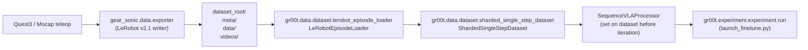

# X2 ↔ Isaac-GR00T Data Contract (M0 reference)

This page is the single source of truth for the LeRobot-format dataset schema that
[Isaac-GR00T](https://github.com/NVIDIA/Isaac-GR00T) expects, and how the X2 Ultra
SONIC pipeline must produce it. All schema-related Item-N work in
[the X2 Ultra VLA integration plan](../../../.cursor/plans/x2-ultra-vla-integration_8059563b.plan.md)
should cite this contract instead of re-deriving it.

The findings below are extracted directly from the locally cloned upstream at
[`external_dependencies/Isaac-GR00T`](../../../external_dependencies/Isaac-GR00T)
(commit `3df8b38`, "Add SONIC embodiment - Testing improvements/fixes").

> **Status:** validated end-to-end against
> [`demo_data/cube_to_bowl_5/`](../../../external_dependencies/Isaac-GR00T/demo_data/cube_to_bowl_5)
> via the M0 acceptance gate
> ([`tests/test_groot_contract.py`](../../../tests/test_groot_contract.py)).

---

## 1. High-level data flow



The contract has three stable layers:

1. **On-disk layout** — what the writer must put in `dataset_root/`.
2. **Modality config** — Python `dict[str, ModalityConfig]` registered for the embodiment.
3. **Step-level Python types** — `VLAStepData` produced by
   [`extract_step_data`](../../../external_dependencies/Isaac-GR00T/gr00t/data/dataset/sharded_single_step_dataset.py)
   and consumed by the processor / model.

Get any one of those three wrong and training silently regresses (or asserts) at
non-obvious places. The autoencoder smoke test in M3 only catches gross failures;
the M0 gate below catches schema regressions before any data is recorded.

---

## 2. On-disk layout (LeRobot v2.1)

```
<dataset_root>/
├── meta/
│   ├── info.json                  # dtypes, shapes, fps, chunk_size, path patterns, "features"
│   ├── episodes.jsonl             # one line per episode: {episode_index, tasks[], length}
│   ├── tasks.jsonl                # one line per task: {task_index, task}
│   ├── modality.json              # state/action/video/annotation slicing (see §3)
│   ├── stats.json                 # mean/std/min/max/q01/q99 per "observation.state" / "action"
│   ├── relative_stats.json        # OPTIONAL: same schema, used when use_relative_action=True
│   └── initial_actions.npz        # OPTIONAL: warm-start actions; loaded via load_initial_actions
├── data/chunk-XXX/episode_NNNNNN.parquet
└── videos/chunk-XXX/<original_video_key>/episode_NNNNNN.mp4
```

Filename patterns are **not** hard-coded; they come from `info.json`:

```json
"data_path":  "data/chunk-{episode_chunk:03d}/episode_{episode_index:06d}.parquet",
"video_path": "videos/chunk-{episode_chunk:03d}/{video_key}/episode_{episode_index:06d}.mp4"
```

Loader code:
[`gr00t/data/dataset/lerobot_episode_loader.py:_load_metadata`](../../../external_dependencies/Isaac-GR00T/gr00t/data/dataset/lerobot_episode_loader.py).

### `meta/info.json` (required keys observed in upstream demo data)

| Key | Type | Notes |
|-----|------|-------|
| `codebase_version` | str | `"v2.1"` is what the loader exercises in upstream tests |
| `robot_type` | str | free-form label, not validated |
| `total_episodes` | int | episode count |
| `total_frames` | int | aggregate frame count |
| `total_tasks` | int | distinct task strings |
| `chunks_size` | int | # episodes per `chunk-XXX/` dir |
| `fps` | int | training-time temporal anchor (50 for X2; 30 for SO-100 demo) |
| `splits` | dict | e.g. `{"train": "0:50"}` (advisory; the trainer doesn't split internally) |
| `data_path` / `video_path` | str | format strings, see above |
| `features` | dict | per-column dtype/shape/names — must include `action` and `observation.state`, plus one entry per `observation.images.<name>` video |

### `meta/modality.json`

Defines, for each parquet column, how `LeRobotEpisodeLoader._extract_joint_groups`
slices it into named "joint groups". Schema:

```json
{
  "state":  { "<group_name>": { "start": int, "end": int, "original_key"?: str } },
  "action": { "<group_name>": { "start": int, "end": int, "original_key"?: str } },
  "video":  { "<view_name>":  { "original_key"?: str } },
  "annotation": { "<sub_key>": { "original_key"?: str } }
}
```

Rules enforced by
[`get_dataset_statistics`](../../../external_dependencies/Isaac-GR00T/gr00t/data/dataset/lerobot_episode_loader.py)
and
[`_load_parquet_data`](../../../external_dependencies/Isaac-GR00T/gr00t/data/dataset/lerobot_episode_loader.py):

- For `state` / `action`, when `original_key` is omitted it defaults to `"observation.state"` / `"action"`. The `(start, end)` pair must lie inside the corresponding parquet array.
- For `video.<name>`, the `original_key` (default `observation.images.<name>`) must appear in `info.json["features"]` and resolves to the on-disk video file via `video_path`.
- For `annotation.<sub_key>`, the modality key consumed at training time is `annotation.<sub_key>`. The `original_key` (default `task_index`) is read from the parquet and looked up in `tasks.jsonl`.

### `meta/episodes.jsonl` and `meta/tasks.jsonl`

```jsonl
# episodes.jsonl
{"episode_index": 0, "tasks": ["cube into yellow bowl"], "length": 568}
```

```jsonl
# tasks.jsonl
{"task_index": 0, "task": "cube into yellow bowl"}
```

`tasks` in `episodes.jsonl` is sampled at random by `create_language_from_meta`
when the configured language key is the bare `"task"` instead of the structured
`annotation.*` form.

### `meta/stats.json`

```json
{
  "observation.state": { "mean": [...], "std": [...], "min": [...], "max": [...], "q01": [...], "q99": [...] },
  "action":            { "mean": [...], "std": [...], "min": [...], "max": [...], "q01": [...], "q99": [...] },
  "timestamp":         { ... }
}
```

`stats.json` is **mandatory** — `LeRobotEpisodeLoader` raises in `_load_metadata`
if it's missing and points the user at `gr00t/data/stats.py` to regenerate it.

### Per-episode parquet schema (observed in `cube_to_bowl_5`)

| Column | Notes |
|--------|-------|
| `observation.state` | `np.ndarray[float32]`, shape `(state_dim,)` per row |
| `action` | `np.ndarray[float32]`, shape `(action_dim,)` per row |
| `observation.images.<name>` | not stored in parquet — reads come from `videos/.../*.mp4` |
| `task_index` | `int64` — joins to `tasks.jsonl` |
| `timestamp`, `frame_index`, `episode_index`, `index` | LeRobot v2.x boilerplate |

`gear_sonic`'s exporter packs additional `observation.*` and `teleop.*` columns
(see [`gear_sonic/data/features_sonic_vla.py`](../../../gear_sonic/data/features_sonic_vla.py));
those columns are fine to keep — anything not referenced by `modality.json` is
simply ignored by the loader.

---

## 3. ModalityConfig contract (Python side)

The Python registry lives at
[`gr00t/configs/data/embodiment_configs.py`](../../../external_dependencies/Isaac-GR00T/gr00t/configs/data/embodiment_configs.py).
Every embodiment is a `dict[str, ModalityConfig]` with exactly four top-level
keys: `video`, `state`, `action`, `language` (and an optional `mask`).

Each `ModalityConfig` has:

| Field | Meaning |
|-------|---------|
| `delta_indices: list[int]` | Time offsets (in frames) sampled around the current step. `[0]` for state/video/language, `list(range(N))` for action chunks of length `N`. |
| `modality_keys: list[str]` | Group names — must match `meta/modality.json` keys for that modality. |
| `action_configs: list[ActionConfig]` | One `(rep, type, format)` triple per `modality_keys` entry. State/video/language must leave this `None`. |
| `sin_cos_embedding_keys` / `mean_std_embedding_keys` | Optional per-key normalization overrides. |

`ActionConfig` enums:

- `ActionRepresentation`: `RELATIVE` / `DELTA` / `ABSOLUTE`
- `ActionType`: `EEF` / `NON_EEF`
- `ActionFormat`: `DEFAULT` / `XYZ_ROT6D` / `XYZ_ROTVEC`

### Reference: `unitree_g1_sonic`

Captured live from the registry on the M0 acceptance run:

```text
state.modality_keys:  ['left_leg', 'right_leg', 'waist', 'left_arm', 'right_arm',
                       'left_hand', 'right_hand', 'projected_gravity']
state.delta_indices:  [0]

action.modality_keys: ['motion_token', 'left_hand_joints', 'right_hand_joints']
action.delta_indices: range(0, 40)         # 40-step chunk (FPS-dependent → 0.8 s @ 50 Hz)
action.action_configs (per key):
    motion_token        -> ABSOLUTE, NON_EEF, DEFAULT
    left_hand_joints    -> ABSOLUTE, NON_EEF, DEFAULT
    right_hand_joints   -> ABSOLUTE, NON_EEF, DEFAULT

video.modality_keys:    ['ego_view']
language.modality_keys: ['annotation.human.task_description']
```

### Extension points

Two complementary mechanisms:

1. **Tagged registry** — extend `EmbodimentTag` in
   [`gr00t/data/embodiment_tags.py`](../../../external_dependencies/Isaac-GR00T/gr00t/data/embodiment_tags.py)
   and add a key to `MODALITY_CONFIGS`. **Requires upstream PR** — not viable
   for v0.
2. **Side-loaded module** (the path we use for X2 v0). `launch_finetune.py`
   accepts `--modality-config-path /abs/path/to/x2_modality_config.py` and runs
   it via `importlib`. The file is expected to call
   `register_modality_config(my_config, embodiment_tag=EmbodimentTag.NEW_EMBODIMENT)`.
   This mutates the in-process `MODALITY_CONFIGS` dict and lets us train against
   `--embodiment-tag NEW_EMBODIMENT` without forking upstream.

The canonical example shipped upstream is
[`examples/SO100/so100_config.py`](../../../external_dependencies/Isaac-GR00T/examples/SO100/so100_config.py).

---

## 4. Step-level (`VLAStepData`) contract

Extracted by
[`extract_step_data`](../../../external_dependencies/Isaac-GR00T/gr00t/data/dataset/sharded_single_step_dataset.py),
this is what the processor/model actually sees:

```python
@dataclass
class VLAStepData:
    images:       dict[str, list[np.ndarray]]   # view_name -> [H,W,3] frames per delta_index
    states:       dict[str, np.ndarray]         # group_name -> (T, dim) where T == len(delta_indices)
    actions:      dict[str, np.ndarray]         # group_name -> (horizon, dim)
    masks:        dict[str, list[np.ndarray]] | None
    text:         str | None                    # taken from the (single) language modality_key
    embodiment:   EmbodimentTag                 # propagated from dataset config
    is_demonstration: bool                      # default False; flips loss masking when True
    metadata:     dict[str, Any]                # free-form
```

Empirical shapes for `cube_to_bowl_5` with `delta_indices=range(16)`:

```text
states.single_arm:  (1, 5)        float32
actions.single_arm: (16, 5)       float32
images.front:       list[ndarray] length 1, each (480, 640, 3) uint8
text:               'cube into yellow bowl'
```

---

## 5. Trainer entrypoint contract

[`gr00t/experiment/launch_finetune.py`](../../../external_dependencies/Isaac-GR00T/gr00t/experiment/launch_finetune.py)
accepts a `FinetuneConfig` dataclass (tyro-bound, full schema in
[`gr00t/configs/finetune_config.py`](../../../external_dependencies/Isaac-GR00T/gr00t/configs/finetune_config.py)):

| CLI flag | Default | Purpose |
|----------|---------|---------|
| `--base-model-path` | required | HF id or path (X2 v0: `nvidia/GR00T-N1.7-3B`) |
| `--dataset-path` | required | LeRobot v2.1 root |
| `--embodiment-tag` | required | `NEW_EMBODIMENT` for v0 |
| `--modality-config-path` | optional | absolute path to `x2_modality_config.py` (required when tag is `NEW_EMBODIMENT`) |
| `--shard-size` | `1024` | timesteps per `ShardedSingleStepDataset` shard |
| `--episode-sampling-rate` | `0.1` | fraction of each episode used per shard pass |
| `--num-shards-per-epoch` | `1e5` | reduce when VRAM-limited |
| `--global-batch-size` | `64` | distributed across `--num-gpus` |
| `--max-steps` | `10000` | wall-clock budget |
| `--tune-{llm,visual,projector,diffusion-model}` | `False/False/True/True` | LoRA / full fine-tune toggles |
| `--state-dropout-prob` | `0.2` | regularization on state input |
| `--color-jitter-params` | model default | image augmentation overrides |
| `--save-only-model` | `False` | when `True`, skip optimizer/scheduler state (smaller checkpoints, no resume) |

The trainer always loads the processor (`nvidia/Cosmos-Reason2-2B`) from
`--base-model-path`, even when `--skip-weight-loading` is set. So during CI we
always need network or a cached copy.

---

## 6. Diff: gear_sonic G1 schema vs X2 requirements

[`gear_sonic/data/features_sonic_vla.py`](../../../gear_sonic/data/features_sonic_vla.py)
is the existing G1 schema and the starting point for the X2 generalization.
Differences and the v0 X2 plan:

| Layer | G1 (today, `features_sonic_vla.py`) | X2 v0 plan | Notes |
|-------|--------------------------------------|------------|-------|
| State joint groups (parquet) | `[left_leg, right_leg, waist, left_arm, left_hand, right_arm, right_hand]` | Same group names, but `start/end` slices come from `RobotModel.get_joint_group_indices` for the X2 model | Item 4 introduces `gear_sonic/data/robot_model/instantiation/x2_ultra.py`. |
| Hand DOF | 7 (G1 ThreeFinger) | **Two variants from the same dataset:** 7 (compat with G1 tag) and 10 (full OmniHand) | Two `*_modality_config.py` files registering different action shapes; same parquet, slice differently. |
| Cameras | `ego_view` (head) + optional `left_wrist`, `right_wrist` | `ego_view` only for v0; future MuJoCo head-mounted RGB-D with native rendering | Wrist views are not available on X2 head-only setup. |
| Action chunk length | n/a (gear_sonic doesn't pin it; trainer-side default) | **40 steps** to match `unitree_g1_sonic` upstream contract (= 0.8 s @ 50 Hz) | Set in `x2_modality_config.py`. |
| Action keys | Many `teleop.*` columns wired through `modality.json` | `motion_token (64)` + `left_hand_joints (7 or 10)` + `right_hand_joints (7 or 10)`; everything else stays as auxiliary parquet columns ignored at training | Mirrors `unitree_g1_sonic`. |
| Embodiment registration | n/a | `EmbodimentTag.NEW_EMBODIMENT` + `--modality-config-path gear_sonic/data/x2_modality_config_{7,10}dof.py` | Dual files keep the slicing math obvious. |

---

## 6.5. Hand DOFs: training MJCF vs renderer MJCF (M3.5)

The X2 Ultra **training** MJCF (`gear_sonic/data/assets/robot_description/
mjcf/x2_ultra.xml`) deliberately ends each arm at `*_wrist_roll_link` for
**31 body DOFs total**. This matches:

- the SONIC tracking decoder's joint surface,
- the `agi_x2_deploy_onnx_ref` C++ deploy harness's reference frame layout,
- the AimDK ROS 2 HAL's `/aima/hal/joint/state/body` topic schema,
- and Pinocchio FK invariants used by `RobotModel.dof_index(...)`.

Hand commands flow **out-of-band** on the real robot via
`/aima/hal/joint/hand/command`. The 10-D `action.{left,right}_hand_joints`
vectors recorded in our LeRobot v2.1 datasets are exactly that
out-of-band command stream; they have **no kinematic effect** in the
training MJCF.

For pure trajectory-level work — M1 (LeRobot exporter), M2 (ZMQ port),
M3 (autoencoder smoke), M4 (LoRA fine-tune), and the trajectory-metric
side of M7 (closed-loop rollout) — that is exactly what we want. None
of those steps need finger pixels.

For pixel-level work — M3 inspection videos, the M5 camera-plumbing
pipeline that bakes camera frames into the LeRobot dataset itself, and
the visual-debug side of M7 — the renderer maintains a *second*,
**augmented** MJCF in memory:

- Composer:
  [`gear_sonic/scripts/compose_x2_with_omnihand.py`](../../../gear_sonic/scripts/compose_x2_with_omnihand.py)
- Wrist-clipping vendor step:
  [`gear_sonic/scripts/clip_x2_wrist_for_omnihand.py`](../../../gear_sonic/scripts/clip_x2_wrist_for_omnihand.py)
- Vendored OmniHand assets:
  `gear_sonic/data/assets/robot_description/omnihand/` (left/right
  URDFs from
  [`AgibotTech/Omnihand-2025-SDK`](https://github.com/AgibotTech/Omnihand-2025-SDK),
  Mulan PSL v2, with absolute-path / xacro-artefact / `<mujoco>` block
  cleanups documented in the vendored README).

The augmented MJCF adds:

- two articulated 10-active-DOF OmniHand chains attached at
  `*_wrist_roll_link` (mount Z = -0.055 m, 180° flip about local Y);
- 6 MJCF `<equality joint>` constraints per side recreating the URDF
  `<mimic>` rules (`thumb_pip = 1.33 × thumb_mcp`,
  `thumb_dip = 1.30 × thumb_mcp`, all `*_dip = 1.097 × *_pip`);
- a clipped wrist-roll *visual* mesh that drops the static "dummy
  fist" stub baked into `*_wrist_roll_link.STL` (collision keeps the
  full mesh — contact behaviour is unchanged);
- `contype = conaffinity = 0` on every hand geom so the dynamics
  engine ignores them.

**Active joint order parity (must hold):**
`OMNIHAND_FINGER_NAMES_PER_SIDE` in
`gear_sonic/data/robot_model/supplemental_info/x2_ultra/x2_ultra_supplemental_info.py`
matches `ACTIVE_FINGER_JOINTS` in `compose_x2_with_omnihand.py`
verbatim, so the M1 dataset's 10-D `left_hand_joints` /
`right_hand_joints` vectors write to the right qpos slot in the
augmented model without re-mapping.

The augmented MJCF is **never** consumed by the trainer, the deploy
harness, or any module that touches `RobotModel`. Acceptance gate:
[`tests/test_x2_omnihand_renderer.py`](../../../tests/test_x2_omnihand_renderer.py)
(10 tests) explicitly asserts the training MJCF stays at 38 meshes /
31 hinges / 0 equality constraints regardless of how many times the
renderer composer runs.

---

## 7. Validating the contract locally

The acceptance gate for M0 is intentionally tiny — it just exercises the upstream
loader against the upstream demo dataset to prove our environment can resolve
the gr00t package and parse the LeRobot layout end-to-end.

```bash
# from repo root
.venv/bin/python tests/test_groot_contract.py
```

Expected output ends with `OK: M0 contract gate green`.

When the gear_sonic exporter starts producing X2 datasets (Item 5b/M5), the same
pattern is reused with the X2 modality config to catch slice/feature mismatches
before any large recording session.
