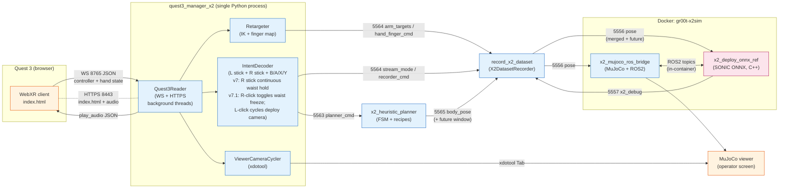
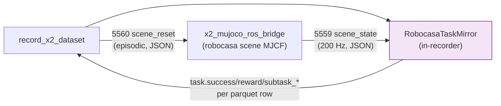

# X2 Quest 3 planner stack — system architecture

End-to-end reference for the multi-process pipeline that takes Quest 3
controller / hand input through the heuristic locomotion planner, the
SONIC ONNX policy, and into MuJoCo (with optional Robocasa scene), with
LeRobot v2.1 dataset capture along the way.

This is the engineering reference. Operator-facing tutorials live in:

* [`docs/source/tutorials/x2_quest3_planner_stack_cheatsheet.md`](../tutorials/x2_quest3_planner_stack_cheatsheet.md)
  — button maps, mode transitions, audio cues, camera cycling.
* [`sample_commands.md`](../../../sample_commands.md) — copy-paste
  invocations grouped by workflow.

Lower-level references this doc cites:

* [`x2_split_deploy_pc2.md`](x2_split_deploy_pc2.md) — split-topology
  deployment where the C++ deploy + hand bridge + motor monitor run
  on the robot's Jetson (PC2) while only the operator-side
  manager / planner / recorder stack stays on the laptop. Use the
  `--remote-deploy HOST` flag on the wrapper described below to
  switch into split mode. Strongly recommended for any real-robot
  test run; the SAFE_IDLE state and pose-ref starvation watchdog
  documented there are the hardware-side recovery path for the
  laptop-WiFi-blink freeze that motivated the split.
* [`x2_motor_monitoring.md`](x2_motor_monitoring.md) — JSONL schema +
  ZMQ summary contract for the new `x2_motor_monitor.py` daemon
  (PC2 side; events forward into `manager_sidecar.jsonl` on the
  laptop).
* [`x2_zmq_protocol.md`](x2_zmq_protocol.md) — packed-message wire
  format spec (`pack_pose_message` / `unpack_message`).
* [`x2_heuristic_planner.md`](x2_heuristic_planner.md) — planner FSM,
  recipe library, future-window semantics.
* [`x2_groot_robocasa.md`](x2_groot_robocasa.md) — Robocasa scene
  integration plan (G1 architecture).
* [`x2_isaac_groot_data_contract.md`](x2_isaac_groot_data_contract.md) —
  LeRobot v1 / v2.1 schema for VLA training.
* [`x2_deployment_code.md`](x2_deployment_code.md) — C++ deploy
  internals.
* [`x2_vla_motion_token_decoder.md`](x2_vla_motion_token_decoder.md)
  — why the live VLA bridge has its own SONIC decoder (the C++ deploy
  ignores `motion_token`), how the bridge closes the body-motion loop
  on the publish side, and the operator runbook.
* [`bug-tracker/thumb-closing-bug.md`](../../../bug-tracker/thumb-closing-bug.md)
  — open issue tracker for the OmniHand thumb regression.

---

## 1. System overview

The stack is **four cooperating Python / shell processes plus one C++
deploy** (running inside a Docker container), wired together over **ZMQ
TCP** and one **WebSocket** to the Quest 3 browser. A single shell
wrapper (`run_x2_quest3_planner_stack.sh`) brings everything up under one
trap with one Ctrl-C.



**Key invariants:**

* Every ZMQ link runs at **50 Hz** (`pose`, `body_pose`, `arm_targets`,
  `hand_finger_cmd`, `planner_cmd`, `x2_debug`) **except** the bridge's
  `scene_state` which inherits the bridge state-publish cadence
  (default **200 Hz**, `--state-rate-hz`).
* The merged `pose` payload published by the recorder on **5556** is the
  **single canonical reference** the SONIC tracker consumes. Body and
  arm slots are merged from `body_pose` (planner) and `arm_targets`
  (manager) at the recorder; hand slots come from `hand_finger_cmd`.
* `planner_cmd` and `arm_targets` / `hand_finger_cmd` come from
  **different** logical channels but **share** the manager process —
  the manager owns both intent decoding (lower-body locomotion) and arm
  IK (upper body), so the two streams stay phase-locked.
* `Quest3Reader` is **not** a separate OS process — it runs as a pair
  of background threads (WebSocket server + HTTPS static server) inside
  the manager Python process.

---

## 2. Process inventory

| # | Process | Role | Entry script | Implementation |
|---|---------|------|---------------|----------------|
| 1 | **Quest 3 WebXR client** | Reads gamepad + XRHand, sends per-frame JSON over WebSocket; receives `play_audio` cues. | Hosted by manager on HTTPS 8443. | `gear_sonic/utils/teleop/vr/quest3_webxr_app/index.html` |
| 2 | **Manager** | Hosts Quest3Reader, runs IK retargeter, decodes button intents, publishes 4 ZMQ topics, plays audio cues, cycles MuJoCo viewer cameras. | `python -m gear_sonic.scripts.quest3_manager_x2` | `gear_sonic/scripts/quest3_manager_x2.py` |
| 3 | **Heuristic planner** | Subscribes to `planner_cmd`, runs the recipe FSM at 50 Hz, publishes `body_pose` with a 9-frame future window. Optionally pre-loaded with a scripted YAML demo (`--demo PATH.yaml`, exposed at the wrapper as `--planner-demo PATH.yaml`) whose commands appear in the queue at boot and drain back to `idle_stand`; the first VR-driven `planner_cmd` then preempts via `replace_pending`. | `python -m gear_sonic.scripts.x2_heuristic_planner` | `gear_sonic/scripts/x2_heuristic_planner.py` + `gear_sonic/utils/planner/state_machine.py` |
| 4 | **Recorder** | Two SUB sockets (5564 manager + 5565 planner); merges body + arm + hand into the `pose` payload on 5556; writes LeRobot v2.1 episodes to disk. | `python -m gear_sonic.scripts.record_x2_dataset` | `gear_sonic/scripts/record_x2_dataset.py` + `gear_sonic/utils/teleop/x2_dataset_recorder.py` |
| 5a | **MuJoCo bridge** | Loads MJCF (bare X2 or robocasa scene), steps physics, publishes joint / IMU state to ROS2, subscribes to deploy actuator commands; in robocasa mode also PUBs `scene_state` and SUBs `scene_reset`. | Spawned by `deploy_x2.sh sim`. | `gear_sonic_deploy/scripts/x2_mujoco_ros_bridge.py` |
| 5b | **C++ deploy** | Loads ONNX policy (SONIC 25k), receives `pose` reference from recorder, runs the tracking inference loop, sends actuator commands over ROS2 to the bridge, publishes `x2_debug` telemetry. | Spawned by `deploy_x2.sh sim`. | `gear_sonic_deploy/src/x2/agi_x2_deploy_onnx_ref/src/x2_deploy_onnx_ref.cpp` |

The wrapper (`gear_sonic/scripts/run_x2_quest3_planner_stack.sh`) starts
processes 2-5 in dependency order, polls for readiness markers, and
installs a single trap for ordered shutdown.

---

## 3. Wire-level data flow per tick

```mermaid
sequenceDiagram
    autonumber
    participant H as Quest 3 (WebXR)
    participant M as Manager<br/>(Quest3Reader+IK+Intent)
    participant P as Planner<br/>(50Hz FSM)
    participant R as Recorder<br/>(Subscribe-mode)
    participant D as C++ Deploy<br/>(SONIC ONNX)
    participant B as MuJoCo Bridge<br/>(physics)

    Note over H,B: One 20 ms tick (50 Hz)

    H->>M: WS JSON {pose, hand_curls, oppose, buttons, sticks}
    M->>M: IK retarget (arms) + finger map (hands)
    M->>M: IntentDecoder (L stick + R stick + buttons -> LocomotionCmd<br/>v7: R stick -> hold_torso(pitch,roll,yaw); B-press latches in ARM_MAN)

    par To planner
        M->>P: 5563 planner_cmd<br/>{intent, magnitude}
    and To recorder
        M->>R: 5564 arm_targets (msgpack, 14 floats)
        M->>R: 5564 hand_finger_cmd (msgpack, 10+10)
        M->>R: 5564 stream_mode (msgpack, str)
        M->>R: 5564 recorder_cmd (json, on edge: start/save/estop)
    end
    M-->>H: WS JSON play_audio (mode/record cues, edge-triggered)

    P->>P: state_machine.step()
    P->>R: 5565 body_pose (packed)<br/>joint_pos_mj + future window

    R->>R: merge body+arm overlay, attach hand slots
    R->>D: 5556 pose (packed)<br/>joint_pos_mj, root_quat, *_future, hand_joints
    R->>B: 5556 pose<br/>(same payload, OmniHand SUB on bridge)

    D->>D: SONIC tracking inference
    D-->>R: 5557 x2_debug (packed)<br/>body_q, base_quat, last_action, hand_q

    B->>B: mj_step + apply_active_hand_ctrl(thumb_roll/abad/mcp + 7)
```

**Per-tick budget (50 Hz):**

* Frame 1: WebXR sample at the headset frame rate (90 Hz native, ~50 Hz
  effective after server-side polling).
* Frame 2-5: manager processing < 5 ms typical (IK is the dominant cost).
* Frame 6: planner FSM step + future-window build ~1 ms.
* Frame 7: recorder merge + ZMQ pack ~0.5 ms.
* Frame 8: SONIC ONNX inference + ROS2 publish ~6-8 ms (this is the
  budget governor on a 4090 / H200 class GPU).
* Frame 9: bridge physics step at 1 kHz (default `--sim-rate-hz 1000`),
  control cadence at 50 Hz from the C++ side.

---

## 4. ZMQ port + topic catalogue

The 5 core ports live on `127.0.0.1` (the wrapper does not bind on
public interfaces). Robocasa adds 2 more. All ports / topics are
declared in
[`run_x2_quest3_planner_stack.sh`](../../../gear_sonic/scripts/run_x2_quest3_planner_stack.sh)
lines 141-153 — bumping any of them requires updating every consumer.

### 4.1 Core ports (always bound)

| Port | Topic | Direction | Wire | Rate | Payload |
|------|-------|-----------|------|------|---------|
| **5556** | `pose` | recorder PUB → C++ deploy SUB **and** bridge OmniHand SUB | packed | 50 Hz | `joint_pos_mj` (f32, 31), `root_quat_xyzw` (f32, 4), `motion_token` (f32, 64), `left_hand_joints` / `right_hand_joints` (f32, 10), `frame_index` (i64), optional `joint_pos_mj_future` (f32, 9×31), `root_quat_xyzw_future` (f32, 9×4), `joint_vel_mj_future` (f32, 9×31), `frame_index_future` (i64, 9), `future_dt_s` (f32) |
| **5557** | `x2_debug` | C++ deploy PUB → recorder SUB | packed | 50 Hz | `control_tick` (i64), `ros_timestamp` / `policy_time` (f64), `base_quat` (f64, 4), `base_ang_vel` (f64, 3), `body_q` / `body_dq` / `last_action` (f64, 31), `left_hand_q` / `right_hand_q` (f64, 10), `hand_frame_idx` (i64), `ramp_alpha` (f64), `tilt_trip` / `dry_run` (u8) |
| **5563** | `planner_cmd` | manager PUB → planner SUB | multipart `[topic, json]` | edge-triggered (intent change) + idle keep-alives | `{"intent": str, "magnitude": str}`, plus optional v7 `waist_pitch_deg`, `waist_roll_deg`, `waist_yaw_deg` floats when `intent == "hold_torso"` (continuous waist hold; see [`x2_heuristic_planner.md`](x2_heuristic_planner.md#v7-continuous-waist-hold-static_hold)) |
| **5564** | `arm_targets`, `hand_finger_cmd`, `stream_mode`, `recorder_cmd` (multiplexed on **one** PUB socket) | manager PUB → recorder SUB | multipart `[topic, msgpack/json]` | 50 Hz (arm/hand/mode); edge-triggered (recorder_cmd) | `arm_targets`: 14 floats (left_q ‖ right_q). `hand_finger_cmd`: `{left_hand_q[10], right_hand_q[10]}`. `stream_mode`: `{mode: "OFF"|"LOCOMOTION"|"ARM_MANIPULATION"}`. `recorder_cmd`: `{op: "start"|"save"|"discard"|"estop", tick: int}` |
| **5565** | `body_pose` | planner PUB → recorder SUB | packed | 50 Hz | Same packed schema as `pose` (planner builds the future window via `state_machine.build_pose_payload`) |

### 4.2 Robocasa-only ports (bound only when `--sim-mjcf` points at a robocasa scene XML)

| Port | Topic | Direction | Wire | Rate | Payload |
|------|-------|-----------|------|------|---------|
| **5559** | `scene_state` | bridge PUB → recorder SUB | `[topic, json]` | 200 Hz (`--state-rate-hz` on bridge) | `sim_time` (f64), `object_freejoint_qpos` (per-joint 7-vec), `mutable_body_pos` (per-body xyz), `grasp_contacts` (bool[]), `fingertip_pos` (per-tip xyz) |
| **5560** | `scene_reset` | recorder PUB → bridge SUB | `[topic, json]` | episodic (on `start`) | `object_freejoint_qpos`, `mutable_body_pos` (re-randomised on each new episode) |

### 4.3 Auxiliary port (optional)

| Port | Topic | Direction | Notes |
|------|-------|-----------|-------|
| **5570** | `robot_pose` | bridge PUB → external SUB | JSON `{sim_time, pelvis_qpos_wxyz}`. Bound only when bridge is invoked with `--robot-pose-pub-port > 0`. Used by `compare_planner_vs_motion.py` and similar diagnostic tools that don't need the full deploy telemetry. |

### 4.4 Topic multiplexing on 5564

The manager's PUB on 5564 carries **four** logical topics over **one**
socket. The recorder's SUB connects once and calls `setsockopt(SUBSCRIBE, ...)`
for each topic name. ZMQ delivers any matching prefix; the recv handler
switches on `parts[0]` to route to the right state slot.

```
manager.pub.bind("tcp://*:5564")
manager.pub.send_multipart([b"arm_targets",     msgpack.packb({...})])
manager.pub.send_multipart([b"hand_finger_cmd", msgpack.packb({...})])
manager.pub.send_multipart([b"stream_mode",     msgpack.packb({...})])
manager.pub.send_multipart([b"recorder_cmd",    json.dumps({...}).encode()])

recorder.sub.connect("tcp://localhost:5564")
for t in (b"arm_targets", b"hand_finger_cmd", b"stream_mode", b"recorder_cmd"):
    recorder.sub.setsockopt(zmq.SUBSCRIBE, t)
parts = recorder.sub.recv_multipart()
dispatch[parts[0]](parts[1])
```

`body_pose` is **not** multiplexed on 5564 — it has its own port (5565)
and a second SUB socket on the recorder. This keeps the planner cadence
isolated from the manager cadence so a manager hiccup doesn't stall the
planner's body-pose stream into the recorder.

### 4.5 CONFLATE / HWM matrix

ZMQ defaults to unbounded queues; we tune per-socket so a slow consumer
can't accumulate stale frames.

| Socket | CONFLATE | Other | Rationale |
|--------|----------|-------|-----------|
| C++ `pose` SUB (`ZmqPoseInputSource`) | yes | `RCVHWM=1` | SONIC always wants the freshest reference; staleness > 20 ms hurts tracking. |
| Bridge OmniHand `pose` SUB (5556) | yes | `RCVTIMEO=200 ms` | Hand qpos applied to MuJoCo at sim cadence; freshest-wins. |
| Recorder `x2_debug` SUB (5557) | no | `RCVHWM=5` | Need a small queue to align observation frames with commanded frames in the LeRobot dataset. |
| Recorder `scene_state` SUB (5559) | yes | `RCVTIMEO=200 ms` | Mirror only needs the latest object state; reward function is per-tick. |
| Bridge `scene_reset` SUB (5560) | yes | `RCVTIMEO=200 ms` | Resets are episodic; queueing them would replay stale randomisations. |
| Recorder `pose` PUB (5556) | — | `SNDHWM=10` | 10-frame send queue cushions sub jitter without unbounded growth. |
| Recorder `body_pose` / 5564 SUBs | no | `RCVTIMEO=50 ms` | Cadence-locked to 50 Hz; missed frames are logged, not discarded silently. |

### 4.6 Wire version notes (`v4` vs `v5`)

The `pack_pose_message` helper writes a JSON header with a `"v"` field.
**Today every publisher uses `version=4`** (planner `PosePublisher`
defaults to 4; recorder `RecorderConfig.protocol_version` defaults to 4).

What we colloquially call **"v5"** is *semantic capability*: the
presence of the future-window fields (`joint_pos_mj_future`,
`root_quat_xyzw_future`, `joint_vel_mj_future`, `frame_index_future`,
`future_dt_s`). The C++ deploy detects these fields by name and falls
back to single-frame v4 behaviour when they're absent.

This means:

* `header.v == 4` does **not** imply "no future window". Look at the
  field list, not the header version.
* If you bump publishers to `version=5`, also bump the C++
  `ZmqPoseInputSource::HandleDecoded` minimum-version check or the
  deploy will reject the new payloads at startup.

See [`x2_zmq_protocol.md`](x2_zmq_protocol.md) for the canonical wire
format spec.

---

## 5. WebSocket + HTTPS to the headset

Both servers run inside `Quest3Reader` (background threads of the
manager process) — there is no separate OS process for WebXR.

| Port | Protocol | Direction | Payload |
|------|----------|-----------|---------|
| **8443** | HTTPS (TLS, self-signed `/CN=quest3-teleop`) | Quest 3 browser GET | `index.html`, JS bundles, `/audio/*.mp3` (mode + recording cues). Cert lives at `gear_sonic/utils/teleop/vr/quest3_certs/`; auto-generated on first launch. |
| **8765** | WebSocket (WSS when SSL on) | Quest 3 → manager (per frame) | UTF-8 JSON: `{pose, hands: {left, right}, buttons, axes}` where `hands.<side>` includes `curls[5]`, `oppose`, `finger_tip_oppose[4]`, `source: "hand"|"controller"`. |
| **8765** | WebSocket | manager → Quest 3 (edge-triggered) | `{"_type": "play_audio", "key": "<prompt>", "fallback": "<text>"}` to drive the headset's `<audio>` element on mode transitions and recording start/save. |

Effective WebSocket rate is **~50 Hz** (server-side EMA reported in
`Quest3Reader._log_fps`). The browser native frame rate is 90 Hz; we
sample at every other frame.

---

## 6. Robocasa scene mode — what changes

When the wrapper is launched with `--robocasa-env X2PickPlaceCube` (or
`X2PickPlaceBowl` / `X2PickPlaceApple`), three things happen on top of
the flat-floor flow:

1. **Wrapper resolves** `gear_sonic/data/assets/robocasa_scenes/<env>.xml`
   (one-time built via
   `python -m gear_sonic.scripts.build_x2_robocasa_scene_xml --env <env>`)
   and forwards `--sim-mjcf <xml>` to `deploy_x2.sh`. The bridge auto-discovers
   the `<env>.json` sidecar with object metadata.
2. **Two extra ZMQ ports come up** (`5559` PUB on bridge, `5560` SUB on
   bridge); the recorder binds the matching pair (5560 PUB, 5559 SUB).
3. **Recorder instantiates** `RobocasaTaskMirror` which mirrors the
   bridge's MuJoCo state (object qpos, fingertip positions, contact
   bools) and computes the 6-phase shaped reward
   (`approach → touch → grasp → off_table → above_bowl → in_bowl`).
   Per-tick `task.success`, `task.reward`, `task.subtask_*` columns are
   written into the LeRobot parquet.



In flat-floor mode `RobocasaTaskMirror` is not instantiated, the two
extra ports stay unbound, and the parquet only carries the standard
locomotion + manipulation columns.

Wrapper-side defaults that flip in robocasa mode (operator can override
with `--no-apply-{curl,oppose}-compensation`):

| Knob | Flat-floor default | Robocasa default | Why |
|------|--------------------|-------------------|-----|
| `--apply-curl-compensation` | OFF | **ON** | Power-grasp pick-and-place needs amplified mid-range curls so a 4 cm cube gets a tight wrap. |
| `--apply-oppose-compensation` | OFF | **ON** | Same workload — the oppose channel suppresses rest-bleed and saturates on explicit thumb-finger touches. |
| `--task` requirement | required | **optional** (auto-fills from scene metadata) | The robocasa env exposes a canonical instruction (e.g. *"pick up the red cube and drop it into the blue bowl"*). |

> Note: the OmniHand thumb has a known regression in robocasa mode where
> it does not close on a casual fist; tracked in
> [`bug-tracker/thumb-closing-bug.md`](../../../bug-tracker/thumb-closing-bug.md).
> A first-attempt surgical fix (thumb exemption from `stretch_finger_curls`)
> did not resolve the symptom and was reverted; the bug is still open.

---

## 7. Boot and shutdown order

The wrapper enforces dependency-ordered startup (so consumers don't see
"socket not bound yet" errors) and a reverse-ordered teardown (so the
recorder drains its episode buffer before the deploy goes silent).

```mermaid
sequenceDiagram
    participant W as Wrapper
    participant D as deploy_x2.sh sim<br/>(C++ + bridge in docker)
    participant P as planner
    participant M as manager (+Quest3Reader)
    participant R as recorder

    Note over W: STARTUP
    W->>W: preflight (ports free, calibration YAML, ONNX, scene XML, primitives PKL)
    W->>D: spawn (background, autostart=0)
    D-->>W: log "policy ready" + bridge "scene plumbing"
    W->>P: spawn (binds 5563 SUB, 5565 PUB)
    P-->>W: PID file at /tmp/x2_heuristic_planner.pid
    W->>M: spawn (binds 5563 PUB, 5564 PUB, WS 8765, HTTPS 8443)
    M-->>W: log "Quest3Reader listening"
    W->>R: spawn (connects 5564, 5565; binds 5556, optionally 5560)
    R-->>W: log "subscribe-mode ready"
    W->>D: send autostart command
    Note over W: STEADY STATE (50 Hz)

    Note over W: SHUTDOWN (Ctrl-C / --duration expires / fault)
    W->>R: SIGINT (drain in-progress episode, flush parquet)
    R-->>W: exits clean
    W->>M: SIGINT (Quest3Reader threads close WS)
    W->>P: SIGINT (drain command queue)
    W->>D: SIGINT (C++ ramp-down, bridge stops physics)
    W->>D: docker stop <container> (last-resort)
```

The wrapper's `--cleanup-only` mode runs only the reverse path: free
ports 5556 / 5557 / 5559 / 5560 / 5563 / 5564 / 5565, kill processes by
PID file + name match (`x2_heuristic_planner`, `quest3_manager_x2`,
`record_x2_dataset`), and `docker stop` any containers matching
`name=x2sim-run` or `ancestor=gr00t-x2sim` / `ancestor=x2sim`.

---

## 8. Invocation matrix

### 8.1 Whole-pipeline launchers

The big shell wrappers that bring up multiple processes under one trap.

| Script | Purpose | Default invocation | Most useful variants |
|--------|---------|---------------------|----------------------|
| [`gear_sonic/scripts/run_x2_quest3_planner_stack.sh`](../../../gear_sonic/scripts/run_x2_quest3_planner_stack.sh) | **Phase 0 four-process stack**: deploy + planner + manager + recorder. The canonical operator-facing entry point. | `bash gear_sonic/scripts/run_x2_quest3_planner_stack.sh` (600 s, teleop-only) | • Robocasa record: `--robocasa-env X2PickPlaceCube --with-record --output-dir data/lerobot/<name>` <br/> • Flat-floor record: `--with-record --output-dir <path> --task "<lang>"` <br/> • Auto-play scripted demo at startup then idle for VR takeover: `--planner-demo gear_sonic/data/scripted_demos/<name>.yaml` <br/> • External deploy: `--no-deploy` <br/> • Headless: `--no-sim-viewer` <br/> • Recovery: `--cleanup-only` <br/> • CI dry-run: `--validate-only` |
| [`gear_sonic/scripts/record_x2_dataset.sh`](../../../gear_sonic/scripts/record_x2_dataset.sh) | **Legacy** monolithic wrapper: deploy + `record_x2_dataset.py` (with embedded Quest 3 server, no planner split). Lower body holds SONIC stand pose. | `bash record_x2_dataset.sh --teleop-only --sonic-checkpoint <pt>` | • Full record: `--output-dir <path> --task "<lang>" --sim-omnihand --wrist-bypass ik` <br/> • Robocasa record: `--robocasa-env X2PickPlaceCube` |
| [`gear_sonic/scripts/run_planner_smoke.sh`](../../../gear_sonic/scripts/run_planner_smoke.sh) | Planner-only smoke (optionally + deploy + kinematic viewer + `dump_x2_debug`). No Quest 3. | `bash run_planner_smoke.sh` (20 s, planner only on 5556) | • Closed-loop sim with keyboard: `--with-deploy --keyboard --duration 120` <br/> • Scripted demo: `--demo gear_sonic/data/scripted_demos/eleven_motion_sequence.yaml --with-deploy --duration 60` <br/> • Recovery: `--cleanup-only` |
| [`gear_sonic/scripts/run_live_vla_demo.sh`](../../../gear_sonic/scripts/run_live_vla_demo.sh) | Live GR00T VLA model → pose publisher → `dump_x2_debug` → deploy. No VR headset. | Requires `MODEL_DIR` + `ONNX` envs. | `./run_live_vla_demo.sh stop` to tear down. |

### 8.2 Individual-component launchers

Run one stage in isolation — useful for debugging without the full stack.

#### Runtime processes

| Script | Isolates | Default invocation | Custom args worth knowing |
|--------|----------|---------------------|----------------------------|
| `python -m gear_sonic.scripts.quest3_manager_x2` | Manager only (Quest3Reader + IK + intent + ZMQ pubs). | Needs operator calibration YAML. | `--ws-port`, `--http-port`, `--planner-cmd-port`, `--recorder-pub-port`, `--apply-{curl,oppose}-compensation`, `--enable-viewer-camera-cycler` |
| `python -m gear_sonic.scripts.x2_heuristic_planner` | Planner FSM only (subscribes to `planner_cmd`, publishes `body_pose`). | Defaults to 5556 PUB (legacy mode); pass `--body-pose-port 5565` for Phase 0. | `--zmq-cmd-host`, `--zmq-cmd-port` (subscribe to manager); `--keyboard` (CLI intent injection); `--demo <yaml>` (scripted) |
| `python -m gear_sonic.scripts.record_x2_dataset` | Recorder only. Subscribe-mode requires upstream manager + planner already running. | Needs `--output-dir` + `--task` (or `--teleop-only`). | `--body-pose-source zmq --arm-targets-source zmq` (Phase 0); `--robocasa-env`; `--scene-{state,reset}-port`; `--episode-seed` |
| `python -m gear_sonic.scripts.teleop_x2_kinematic` | Pure kinematic VR → MuJoCo viewer. No SONIC, no planner. | `python -m gear_sonic.scripts.teleop_x2_kinematic` | `--output-dir` (record path); `--with-omnihand`; `--hand-input {trigger,grip,max}` |
| `bash gear_sonic_deploy/deploy_x2.sh sim --vla` | C++ deploy + bridge in Docker, listening for ZMQ pose. | `bash deploy_x2.sh sim --no-confirm --vla --model <onnx>` | `--sim-mjcf <robocasa.xml>` (scene); `--sim-with-omnihand`; `--wrist-bypass {off,ik}`; `--sim-viewer` |
| `python -m gear_sonic.scripts.x2_mujoco_ros_bridge` | The Python MuJoCo bridge in isolation (rare; usually invoked by deploy). | Started by `deploy_x2.sh sim`. | `--state-rate-hz`, `--scene-state-pub-port`, `--scene-reset-sub-port`, `--robot-pose-pub-port` |

#### One-time / asset builders

| Script | Purpose |
|--------|---------|
| `python -m gear_sonic.scripts.build_x2_robocasa_scene_xml --env {X2PickPlaceCube,X2PickPlaceBowl,X2PickPlaceApple,--all}` | Build a robocasa scene MJCF + JSON sidecar. Required before first robocasa launch. |
| `python -m gear_sonic.scripts.build_x2_planner_primitives` | Build the planner's motion primitive PKL from recipe sources. |
| `python -m gear_sonic.scripts.bake_planner_demo_to_pkl --demo <yaml> --out <pkl>` | Bake a scripted YAML demo into a PKL the deploy can replay via `--motion`. |
| `python -m gear_sonic.scripts.bake_planner_rsi_anchor` | Bake the RSI anchor PKL used by `--sim-profile parity` (auto-rebuilt by the wrapper if missing). |
| `python -m gear_sonic.scripts.curate_x2_primitives` | Curate the primitive library (alternative to build). |
| `python -m gear_sonic.scripts.vr_operator_calibrate --operator-id <name>` | Capture per-operator 4-pose calibration into `data/operator_calibrations/<name>.yaml`. Required by wrapper preflight. |

#### View / replay / diagnostics

| Script | Purpose |
|--------|---------|
| `python -m gear_sonic.scripts.view_x2_planner_mujoco --demo <yaml>` | Passive MuJoCo viewer, in-proc planner OR `--from-zmq HOST:PORT` to peek at a running stack's pose stream. |
| `python -m gear_sonic.scripts.replay_x2_kinematic --dataset <name> --episode <i>` | Kinematic MuJoCo replay of a recorded LeRobot episode (no policy, no Quest 3). |
| `python -m gear_sonic.scripts.replay_recorded_dataset --npz <ep.npz> --parquet <ep.parquet> --output-dir <out>` | Re-derive a parquet by replaying the recorded debug NPZ through the current retargeter / calibration / filter. Useful for tuning offline. |
| `python -m gear_sonic.scripts.replay_finger_curl_comparison --npz <ep.npz> --out <out>` | Generate side-by-side PNGs comparing pre/post stretch finger curls. |
| `python -m gear_sonic.scripts.inspect_sonic_correction --dataset <name> --episode <i>` | Per-arm-joint commanded vs executed delta from the v1 LeRobot schema. |
| `python -m gear_sonic.scripts.dump_x2_debug --duration <s> --csv-out <path>` | Subscribe to `x2_debug` (5557) and dump telemetry. |
| `python -m gear_sonic.scripts.eval_x2_mujoco --checkpoint <pt> --motion <pkl>` | Offline rollout of a Python policy in MuJoCo (no ONNX, no ZMQ). |
| `python -m gear_sonic.scripts.compare_planner_vs_motion --motion-pkl <pkl> --planner-demo <yaml>` | Sequential A/B between PKL motion replay and planner output through the deploy. Catches v5 future-window regressions. |
| `python -m gear_sonic.scripts.diagnose_planner_vs_pkl` | Diagnostic parity tool. |
| `python scripts/replay_teleop_debug_with_fixes.py --npz <ep.npz>` | Replay debug NPZ through `VRArmTeleopCalibrated` for arm-IK regression analysis. |

### 8.3 Test groups

All run as `pytest <files>` from the repo root. Group these by concern;
the full suite is fast (most groups < 30 s).

| Group | Files | What it covers | Heavy deps |
|-------|-------|----------------|------------|
| **Wrapper CLI smoke** | `tests/test_run_x2_quest3_planner_stack_cli.py` | Bash arg parsing + preflight via `--validate-only`. Spawns short-lived bash subprocesses. | none |
| **ZMQ wire format** | `tests/test_zmq_pose_loopback.py`, `tests/test_quest3_manager_x2_wire_format.py`, `tests/test_x2_planner_zmq_publish.py` | `pack_pose_message` / `unpack_message` round-trip; manager → planner / recorder shapes; planner cadence + cleanup. | zmq (no GPU/MuJoCo) |
| **Manager ↔ retargeter parity** | `tests/test_quest3_manager_x2_retargeting_parity.py` | NPZ regression vs the v6 kinematic dataset. Skips if data files absent. | numpy + bundled NPZ |
| **Subscribe-mode recorder** | `tests/test_recorder_subscribe_mode.py` | Decode helpers + ZMQ thread against fake publishers. | zmq + numpy |
| **Intent / button / joystick** | `tests/test_intent_decoder.py`, `tests/test_vr_button_and_joystick_utilities.py` | IntentDecoder FSM, ButtonStateMachine edges, joystick deadzone + yaw accumulator. | none |
| **Audio prompts** | `tests/test_quest3_audio_prompts.py` | Prompt cache registry + key contract. Skips gTTS if offline. | optional gTTS |
| **Viewer camera cycler** | `tests/test_viewer_camera_cycler.py` | xdotool window discovery (mocked); reproduces and pins the `mutter-x11-frames` exclusion. | none (xdotool mocked) |
| **Finger pipeline** | `tests/test_teleop_v2_dropout_and_orientation.py`, `tests/test_replay_finger_curl_comparison.py`, `tests/test_tune_finger_curl_compensation.py`, `tests/test_finger_signal_filter.py` | Curl stretch, oppose stretch, finger-tip oppose, dropout handling, finger smoothing filter. | numpy / scipy |
| **Planner state machine** | `tests/test_x2_planner_seam_continuity.py`, `tests/test_x2_planner_recipes.py`, `tests/test_x2_planner_curator.py` | FSM seam continuity, recipe library, curator. | numpy |
| **Kinematic teleop / IK / schema** | `tests/test_teleop_x2_kinematic_smoke.py`, `tests/test_vr_arm_teleop_v2_smoke.py`, `tests/test_x2_arm_ik_smoke.py`, `tests/test_record_x2_dataset_schema.py`, `tests/test_replay_x2_kinematic.py`, `tests/test_operator_calibration.py` | Offline exporter, IK invariants, schema wiring, replay CLI. | numpy / pyarrow |
| **MuJoCo-adjacent** | `tests/test_x2_kinematic_view.py`, `tests/test_x2_omnihand_renderer.py`, `tests/test_x2_robocasa_scene_mode.py` | MJCF model build, OmniHand renderer, robocasa scene argparse. | **mujoco** import required |
| **Pre-roll integration** | `tests/test_x2_smoketest_pipeline.py` | M3 motion variations, synthetic dataset, trajectory compare. | may need `external_dependencies/Isaac-GR00T` on path |

#### One-liners

```sh
# Fast feedback loop (everything except MuJoCo / Isaac-GR00T):
pytest tests/test_run_x2_quest3_planner_stack_cli.py \
       tests/test_quest3*.py tests/test_x2_planner_*.py \
       tests/test_recorder_*.py tests/test_intent_*.py \
       tests/test_vr_*.py tests/test_viewer_*.py \
       tests/test_teleop_v2*.py tests/test_replay_finger*.py \
       tests/test_tune_finger*.py tests/test_finger_signal*.py \
       tests/test_zmq_pose*.py tests/test_audio_prompts.py 2>/dev/null

# Phase 0 wire-level + parity (the bits that move in this stack):
pytest tests/test_quest3_manager_x2_wire_format.py \
       tests/test_quest3_manager_x2_retargeting_parity.py \
       tests/test_recorder_subscribe_mode.py \
       tests/test_x2_planner_zmq_publish.py \
       tests/test_run_x2_quest3_planner_stack_cli.py
```

---

## 9. Known issues + open work

| Issue | Tracker | Status |
|-------|---------|--------|
| OmniHand thumb does not close on casual fist in robocasa mode (4 fingers do). | [`bug-tracker/thumb-closing-bug.md`](../../../bug-tracker/thumb-closing-bug.md) | OPEN. First attempt (thumb exemption from `stretch_finger_curls`) did not fix; reverted. Six follow-up investigation directions documented in the tracker. |

---

## 10. Glossary

* **Subscribe-mode** — recorder operating mode where the recorder
  consumes `body_pose` (planner) + `arm_targets` / `hand_finger_cmd`
  (manager) over ZMQ rather than running its own embedded Quest 3
  server. The Phase 0 default.
* **Phase 0** — the four-process planner-stack architecture (this
  document). Contrasts with the legacy "monolithic recorder" path used
  by `record_x2_dataset.sh`.
* **Future window** — 9-frame lookahead (joint_pos + root_quat + joint_vel)
  that the planner ships in `body_pose` so the C++ tracker's tokenizer
  can plan ahead. See
  [`x2_heuristic_planner.md`](x2_heuristic_planner.md).
* **Wrist bypass** — runtime override of SONIC's pinned wrist DOFs with
  the operator's IK reference. See `--wrist-bypass {off,ik}` in the
  deploy + wrapper CLIs.
* **Robocasa mirror** — `RobocasaTaskMirror` instance inside the recorder
  that mirrors the bridge's MuJoCo state and computes shaped rewards.
* **Manager / Quest3Reader split** — `Quest3Reader` is a class with WS
  + HTTPS background threads; the manager is the *process* that hosts
  it plus the IK retargeter, intent decoder, and ZMQ publishers.
