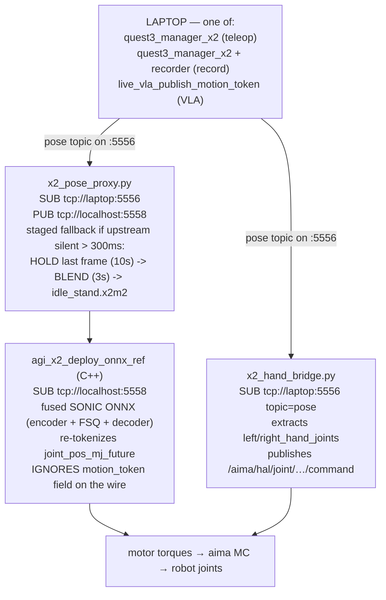
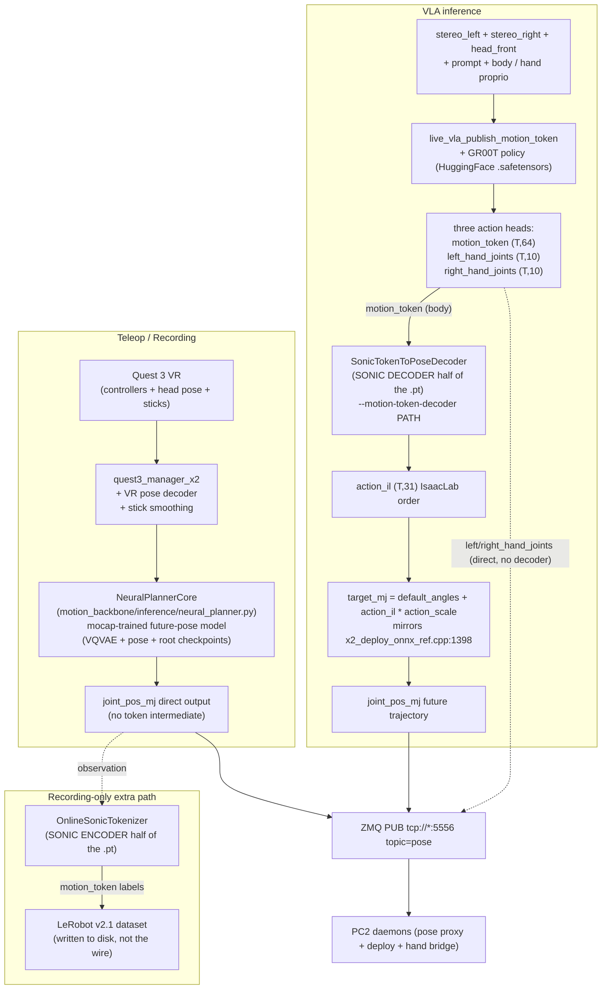
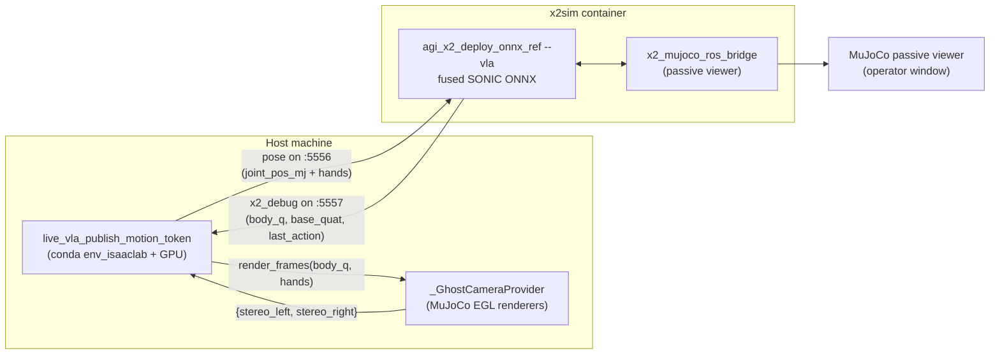

# X2 SONIC runtime architecture — teleop, recording, and VLA in one frame

This page explains how the three operating modes of the X2 — VR
teleoperation, dataset recording, and autonomous VLA inference — share
the same on-robot runtime. The common substrate is the SONIC tracking
policy that lives on PC2 and the `joint_pos_mj` wire contract on port
5556. Everything that differs between the modes lives on the laptop:
who **thinks**, what they emit, and how the predictions get translated
to the wire.

If you already know one of the three modes, this doc tells you what
changes when you switch to the other two without re-learning the whole
stack.

For deep dives, see:

- [`X2 Quest 3 Planner Stack — System Architecture`](x2_quest3_planner_stack_architecture.md)
  — the four-process teleop / recording stack in full detail (ZMQ port
  catalogue, CONFLATE/HWM matrix, robocasa scene plumbing).
- [`X2 VLA motion_token Decoder`](x2_vla_motion_token_decoder.md) —
  why the C++ deploy ignores the wire's `motion_token` field, how the
  laptop closes the loop with the SONIC decoder, and the bridge ↔
  deploy joint-order / action-scale contract.
- [`X2 Split-topology PC2 daemons`](x2_split_deploy_pc2.md) — what
  `x2_pc2_daemons.sh` actually brings up on the Orin NX.

---

## 1. TL;DR — one robot, three thinkers

| Mode | Laptop launcher | Laptop "thinker" | Wire payload that drives the body | Operator runbook |
|---|---|---|---|---|
| **Teleop** | `run_x2_quest3_planner_stack.sh` | `NeuralPlannerCore` (kplanner) driven by VR + sticks | `joint_pos_mj` (direct from kplanner) | [`VR whole-body teleop`](../tutorials/vr_wholebody_teleop.md) |
| **Recording** | `run_x2_quest3_planner_stack.sh --with-record --head-cameras` | kplanner (above) **plus** `OnlineSonicTokenizer` for label generation | `joint_pos_mj` (same as teleop) — the tokenizer only writes to disk | [`X2 dataset record and replay`](../tutorials/x2_dataset_record_and_replay.md) |
| **Autonomous VLA** | `run_x2_vla_runtime.sh` | `live_vla_publish_motion_token` running GR00T -> SONIC decoder | `joint_pos_mj` (decoded from VLA's `motion_token` chunk) | [`X2 VLA runtime`](../tutorials/x2_vla_runtime.md) |

The PC2 side is **byte-identical** across all three modes — the same
`x2_pc2_daemons.sh start` keeps SONIC alive and you just flip which
laptop launcher you run.

---

## 2. The shared backbone — everything below the wire

Whichever mode you're in, the moment a `pose` frame leaves the laptop
on `tcp://<laptop>:5556`, the downstream path is identical:



Two important consequences of this layout:

1. **The deploy never reboots between modes.** SONIC, the pose proxy,
   the hand bridge, and the motor monitor all keep running. Switching
   from teleop to VLA is just killing one laptop process and starting
   another against the same `:5556` wire.
2. **Body vs hand control is split at the wire.** The deploy only
   consumes the body fields (`joint_pos_mj` + future window + root
   quat). Hand fingers ride the **same** `pose` topic but are read by
   a different PC2 subscriber (`x2_hand_bridge`) and pushed straight
   to the AimDK HAL without going through SONIC. This split is what
   makes the "robot stands at idle, only fingers move" failure mode
   from the [VLA decoder reference](x2_vla_motion_token_decoder.md)
   possible — hands bypass SONIC by design.

The proxy's upstream-silent fallback is staged on purpose: a step
change in the commanded body reference (such as instantly switching
from operator-IK pose to baked `idle_stand`) cannot be absorbed by the
deploy's target LPF + `max_target_dev_arm` clamp, and would swing the
arms through their full ROM in ~200 ms during any WiFi blip. The
`HOLD -> BLEND -> IDLE_CLIP` ladder (see milestone
[2026-06-08 — Pose-proxy fallback ladder](../user_guide/milestones/2026-06-08_arm_freeze_on_upstream_stall.md))
keeps the wire alive while only making per-frame commanded-reference
moves the deploy can actually track. `POSE_PROXY_IDLE_MODE=idle-stand`
restores the pre-2026-06-08 behaviour as a regression escape.

---

## 3. The wire contract — `pose` topic on :5556

The single source of truth across teleop / record / VLA is the `pose`
message published on `tcp://<laptop>:5556`. Same fields, same dtypes,
same future-window layout, regardless of who produced it. Anyone
implementing a new thinker just has to populate this dict and pack it
with `gear_sonic.utils.teleop.zmq.zmq_planner_sender.pack_pose_message`.

| Field | Shape, dtype | Read by | Notes |
|---|---|---|---|
| `joint_pos_mj` | `(31,) f32` | PC2 deploy (via pose proxy) | Canonical body reference in MuJoCo joint order. Every mode publishes this. |
| `joint_pos_mj_future` | `(9, 31) f32` | PC2 deploy | 9-step lookahead at `future_dt_s = 0.1s` (~ 0.9 s horizon). The deploy's SONIC encoder re-tokenizes this. |
| `root_quat_xyzw` | `(4,) f32` | PC2 deploy | Current frame root orientation. |
| `root_quat_xyzw_future` | `(9, 4) f32` | PC2 deploy | Future root orientations matching the joint future. |
| `joint_vel_mj_future` | `(9, 31) f32` | PC2 deploy | Numerical derivative of the future joints; some encoder variants read it. |
| `frame_index` / `frame_index_future` | `(1,)` / `(9,) i64` | PC2 deploy | Monotonic publisher tick + lookahead indices. |
| `future_dt_s` | `(1,) f32` | PC2 deploy | Always 0.1 in this stack. |
| `motion_token` | `(64,) f32` | **Nobody (currently)** | Logged on disk by the recorder + dumped by VLA chunk dumps; the C++ deploy explicitly **ignores** this field on the wire — see [decoder reference](x2_vla_motion_token_decoder.md) section 2.2 for why. |
| `left_hand_joints` | `(10,) f32` | `x2_hand_bridge` on PC2 | OmniHand finger angles. Direct passthrough, no SONIC. |
| `right_hand_joints` | `(10,) f32` | `x2_hand_bridge` on PC2 | Same as left. |

The `motion_token` field is the field that often confuses operators
first looking at the wire: it's populated by the VLA bridge and the
recorder labels it during data capture, but the C++ deploy on PC2
discards it for control. The body only moves when something on the
laptop has already decoded the token into `joint_pos_mj` before
publishing.

---

## 4. The three "thinkers" compared

Below is the architecture from the laptop side, with the same wire as
the convergence point. The thinkers differ in input modality, the
intermediate representation they reason in, and how they translate
that representation back to `joint_pos_mj`.



The key thing to read off this diagram:

- **Teleop and recording share a thinker.** Recording is teleop plus a
  side-channel labeler. The labeler does NOT touch the wire — it just
  encodes the body pose the kplanner is already commanding into a
  64-D `motion_token` and writes it to the LeRobot parquet for later
  training. The wire payload is identical to pure teleop.
- **VLA replaces the entire thinker.** GR00T eats cameras + prompt and
  outputs three action heads instead of joint angles. The body head
  is in token space, so the bridge runs the SONIC decoder on the
  laptop before publishing.
- **All three thinkers converge on the same `joint_pos_mj` wire field**
  because PC2's deploy is the same C++ binary in all three cases and
  it only knows how to consume `joint_pos_mj`.

---

## 5. The VLA action surface, in detail

Pick-and-place on the VLA path is split across two of the three GR00T
heads. The split mirrors the deploy / hand-bridge split on PC2:

| Phase of motion | Where the detail lives in the VLA output | How it reaches the robot |
|---|---|---|
| Lean torso forward, brace legs | `motion_token` (waist + leg DoFs through SONIC) | decoder -> `joint_pos_mj` -> SONIC tracker -> motor torques |
| Reach arm out to the can | `motion_token` (7 arm DoFs through SONIC) | same |
| Pre-shape fingers (open palm) | `right_hand_joints` (10-D direct) | wire field -> `x2_hand_bridge` -> AimDK HAL |
| Close fingers around can | `right_hand_joints` (10-D direct) | same |
| Lift + retract with grip held | `motion_token` (arm pose) + `right_hand_joints` (grip tension) | both paths in parallel |
| Move to drop location | `motion_token` (body + arm) | decoder path |
| Release | `right_hand_joints` (10-D direct) | hand-bridge path |

Two practical consequences:

- **Skip the decoder and the body freezes, fingers still twitch.**
  Without `--motion-token-decoder`, every chunk publishes the
  `idle_stand` reference for `joint_pos_mj` (the deploy then sees no
  motion intent for the body). The fingers still move because they
  bypass SONIC entirely. This is the canonical "is the decoder loaded?"
  diagnostic.
- **The 14 arm DoFs are inside the 64-D token.** SONIC was trained on
  whole-body motion and its FSQ codebook covers the full 31-DoF body
  state — including all 7 arm DoFs per side (shoulder pitch/roll/yaw +
  elbow + wrist yaw/pitch/roll). Reach trajectories live entirely
  inside the token; the decoder is the only thing that knows how to
  unpack them.

For the math (joint-order maps, `action_il -> target_mj` formula,
proprio assembly), see
[`x2_vla_motion_token_decoder.md`](x2_vla_motion_token_decoder.md)
section 3.

---

## 6. The same .pt file plays two different roles

The SONIC `.pt` checkpoint (e.g.
`model_step_025000.pt`) ships **both halves** of the SONIC autoencoder
in one file. The X2 stack loads one half or the other depending on
the mode:

| Mode | Half loaded | Loader class | What it does |
|---|---|---|---|
| Recording | **Encoder** | `OnlineSonicTokenizer` in [`gear_sonic/scripts/sonic_motion_token_labeler.py`](../../../gear_sonic/scripts/sonic_motion_token_labeler.py) | Take the commanded `joint_pos_mj` trajectory and encode it to a 64-D `motion_token`. The label goes into `action.motion_token` in the LeRobot dataset for VLA training. |
| VLA inference | **Decoder** | `SonicTokenToPoseDecoder` in [`gear_sonic/utils/teleop/sonic_token_to_pose_decoder.py`](../../../gear_sonic/utils/teleop/sonic_token_to_pose_decoder.py) | Take the VLA's predicted `motion_token` and decode it back into a body pose to ship on the wire as `joint_pos_mj`. |
| Teleop | neither loaded | — | The kplanner already produces `joint_pos_mj` directly; no token round-trip needed on the laptop. |

This is why both the recorder script and the VLA launcher accept a
SONIC-checkpoint argument. They point at the same file, but they're
using different halves of it, for very different purposes.

The deploy on PC2 also loads SONIC — but as a single fused ONNX with
both halves stitched together (`encoder + FSQ + decoder` in one
graph). That ONNX consumes `joint_pos_mj_future` from the wire,
encodes it, decodes through the FSQ-quantized latent, and outputs
motor action deltas. The wire's `motion_token` field is **not** an
input to that ONNX; the ONNX always re-tokenizes the trajectory it
receives. That's the architectural quirk that makes the laptop-side
decoder load mandatory for VLA — there's no other way to inject token
intent into the deploy without changing C++.

---

## 7. Sim-side parity — `run_x2_vla_runtime.sh` (omit `--pc2-host`) for safe VLA debugging

The same VLA bridge that runs against the real robot can be pointed at a
Dockerized MuJoCo deploy instead. This is the **first stop** whenever
the powered robot shows unexpected behaviour (vibration, divergent
joint targets, etc.) — it lets you observe the policy's intent without
risking hardware.



What stays identical to the real-robot path (`run_x2_vla_runtime.sh`):

- Wire contract (`pose` on `:5556`, `x2_debug` on `:5557`, same fields).
- Action surface (`motion_token` + `left_hand_joints` + `right_hand_joints`).
- SONIC motion-token decoder (`--motion-token-decoder` loads the same `.pt`).
- Bridge-side wire shaping (`--vla-ramp-in-ticks`, `--vla-target-lpf-hz`)
  so the published `joint_pos_mj` looks the same in sim and on metal.
- Proprioception assembly (full 990-D buffer from `x2_debug`).

What's different:

- **Cameras**: sim uses `_GhostCameraProvider`, a sibling of
  `_RealCameraProvider`, that renders MuJoCo ego/stereo cameras instead
  of subscribing to PC2's `ComposedCameraClientSensor`. The modality
  config drives which keys it produces.
- **Deploy**: a Dockerized C++ deploy with `--sim-viewer` instead of the
  on-PC2 daemon. Same ONNX, same hand bridge, just running in a
  container with a MuJoCo backend instead of AimDK / real motors.

### 7.1 Ghost camera multi-key adapter

Real-robot checkpoints are trained against `x2_modality_config_omnihand_stereo.py`
which declares `video.modality_keys=["stereo_left","stereo_right"]`.
The X2 MJCF has the right stereo mount (`stereo_head_front` in
`HEAD_CAMERAS`, see `render_smoketest_episode_video.py`) but only **one**
optical centre. Rather than edit the MJCF (proper-stereo is the
follow-up, not the blocker), the bridge ships **degenerate stereo**:
one MuJoCo render of `stereo_head_front`, aliased into both modality
keys via `_GhostCameraProvider.MODALITY_TO_MJ_CAMERA`.

| Modality key | MJCF camera | Notes |
|---|---|---|
| `ego_view`, `rgbd`, `rgbd_head_front`, `head_front` | `rgbd_head_front` | Egocentric RGB-D mount. |
| `stereo_left`, `stereo_right`, `stereo`, `stereo_head_front` | `stereo_head_front` | Single optical centre; L/R alias the same frame. |
| `rgb_head_center` | `rgb_head_center` | Direct passthrough for custom modalities. |
| `rgb_head_rear` | `rgb_head_rear` | Direct passthrough for custom modalities. |

This is enough to validate the **data flow** end-to-end (proprio, ramp,
LPF, decoder, SONIC body motion) without breaking the real robot — but
the policy is OOD on visual reasoning because L and R are identical. If
your goal is reasoning quality rather than pipeline validation, add
two distinct stereo cameras to the MJCF and grow the provider
correspondingly. The `_GhostCameraProvider` rebuilds one
`MujocoFrameRenderer` per unique MJCF camera so the upgrade is purely
additive.

### 7.2 Operator commands

```bash
# Sim (default — omit --pc2-host; spawns local deploy_x2.sh + ghost cams)
./gear_sonic/scripts/run_x2_vla_runtime.sh \
    --model data/checkpoints/x2_grab_a_drink_n17_30k_v1/checkpoint-25000 \
    --motion-token-decoder $HOME/x2_cloud_checkpoints/h200-iter-25000-sphere-feet-20260501/model_step_025000.pt \
    --prompt "grab the can from the table"

# Real robot (--pc2-host; assumes x2_pc2_daemons.sh already running)
./gear_sonic/scripts/run_x2_vla_runtime.sh \
    --pc2-host 192.168.86.32 \
    --model data/checkpoints/x2_grab_a_drink_n17_30k_v1/checkpoint-25000 \
    --motion-token-decoder $HOME/x2_cloud_checkpoints/h200-iter-25000-sphere-feet-20260501/model_step_025000.pt \
    --prompt "grab the can from the table"

# Stop everything
./gear_sonic/scripts/run_x2_vla_runtime.sh stop
```

Things to watch in the MuJoCo viewer / `bridge.log`:

- `[live-VLA] cameras: ghost mode — modality keys [...] -> MJCF cameras [...]`
  in `bridge.log` confirms the right modality auto-promoted to the
  right MJCF cameras.
- `raw_Δ=<rad>` is the decoder's intended deviation from idle (policy
  intent). `wire_Δ=<rad>` is the post-ramp, post-LPF deviation actually
  shipped. Persistent `raw_Δ > 1.5 rad` indicates a policy / proprio /
  modality mismatch — fix it in sim before powering on.
- The third-person `front_view.mp4` and `ego_view.mp4` recorded by the
  bridge show exactly what the policy commanded; replay them to find
  the chunk boundary where the body diverged.

---

## 8. Pointers — where to go for each operating mode

- **Teleop and recording cheat sheet (operator-side):**
  [`X2 Quest 3 planner stack cheat sheet`](../tutorials/x2_quest3_planner_stack_cheatsheet.md)
- **Full teleop tutorial:**
  [`VR whole-body teleop`](../tutorials/vr_wholebody_teleop.md)
- **Recording tutorial:**
  [`X2 dataset record and replay`](../tutorials/x2_dataset_record_and_replay.md)
- **VLA inference runbook:**
  [`X2 VLA runtime`](../tutorials/x2_vla_runtime.md)
- **Full Quest 3 architecture (4-process detail):**
  [`X2 Quest 3 planner stack architecture`](x2_quest3_planner_stack_architecture.md)
- **VLA decoder math + diagnostic chain:**
  [`X2 VLA motion_token decoder`](x2_vla_motion_token_decoder.md)
- **What runs on PC2:**
  [`X2 split-topology PC2 daemons`](x2_split_deploy_pc2.md)
