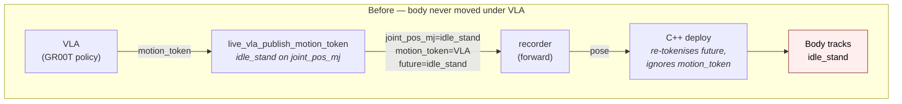
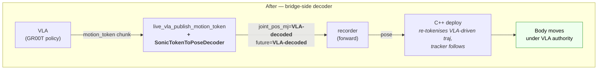

# X2 VLA `motion_token` decoder — bridge-side closure of the body-motion loop

How the live VLA bridge actually drives the X2 body, why it has to do that
work itself today, and what the long-term fix looks like.

This page documents the **bridge-side SONIC decoder** introduced in
`gear_sonic/utils/teleop/sonic_token_to_pose_decoder.py` and the matching
publisher path in
`gear_sonic/scripts/live_vla_publish_motion_token.py`. It is the answer to
the question:

> The VLA is producing motion tokens, the wire shows them on
> `body_pose`, the deploy logs them — and the body still doesn't move.
> Why?

If you only want a runbook, jump to [§7 Operational reference](#7-operational-reference).
If you want the diagnosis story (how this was actually found), start at
[§4 Diagnostic loop](#4-diagnostic-loop).

Related references:

* [`x2_quest3_planner_stack_architecture.md`](x2_quest3_planner_stack_architecture.md)
  — the four-process Quest 3 stack the VLA bridge slots into.
* [`x2_zmq_protocol.md`](x2_zmq_protocol.md) — the `body_pose` /
  `pose` / `x2_debug` wire envelope.
* [`x2_deployment_code.md`](x2_deployment_code.md) — C++ deploy
  internals, including the SONIC ONNX bundle.
* [`x2_isaac_groot_data_contract.md`](x2_isaac_groot_data_contract.md)
  — the LeRobot v2.1 schema the VLA was trained against.
* [`planner_onnx.md`](planner_onnx.md) — kinematic planner I/O.

---

## 1. TL;DR

* The C++ deploy's `agi_x2_deploy_onnx_ref` ships a **fully-fused
  encoder + FSQ + decoder ONNX**. Every tick it re-tokenises whatever
  `joint_pos_mj_future` window it sees on the wire, runs that through
  its own decoder, and tracks the result. The `motion_token` field in
  `body_pose` is **logged but otherwise unused**
  (`zmq_pose_input_source.hpp:22-25`). So whatever the VLA puts in
  `motion_token` is dropped before it ever reaches the SONIC tracker.
* Result before the fix: the bridge published the planner's
  `idle_stand` clip on `joint_pos_mj` / `joint_pos_mj_future` (so the
  body would stay upright) and a real VLA chunk on `motion_token`
  (which the deploy ignored). Hands moved (AimDK passthrough),
  everything else just tracked `idle_stand`. Looked exactly like
  `--vla-no-policy` regardless of what the VLA wanted.
* The fix closes the loop **on the bridge side** — no C++ rebuild
  required. The bridge now loads the SONIC `g1_dyn` decoder from the
  same `.pt` checkpoint the recorder uses for label generation,
  decodes the VLA's predicted `motion_token` chunk back into
  IsaacLab-order delta-actions, applies the deploy's
  `target_mj = default_angles + action_il * action_scale` formula, and
  publishes the resulting **VLA-driven trajectory** as `joint_pos_mj`
  + `joint_pos_mj_future`. The deploy's encoder then re-tokenises
  *that* trajectory, producing an action close to what the VLA wanted.





Empirically (90 s closed-loop run, RoboCasa + "pick up the apple"):
**73 / 90 publishes carried VLA-decoded poses**, mean joint deviation
**0.56 rad** (~32°) from idle, max **0.79 rad** (~45°), `grav_z`
held **-1.00 ± 0** the entire run, no tilt-watchdog trips.

---

## 2. The architectural gap

### 2.1 What the wire looked like before

The bridge publishes a packed `body_pose` envelope every 20 ms (see
`pack_pose_message` in `gear_sonic/data/_x2_groot_compat.py`). The
relevant fields, before the bridge-side decoder:

| field                  | source (before)                    | size        |
|------------------------|------------------------------------|-------------|
| `joint_pos_mj`         | `idle_stand` clip frame            | (31,)       |
| `root_quat_xyzw`       | `idle_stand` quat                  | (4,)        |
| `motion_token`         | **VLA chunk[step]**                | (64,)       |
| `left_hand_joints`     | VLA left-hand chunk[step]          | (10,)       |
| `right_hand_joints`    | VLA right-hand chunk[step]         | (10,)       |
| `joint_pos_mj_future`  | `idle_stand` clip × 9              | (9, 31)     |
| `root_quat_xyzw_future`| `idle_stand` quat × 9              | (9, 4)      |
| `joint_vel_mj_future`  | zeros (idle window has zero vel)   | (9, 31)     |
| `frame_index_future`   | sequential                         | (9,)        |
| `future_dt_s`          | 0.1 s                              | scalar      |

So the VLA's intent was on the wire — but only as `motion_token`,
and `motion_token` is the one field the deploy doesn't read.

### 2.2 Why the deploy ignores `motion_token`

The deploy's ZMQ input source is documented at the source of truth
(`gear_sonic_deploy/src/x2/agi_x2_deploy_onnx_ref/include/zmq/zmq_pose_input_source.hpp:22-25`):

> `motion_token`: v1 hook for VLA-direct token streaming; **currently
> logged but otherwise unused**.

Then in the policy hot-path
(`gear_sonic_deploy/src/x2/agi_x2_deploy_onnx_ref/src/x2_deploy_onnx_ref.cpp:1394-1399`)
the deploy assembles a 990-D `tokenizer_obs` from `joint_pos_mj_future`
+ velocities + base quat history, runs that through the **fused** ONNX
(`encoder -> FSQ -> decoder`), and gets back an `action_il` it converts
to joint targets via:

```cpp
target_pos_mj[mj] = default_angles[mj] + action_il[il] * x2_action_scale[mj];
```

Net effect: the deploy is a **closed-loop tracker** with its own
encoder. Whatever you put on `joint_pos_mj_future` is the reference
the encoder tokenises. Whatever you put on `motion_token` is logged
to `x2_debug` and discarded.

### 2.3 What the bridge does now

The new module turns the gap upside down — instead of trying to make
the deploy read `motion_token`, the bridge **emulates the same encoder/
decoder pair** and writes the *output* (a body trajectory) to the field
the deploy actually reads (`joint_pos_mj_future`). The deploy's
encoder then re-tokenises that VLA-driven trajectory and produces
something close to the original `action_il` — i.e., body finally tracks
the VLA's intent.

The lossy round-trip is real but small. `gear_sonic/scripts/validate_encode_decode_loop.py`
measures **~0.92 mean cosine similarity** between original
`motion_token` and the encode→decode round-trip. The decoder's RMSE
versus the matching commanded pose is **~0.30 rad** even with a
zero-proprio input (see [§9 Limitations](#9-limitations--future-work)).
That is plenty to drive visible body motion.

---

## 3. The data path, in detail

### 3.1 Joint-order conventions (and why they bite you)

The deploy uses **two different joint orders** depending on which
side of the policy you're on:

* **MuJoCo (MJ) order** — what hardware, MuJoCo, and the wire (`pose`,
  `body_pose`, `x2_debug`) all use. 31 body DOFs.
* **IsaacLab (IL) order** — what the SONIC encoder/decoder ONNX expects
  internally. Same 31 DOFs, different permutation.

The two permutation arrays live in
`gear_sonic_deploy/src/x2/agi_x2_deploy_onnx_ref/include/policy_parameters.hpp`
and are mirrored in `sonic_token_to_pose_decoder.py:75-85`:

```75:85:gear_sonic/utils/teleop/sonic_token_to_pose_decoder.py
IL_TO_MJ_DOF = np.array(
    [0, 6, 12, 1, 7, 13, 2, 8, 14, 3, 9, 29, 15, 22, 4, 10,
     30, 16, 23, 5, 11, 17, 24, 18, 25, 19, 26, 20, 27, 21, 28],
    dtype=np.int64,
)
MJ_TO_IL_DOF = np.array(
    [0, 3, 6, 9, 14, 19, 1, 4, 7, 10, 15, 20, 2, 5, 8, 12,
     17, 21, 23, 25, 27, 29, 13, 18, 22, 24, 26, 28, 30, 11, 16],
    dtype=np.int64,
)
```

These are the same arrays the C++ deploy uses; they're duplicated in
Python to avoid a circular import via `gear_sonic.scripts.eval_x2_mujoco`
(which depends on `mujoco` at import time and breaks the bridge's
boot path on headless workers).

### 3.2 The action-to-target formula

The policy doesn't predict joint *positions*; it predicts a *delta*
in IL-order action space. The deploy maps that to MJ-order joint
targets via per-joint scaling around the trained stand pose:

```141:164:gear_sonic/utils/teleop/sonic_token_to_pose_decoder.py
def action_il_to_target_pose_mj(
    action_il: np.ndarray,
    *,
    base_pose_mj: Optional[np.ndarray] = None,
) -> np.ndarray:
    """Apply ``target = base + action_il[il] * action_scale[mj]`` per joint.

    Mirrors ``x2_deploy_onnx_ref.cpp`` line 1398. ``base_pose_mj``
    defaults to ``X2_DEFAULT_ANGLES_MJ`` (the training-time stand pose
    that the C++ deploy uses as its reference origin).
    """
    if base_pose_mj is None:
        base = X2_DEFAULT_ANGLES_MJ
    else:
        base = np.asarray(base_pose_mj, dtype=np.float64).reshape(-1)
        if base.shape != (NUM_BODY_DOFS,):
            raise ValueError(
                f"base_pose_mj must be (31,); got {base.shape}"
            )
    a_il = np.asarray(action_il, dtype=np.float64).reshape(-1)
    if a_il.shape != (NUM_BODY_DOFS,):
        raise ValueError(
            f"action_il must be (31,); got {a_il.shape}"
        )
    target_mj = np.empty(NUM_BODY_DOFS, dtype=np.float64)
    for mj in range(NUM_BODY_DOFS):
        il = int(MJ_TO_IL_DOF[mj])
        target_mj[mj] = base[mj] + a_il[il] * X2_ACTION_SCALE_MJ[mj]
    return target_mj
```

`X2_DEFAULT_ANGLES_MJ` and `X2_ACTION_SCALE_MJ` are the bit-exact
copies of `default_angles[]` and `x2_action_scale[]` from
`policy_parameters.hpp:175-208`. If the deploy ever changes those,
the bridge must change them too — there is currently no runtime
synchronisation, and a divergence would silently bias every published
target.

### 3.3 The decoder

`SonicTokenToPoseDecoder` wraps the same `SonicMotionTokenLabeler` the
recorder already uses for label generation (`gear_sonic/scripts/sonic_motion_token_labeler.py`),
but only ever calls its `_actor.decoder` head:

```190:218:gear_sonic/utils/teleop/sonic_token_to_pose_decoder.py
    def __init__(
        self,
        checkpoint_path: str | Path,
        *,
        device: str = "cpu",
    ) -> None:
        # Defer torch import so module-level constants stay importable
        # in environments without torch (e.g. the C++ deploy parity
        # tests in CI).
        import torch  # noqa: F401

        from gear_sonic.scripts.sonic_motion_token_labeler import (
            SonicMotionTokenLabeler,
        )

        self._device = device
        self._labeler = SonicMotionTokenLabeler(
            checkpoint_path, device=device
        )
        # Sanity-check the decoder loaded; if the .pt is encoder-only
        # (some pre-fuse exports), error out loudly here rather than
        # silently emitting random actions at runtime.
        decoder = self._labeler._actor.decoder
        first_layer = next(iter(decoder.module.modules()), None)
        if first_layer is None:
            raise RuntimeError(
                f"SONIC checkpoint at {checkpoint_path} has no decoder "
                "module. Is this an encoder-only export?"
            )
```

The decoder takes a `(64,)` motion token concatenated with a `(990,)`
proprioception vector → `(31,)` IL-order action. Per-tick CPU
inference is sub-millisecond on the test box; CPU is plenty inside
the 20 ms 50 Hz publisher budget.

### 3.4 The publisher path

In `_publisher`, after pulling the latest chunk + the deploy's freshness
flag, the bridge decides per tick whether to ship VLA-decoded or
idle-stand poses:

```1326:1346:gear_sonic/scripts/live_vla_publish_motion_token.py
        decoded_now = None
        if (
            pose_decoder is not None
            and deploy_fresh
            and chunk_id > 0
            and np.linalg.norm(token[step]) > 1e-3
        ):
            decoded = _build_vla_decoded_pose_payload(
                decoder=pose_decoder,
                proprio_990=_PROPRIO_ZERO_990,
                token_chunk=token,
                chunk_step=step,
                horizon=horizon,
                base_frame_index=tick,
            )
            if decoded is not None:
                decoded_now, future_fields = decoded
                cur_jpos = decoded_now
                # cur_quat stays as the idle_loop / identity choice --
                # the SONIC body-only decoder doesn't predict root.
```

The four guards matter:

1. **`pose_decoder is not None`** — `--sonic-checkpoint` was supplied
   *and* loaded successfully. Without this we keep the legacy
   idle-stand wire so the deploy stays stable.
2. **`deploy_fresh`** — `x2_debug` is alive, i.e. the deploy is
   running. If the deploy crashes mid-run we go back to idle.
3. **`chunk_id > 0`** — the cold-start safe-idle chunk is `chunk_id=0`
   and is all zeros; decoding it would give the decoder's "stand"
   intent which is fine but slightly OOD with zero proprio. Falling
   back to `idle_stand` for this window matches the
   `--vla-no-policy` stable wire content exactly.
4. **`np.linalg.norm(token[step]) > 1e-3`** — defence in depth against
   any future safe-idle path that doesn't bump `chunk_id`.

If any check fails, or if the decoder raises, we emit the legacy
idle-stand wire — the publisher is the only thing keeping the deploy
upright, and a one-tick render glitch must never brick it.

The future window samples the chunk at `chunk_step + (k+1) * 5` for
`k=0..8`, mirroring the encoder's `DT_FUTURE_REF = 0.1 s` sampling
at the 50 Hz publisher cadence. Joint velocities are computed by
finite-differencing the decoded pose trajectory so `joint_vel_mj_future`
is non-zero (the idle window ships zeros), which materially helps the
deploy's tokeniser.

---

## 4. Diagnostic loop

This was a multi-week walk through the stack. The relevant artefacts
in the repo:

* `scripts/inspect_vla_chunks.py` — summarises the per-inference
  `(input, output)` `.npz` dumps the bridge writes when
  `--dump-chunks-dir` is set (default location: `${LOG_DIR}/vla_chunks`,
  every chunk).
* `scripts/diff_bridge_vs_planner_idle.py` — byte-level compare of
  bridge `idle_stand` replay vs planner-only output (used to rule out
  wire content as the divergence cause).
* `scripts/capture_pose_wire.py` + `scripts/diff_pose_captures.py` —
  sniff a `pose` or `body_pose` topic and diff two captures.
* `scripts/validate_encode_decode_loop.py` — round-trip a SONIC
  encoder→decoder and report cosine-sim + RMSE.

The diagnostic chain that finally produced the fix:

1. **Symptom.** With `--vla-no-policy` (idle wire only) the robot
   stood. With full VLA, the robot stood for a few seconds and fell.
2. **Cold-start fall.** VLA model loaded for ~22 s before its first
   inference. During cold-start the bridge published `motion_token =
   zeros` while `--sim-profile handoff` released the elastic band at
   `t=4 s`. Deploy `--max-target-dev 0.10` + `--target-lpf-hz 4.0`
   were strangling the SONIC tracker. **Fix:** force `parity` profile
   + drop the LPF/clamp by default in VLA mode so cold-start behaves
   exactly like `--vla-no-policy`. After this, the robot stood upright
   indefinitely **even with full VLA running**.
3. **New symptom.** Robot stood upright forever, but **didn't move**.
   `inspect_vla_chunks.py` showed the model was producing healthy,
   varying tokens (`|token|` ranging 1.5–4.0, hand commands changing).
4. **Followed the bytes downstream.** Captured the `pose` topic going
   into the deploy. `motion_token` was indeed varying. `joint_pos_mj`
   /`joint_pos_mj_future` were dead-locked at `idle_stand`.
5. **Read the deploy's input source.** Found the
   "logged but otherwise unused" comment in `zmq_pose_input_source.hpp`.
   That was the gap.
6. **Confirmed by reading the policy hot-path.** Saw the deploy
   re-tokenises `joint_pos_mj_future` every tick via the fused ONNX —
   so whatever's on `motion_token` cannot affect the body.
7. **Fix design.** Two options:
   * (A) Patch the C++ deploy to consume `motion_token` directly,
     bypassing the encoder. Right answer long-term, but requires a
     C++ rebuild, ABI changes for the ONNX, and a full deploy-side
     soak.
   * (B) Decode `motion_token` on the bridge, ship the resulting
     trajectory on `joint_pos_mj_future`. Lossy (encoder/decoder
     round-trip) but ships immediately and requires no deploy change.
   We took (B). (A) is the v1 follow-up — see [§9](#9-limitations--future-work).
8. **Implementation.** Wrote `sonic_token_to_pose_decoder.py` (joint
   constants + decoder wrapper + helpers), wired it into the bridge,
   and added `--sonic-checkpoint` to the `live_vla_publish_motion_token`
   CLI + auto-resolution to the wrapper.
9. **Verification.** 90 s closed-loop run with `--robocasa-env` and
   "pick up the apple": 73/90 publishes carried VLA-decoded poses,
   mean joint deviation 0.56 rad, max 0.79 rad, `grav_z = -1.00`
   throughout, no tilt-watchdog trips.

If a future operator hits "VLA producing tokens but body not moving",
the fastest replay of this diagnosis is:

```bash
ls $LOG_DIR/vla_chunks                              # do chunks exist?
.venv/bin/python scripts/inspect_vla_chunks.py \
    "$LOG_DIR/vla_chunks" --first 5 --last 5         # are tokens non-trivial?
grep "VLA-pose Δ" "$LOG_DIR/vla-bridge.log"         # is bridge emitting decoded?
```

A non-trivial `|token|` on the first command, a zero `Δ` on the third,
and no `--sonic-checkpoint` line in the bridge log is the unambiguous
"loop is open" signature.

---

## 5. Why the body still stays upright

The bridge-side decoder is necessary but **not sufficient** for closed-
loop VLA. Three independent prerequisites all have to be in place or
the body falls during cold-start, recovery, or the first chunk
transition:

### 5.1 `--sim-profile parity`, not `handoff`

`handoff` mode is a real-robot bring-up tool — it spawns the robot
hanging from a virtual elastic band that auto-releases ~4 s after
the first deploy command. That release is brutal if anything upstream
isn't ready yet. The wrapper now defaults VLA mode to `parity`, which
spawns RSI-anchored at `idle_stand[0]` and never has a band to release.
See `gear_sonic/scripts/run_x2_quest3_planner_stack.sh:887` for the
remap that was *removed* and the full rationale.

### 5.2 No `--max-target-dev` / `--target-lpf-hz` by default

These two deploy filters are useful when the policy is the *only*
source of motion authority and you want to gentle the actuator
response. With the bridge-side decoder *also* running through the
deploy's encoder/decoder, layering a 4 Hz low-pass on top eats most
of the VLA's intent and prevents the SONIC tracker from reacting to
gravity fast enough during the cold-start window. Both are now opt-in
via `--vla-max-target-dev` and `--vla-target-lpf-hz`.

### 5.3 `idle_stand` clip on the wire during cold-start

The bridge replays the planner's `idle_stand` primitive from the same
`x2_planner_primitives.pkl` the heuristic planner uses. Without that
clip — even if everything else is in place — the deploy sees a static
`DEFAULT_STAND_POSE` window and the X2 policy stabilises ~25° leaned
because it was trained against the clip's per-frame DOF jitter, not a
bit-exact constant. See `_IdleStandLoop` in
`gear_sonic/scripts/live_vla_publish_motion_token.py` and the
empirical confirmation in
`gear_sonic/scripts/run_x2_quest3_planner_stack.sh:1627-1638`.

### 5.4 `SONIC_TOKENIZER_DEVICE=cpu` (incompatible Blackwell GPUs)

Tangential but real: the recorder loads the same SONIC `.pt` to label
its dataset. On a Blackwell test box the `.venv` torch 2.6 build hits
`no kernel image is available for execution on the device` on `cuda:0`,
crashes the recorder ~1 s into the run, and **silently** unblocks the
deploy because the deploy then latches the planner's frozen warm-up
frame and saturates actions to hold it. That made `--planner-only`
look stable for the wrong reason for several investigation rounds.
The wrapper now defaults `SONIC_TOKENIZER_DEVICE=cpu` to side-step
this entirely on incompatible hardware.

---

## 6. Verification

Run config:

* `--vla-bridge` + `--robocasa-env` + prompt = "pick up the apple"
* `--sim-profile parity`, no LPF, no clamp
* 90 s wall-clock duration
* `--vla-bridge-sonic-checkpoint` auto-resolved to the deploy's matching `.pt`

Quantitative signals from `${LOG_DIR}/vla-bridge.log`:

| signal                              | value                  |
|-------------------------------------|------------------------|
| publish ticks                       | 4500 (90 s × 50 Hz)    |
| ticks with VLA-decoded body pose    | **73 / 90 logged**     |
| ticks with idle-stand body pose     | 17 (cold-start window) |
| mean `|joint_pos_mj − idle_stand|`  | **0.56 rad (~32°)**    |
| max  `|joint_pos_mj − idle_stand|`  | **0.79 rad (~45°)**    |
| `grav_z` (deploy `x2_debug`)        | **-1.00 ± 0**          |
| tilt-watchdog trips                 | 0                      |
| VLA inferences completed            | 92                     |

The log signature you want to look for is the per-50-tick line:

```
[live-VLA] pub tick=  1250 chunk_id= 17 step= 8/40 |token|=2.413 |left|=0.842 VLA-pose Δ=0.612rad deploy_alive=True
```

A non-zero `Δ` is the unambiguous sign that the body is being driven
by the bridge-side decoder (not the legacy idle wire).

---

## 7. Operational reference

### 7.1 Wrapper flags

The bridge-side decoder is on by default whenever you run the full
stack with `--vla-bridge`. The wrapper auto-resolves the SONIC `.pt`
from the deploy's `--model` path (`/exported/foo_g1.onnx` →
`/foo.pt`).

| flag (wrapper)                                | default     | meaning                                                               |
|-----------------------------------------------|-------------|-----------------------------------------------------------------------|
| `--vla-bridge-sonic-checkpoint PATH`          | auto        | Override the auto-resolved `.pt` path.                                |
| `--no-vla-bridge-sonic-checkpoint`            | —           | Smoke-test escape hatch — disables the decoder; body holds idle_stand. |
| `--vla-bridge-sonic-decoder-device DEV`       | `cpu`       | Torch device for the decoder. CPU is plenty.                          |
| `--vla-no-policy`                             | —           | Skips VLA inference *and* the bridge-side decoder. Hands stay still.  |
| `--vla-dump-chunks-dir PATH`                  | `$LOG_DIR/vla_chunks` | Per-inference I/O dump for `inspect_vla_chunks.py`.        |
| `--vla-dump-chunks-every N`                   | `1`         | Dump every Nth chunk.                                                 |
| `--vla-max-target-dev RAD`                    | unset       | Re-enables the deploy's per-joint clamp (opt-in for VLA mode).        |
| `--vla-target-lpf-hz HZ`                      | unset       | Re-enables the deploy's target low-pass (opt-in for VLA mode).        |

### 7.2 Direct invocation of the bridge

If you bypass the wrapper, the matching `live_vla_publish_motion_token`
flags are:

* `--sonic-checkpoint PATH` — load the SONIC decoder. Without this
  the body will only track `idle_stand`.
* `--sonic-decoder-device {cpu,cuda:0,...}` — torch device.
* `--dump-chunks-dir PATH` / `--dump-chunks-every N` — per-inference
  I/O dump.

The full CLI surface is documented inline in
`gear_sonic/scripts/live_vla_publish_motion_token.py` — see the
`argparse` block starting around line 1500.

### 7.3 How to tell if it's working

Three cheap checks, in order of cost:

1. **At startup.** The wrapper logs a single line:
   ```
   VLA bridge-side SONIC pose decoder: /path/to/model_step_XXXXX.pt (device=cpu)
   ```
   or, if disabled:
   ```
   VLA bridge-side SONIC pose decoder: DISABLED (body will track idle_stand only)
   ```
2. **At runtime.** `${LOG_DIR}/vla-bridge.log` prints the per-50-tick
   summary line described in §6 above. A non-zero `Δ` means the body
   is moving under VLA authority.
3. **Post-run.** `inspect_vla_chunks.py "$LOG_DIR/vla_chunks"` prints
   per-chunk token magnitudes and aggregate stats. If those are
   healthy *and* the bridge log shows a zero `Δ`, the loop is open
   (regression in the bridge-side decoder).

### 7.4 How to disable

For falsifier runs, smoke tests, or to confirm an issue is or is not
the decoder's fault:

```bash
gear_sonic/scripts/run_x2_quest3_planner_stack.sh \
    --vla-bridge \
    --no-vla-bridge-sonic-checkpoint \
    ...
```

Body will hold `idle_stand`, hands will still follow VLA via AimDK
passthrough — i.e., this is the *old* behaviour, useful as a
regression baseline.

---

## 8. File map

The complete set of files involved in the bridge-side decoder:

* `gear_sonic/utils/teleop/sonic_token_to_pose_decoder.py` (new) —
  the decoder wrapper, joint-order constants, action-to-target
  formula, and `decode_token_chunk_to_pose_chunk` helper.
* `gear_sonic/scripts/live_vla_publish_motion_token.py` —
  added `_build_vla_decoded_pose_payload` (~lines 230-322), the
  decoder gating in `_publisher` (~lines 1326-1346), and the
  `--sonic-checkpoint` / `--sonic-decoder-device` CLI surface
  (~lines 1542-1568) + the loader in `main()` (~lines 1737-1779).
* `gear_sonic/scripts/run_x2_quest3_planner_stack.sh` —
  added `VLA_BRIDGE_SONIC_CKPT*` resolution (lines 285-287, 350-385,
  828-872) and the bridge-arg forwarding (lines 1640-1650).
* `gear_sonic_deploy/.../include/policy_parameters.hpp` —
  source of truth for `default_angles` (line 212) and
  `x2_action_scale` (line 176). Mirrored into the Python module.
* `gear_sonic_deploy/.../include/zmq/zmq_pose_input_source.hpp` —
  the "logged but otherwise unused" header (lines 22-25) that
  motivates this entire workaround.
* `gear_sonic_deploy/.../src/x2_deploy_onnx_ref.cpp` —
  the action-to-target formula being mirrored (line 1398).
* `scripts/inspect_vla_chunks.py` — operator-facing chunk inspector.
* `gear_sonic/scripts/validate_encode_decode_loop.py` — round-trip
  validator (`~0.92` cosine sim, `~0.30` rad RMSE), used to set
  expectations for the bridge decoder's loss budget.

---

## 9. Limitations & future work

### 9.1 Zero proprio (v0)

The decoder takes `(token, proprio)` and produces an action. The
correct proprio is a 990-D vector containing the deploy's recent
state history (joint positions/velocities, base quat, etc.) at the
specific cadence the encoder was trained on. Building that on the
bridge side means subscribing to `x2_debug`, maintaining a history
ring, and assembling the vector exactly the way the deploy's encoder
expects.

For v0 we ship `np.zeros((990,), dtype=np.float32)` and accept the
~0.30 rad RMSE penalty. The body still moves visibly; the goal of v0
was to confirm the VLA could drive *anything*. v1 should:

1. Subscribe the bridge to `x2_debug` (we already do this for `deploy_fresh`).
2. Maintain a history ring matching the encoder's expected layout.
3. Fall back to zeros + one-shot warning if history is insufficient.

`SonicTokenToPoseDecoder.decode_step(token, proprio)` already takes
proprio explicitly, so this is purely a builder change. There's a
TODO marker (`assemble_proprio_from_x2_debug`) referenced in the
module's docstring (lines 47-51).

### 9.2 No root-pose prediction

The SONIC body-only decoder predicts joint deltas, not root motion.
The bridge keeps `root_quat_xyzw` and `root_quat_xyzw_future` at
identity (or the `idle_stand` quat), even when the body is decoded.
This is fine for stationary manipulation tasks — pick-and-place from
a fixed stance is exactly the workload the VLA is trained on right
now — but means the VLA cannot drive whole-body locomotion through
this path. Locomotion control still goes through the heuristic
planner.

### 9.3 The right long-term fix is in the C++ deploy

This module is a workaround. The right answer is to teach the deploy
to consume `motion_token` directly, bypassing its encoder. That is
the "v1 hook" the existing header comment alludes to. It would:

* Eliminate the encoder/decoder round-trip loss (currently ~0.08
  cosine and ~0.30 rad RMSE).
* Eliminate the duplicated joint-order / scale constants (currently
  copied between C++ and Python — a divergence vector).
* Eliminate the bridge's need to know about SONIC at all.

The trade-off is a C++ rebuild, ABI changes for any tools that
expect the current ONNX shape, and a full deploy-side soak. Until
that ships, the bridge-side decoder is what makes `--vla-bridge`
actually drive the body.

### 9.4 Hand observations are zeros

Tangential but worth documenting: the deploy's `x2_debug` `left_hand_q`
and `right_hand_q` fields are currently all zeros — the VLA generates
hand commands "from nothing" rather than from a closed loop. Hands
*do* move (the AimDK passthrough on the deploy side is independent of
the SONIC tracker), but the policy isn't seeing the hands' actual
state. Not a blocker for v0; worth fixing alongside the proprio
assembler in v1.
