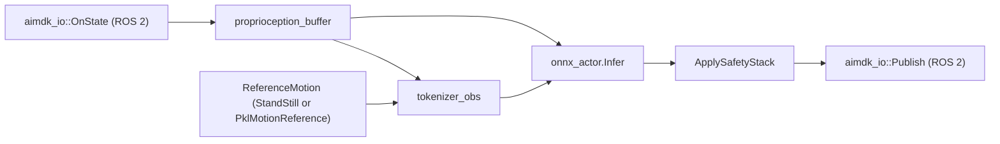
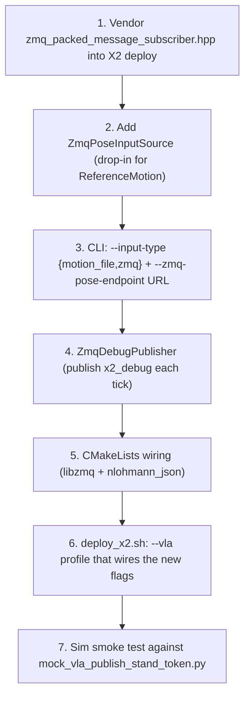

# X2 deploy: C++ ZMQ port handoff plan

This document is the executable handoff for porting the G1 deploy's ZMQ
input/output stack to the X2 Ultra deploy
(`gear_sonic_deploy/src/x2/agi_x2_deploy_onnx_ref/`). It is intentionally
narrow: everything outside the C++ deploy binary -- Python helpers,
modality configs, Isaac-GR00T contract, ZMQ wire format, autoencoder
smoke-test methodology -- is already in place from M0 and M2.

The Python side and the wire protocol are already validated end-to-end
in this session:

- `tests/test_zmq_pose_loopback.py` -- 8/8 PASS
- `tests/test_groot_contract.py` -- GREEN
- `tests/test_x2_ultra_robot_model.py` -- 13/13 PASS
- `gear_sonic/scripts/mock_vla_publish_stand_token.py` ↔
  `gear_sonic/scripts/dump_x2_debug.py` -- end-to-end Python loopback verified.

What remains is to teach the C++ deploy to **consume** that wire format
in place of `--motion PATH` and to **emit** `x2_debug` snapshots from
the same control tick. This is the gating work for M2 (acceptance gate
"mock-VLA drives a standing X2 in MuJoCo with the C++ deploy in zmq mode").

The plan below is small enough to fit in a single follow-up session.

## 1. State of the world

### 1.1 Existing X2 deploy entry-point

[`gear_sonic_deploy/src/x2/agi_x2_deploy_onnx_ref/src/x2_deploy_onnx_ref.cpp`](../../../gear_sonic_deploy/src/x2/agi_x2_deploy_onnx_ref/src/x2_deploy_onnx_ref.cpp)
already implements the full real-time loop:



CLI parsing is hand-rolled in `ParseCli` (lines 356-404 of
`x2_deploy_onnx_ref.cpp`). Reference motion comes from `--motion PATH`;
empty path falls back to `StandStillReference`.

The X2 deploy supports both **real** and **sim** modes via the same
binary -- the sim path replaces the AimDK IO with
`gear_sonic_deploy/scripts/x2_mujoco_ros_bridge.py` so the deploy
talks to MuJoCo over the same ROS 2 topics as on the real robot.
See [`docs/source/tutorials/vla_training.md`](../tutorials/vla_training.md)
for the full mode matrix.

### 1.2 G1 deploy ZMQ stack to port

The G1 deploy already implements the target architecture:

- [`gear_sonic_deploy/src/g1/g1_deploy_onnx_ref/include/input_interface/zmq_packed_message_subscriber.hpp`](../../../gear_sonic_deploy/src/g1/g1_deploy_onnx_ref/include/input_interface/zmq_packed_message_subscriber.hpp)
  -- low-level [topic][1280-byte JSON header][binary] decoder. Includes
  `HEADER_SIZE = 1280` and `nlohmann::json` parsing of `metadata` /
  `data` blocks.
- [`gear_sonic_deploy/src/g1/g1_deploy_onnx_ref/include/input_interface/zmq_endpoint_interface.hpp`](../../../gear_sonic_deploy/src/g1/g1_deploy_onnx_ref/include/input_interface/zmq_endpoint_interface.hpp)
  -- streamed-motion path (consumes `pose` topic).
- [`gear_sonic_deploy/src/g1/g1_deploy_onnx_ref/include/input_interface/zmq_manager.hpp`](../../../gear_sonic_deploy/src/g1/g1_deploy_onnx_ref/include/input_interface/zmq_manager.hpp)
  -- top-level mux that switches between `command` / `planner` / `pose`
  topics and exposes a unified `InputInterface`. Heavily tied to G1's
  17-DOF upper body and locomotion planner.

### 1.3 Python-side validation (already done)

Documented in [`docs/source/references/x2_zmq_protocol.md`](x2_zmq_protocol.md).
Loopback test:

```
.venv/bin/python -m pytest tests/test_zmq_pose_loopback.py -v
# => 8 passed
```

End-to-end mock-VLA sanity:

```
# Terminal A
.venv/bin/python gear_sonic/scripts/mock_vla_publish_stand_token.py \
    --bind tcp://127.0.0.1:5556 --hand-dof 10 --hz 50

# Terminal B
.venv/bin/python gear_sonic/scripts/dump_x2_debug.py \
    --connect tcp://127.0.0.1:5556 --topic pose --max 100
```

## 2. Design constraints from the prior session

These were settled with the user and must NOT be re-litigated:

1. **No kinematic planner for X2 in v0.** VLA streams motion tokens
   directly over ZMQ Protocol-v4 (64-D motion token + 20-D hand joints).
   Documented in
   [`docs/source/tutorials/vla_training.md#future-planner-enhancements`](../tutorials/vla_training.md).
   This means the X2 deploy needs only the `pose` topic (Protocol-v4)
   -- the G1 `command` / `planner` mux logic is **out of scope**.
2. **Two hand variants.** 7-DOF (G1-compatible) and 10-DOF (full
   OmniHand). Names + limits live in
   [`gear_sonic/data/robot_model/supplemental_info/x2_ultra/x2_ultra_supplemental_info.py`](../../../gear_sonic/data/robot_model/supplemental_info/x2_ultra/x2_ultra_supplemental_info.py).
3. **Both real and sim deploys** use the same C++ binary; sim mode
   talks to MuJoCo through `x2_mujoco_ros_bridge.py`. The new ZMQ I/O
   must therefore work identically in both.
4. **Wire format is frozen.** `HEADER_SIZE = 1280` JSON header +
   concatenated little-endian `float32` blobs. See
   [`docs/source/references/x2_zmq_protocol.md`](x2_zmq_protocol.md).
5. **Command discipline.** Every shell invocation that could hang
   (`mujoco run`, `docker build`, `colcon build`, etc.) must be wrapped
   in `timeout` with a sane bound. Mirrors the rule in
   [`docs/source/tutorials/vla_training.md#command-execution-discipline`](../tutorials/vla_training.md).

## 3. Concrete C++ work breakdown

Estimated total: 2-4 hours of focused C++ work + a 30 min sim smoke test.



### 3.1 Vendor `ZMQPackedMessageSubscriber` into X2 tree

- Copy
  `gear_sonic_deploy/src/g1/g1_deploy_onnx_ref/include/input_interface/zmq_packed_message_subscriber.hpp`
  to
  `gear_sonic_deploy/src/x2/agi_x2_deploy_onnx_ref/include/zmq/zmq_packed_message_subscriber.hpp`.
- Strip G1-specific includes; keep only `<zmq.hpp>` + `<nlohmann/json.hpp>`
  + STL.
- Verify `HEADER_SIZE = 1280` is preserved verbatim. The Python loopback
  test pads the JSON header to exactly this size; mismatching here is
  the most common porting bug.

### 3.2 Add `ZmqPoseInputSource`

Create `include/zmq/zmq_pose_input_source.hpp` + `src/zmq_pose_input_source.cpp`.
The class is a drop-in alternative to `PklMotionReference` /
`StandStillReference` -- it implements the same interface (whatever
`onnx_actor` consumes today) but pulls each frame from a ZMQ SUB socket
instead of a `.pkl` motion file.

Required methods (mirror `ReferenceMotion`):

```cpp
class ZmqPoseInputSource {
 public:
  static std::unique_ptr<ZmqPoseInputSource> Connect(
      const std::string& endpoint,            // e.g. "tcp://127.0.0.1:5556"
      const std::string& topic = "pose",
      int                hand_dof = 10);

  // Block (with timeout) until the next pose frame is available.
  // Returns false on timeout or socket error -- caller falls back
  // to last-good frame and bumps the safety watchdog.
  bool TryRecv(double timeout_seconds);

  // Latest decoded payload, valid after a successful TryRecv.
  // Sized to match the Python `pack_pose_message` schema:
  //     motion_token: float32[64]
  //     hand_joints:  float32[2 * hand_dof]
  std::span<const float> motion_token() const noexcept;
  std::span<const float> hand_joints()  const noexcept;
  int64_t frame_index() const noexcept;
};
```

Implementation notes:

- Use a `zmq::context_t` shared with `ZmqDebugPublisher` (one context
  per process; `zmq::socket_t` per channel).
- Subscribe filter is the topic name as bytes (matches the Python
  `socket.subscribe(topic)` call in `mock_vla_publish_stand_token.py`).
- Decode the JSON header with `nlohmann::json::parse(header_view)`.
  Expected fields: `topic`, `dtype` (must be `float32`), `data`
  (array of `{name, shape}` entries). Reject anything else with a
  log line + dropped frame -- never silently coerce.
- The ZMQ socket must be opened with
  `socket.set(zmq::sockopt::rcvtimeo, …)` so `TryRecv` is bounded.

### 3.3 CLI plumbing in `x2_deploy_onnx_ref.cpp`

In `struct CliArgs`, add:

```cpp
std::string input_type = "motion_file";  // or "zmq"
std::string zmq_pose_endpoint;           // tcp://host:5556
std::string zmq_debug_endpoint;          // tcp://*:5557 (bind)
int         hand_dof = 10;
```

In `ParseCli`, add the matching `--input-type`, `--zmq-pose-endpoint`,
`--zmq-debug-endpoint`, `--hand-dof` cases. Reject `--motion` when
`input_type == "zmq"` with a clear error message.

In `X2Deploy::X2Deploy(...)`, replace:

```cpp
if (cli.motion_path.empty()) {
  ref_motion_ = std::make_unique<StandStillReference>();
} else {
  ref_motion_ = PklMotionReference::Load(cli.motion_path);
}
```

with:

```cpp
if (cli.input_type == "zmq") {
  ref_motion_ = ZmqPoseInputSource::Connect(
      cli.zmq_pose_endpoint, /*topic=*/"pose", cli.hand_dof);
} else if (cli.motion_path.empty()) {
  ref_motion_ = std::make_unique<StandStillReference>();
} else {
  ref_motion_ = PklMotionReference::Load(cli.motion_path);
}
```

This requires `ZmqPoseInputSource` to inherit (or duck-type via a
common base) the same interface `PklMotionReference` exposes. If
`ReferenceMotion` is not a virtual base today, introduce a thin
`IReferenceMotion` interface containing only the methods
`x2_deploy_onnx_ref.cpp` actually calls -- keep the diff minimal.

### 3.4 `ZmqDebugPublisher` (port 5557)

Same shape as `ZmqPoseInputSource` but on the publish side. Each
control tick (after `safety::ApplySafetyStack` produces
`sc.target_pos_mj`) the deploy publishes one packed message on topic
`x2_debug`:

```
metadata: { tick: int64, state: str, safety_event: optional[str] }
data:
  joint_pos:    float32[31]
  joint_vel:    float32[31]
  target_pos:   float32[31]
  hand_joints:  float32[2 * hand_dof]
  imu:          float32[3 + 3 + 4]   # gyro + accel + quat
```

Schema must match `gear_sonic/scripts/dump_x2_debug.py` -- the
Python decoder is the authoritative wire reader.

Performance budget: at 50 Hz with ~700 floats per message, this is
~140 KB/s. ZMQ TCP is fine here; do **not** introduce shared memory
for v0.

### 3.5 CMake / build wiring

- Add `find_package(cppzmq REQUIRED)` and `find_package(nlohmann_json REQUIRED)`
  to `gear_sonic_deploy/src/x2/agi_x2_deploy_onnx_ref/CMakeLists.txt`.
- Link the binary against `cppzmq::cppzmq` and `nlohmann_json::nlohmann_json`.
- Mirror what the G1 deploy's CMake already does (search for
  `cppzmq` in
  `gear_sonic_deploy/src/g1/g1_deploy_onnx_ref/CMakeLists.txt`).

Build with `colcon`:

```
timeout 600 colcon build \
  --packages-select agi_x2_deploy_onnx_ref \
  --cmake-args -DCMAKE_BUILD_TYPE=Release
```

### 3.6 `deploy_x2.sh` profile

Add a new profile (e.g. `--vla`) that emits flags equivalent to:

```
--input-type zmq \
--zmq-pose-endpoint tcp://127.0.0.1:5556 \
--zmq-debug-endpoint tcp://0.0.0.0:5557 \
--hand-dof 10 \
--motion ""
```

Existing `--sim` and `--real` profiles continue to work unchanged.

### 3.7 Sim smoke test (acceptance gate for M2)

```
# Terminal A: MuJoCo bridge (sim mode)
timeout 600 .venv/bin/python gear_sonic_deploy/scripts/x2_mujoco_ros_bridge.py \
    --xml gear_sonic/data/assets/robot_description/mjcf/x2_ultra.xml

# Terminal B: mock-VLA publishes stand token
timeout 600 .venv/bin/python gear_sonic/scripts/mock_vla_publish_stand_token.py \
    --bind tcp://0.0.0.0:5556 --hand-dof 10 --hz 50

# Terminal C: telemetry
timeout 600 .venv/bin/python gear_sonic/scripts/dump_x2_debug.py \
    --connect tcp://127.0.0.1:5557 --topic x2_debug --max 500

# Terminal D: deploy with the new --vla profile
timeout 600 ./gear_sonic_deploy/scripts/deploy_x2.sh --sim --vla \
    --model /path/to/22k_sonic.onnx
```

Pass criteria:

- `dump_x2_debug.py` reports joint drift below 0.05 rad relative to
  `default_angles` while the mock-VLA streams the constant standing
  token.
- No safety events (`tilt_cos` watchdog stays below threshold).
- Deploy logs show `[ZmqPoseInputSource] frame_index=…` advancing
  monotonically at 50 Hz.

## 4. What is explicitly out of scope for this port

- **Full G1 `ZMQManager` mux.** We do not need the `command` / `planner`
  topics for v0. The X2 stack listens only to `pose`.
- **ONNX model splitting.** The 22k SONIC checkpoint is used as-is on
  the X2 side; head/torso decoder splitting (Isaac-GR00T-N1.7's split
  trick) is an M5/M6 concern.
- **OmniHand IK.** Hand commands flow through ZMQ as joint targets and
  are forwarded to AimDK HAL verbatim. No retargeting in C++.
- **Quest3 teleop.** M8 (post-VLA-validation milestone). The Python
  tooling is ready (`mock_vla_publish_stand_token.py` is a stand-in);
  Quest3 plugs into the same `pose` topic shape later.

## 5. Files to create / modify (full list)

New (create):

- [`gear_sonic_deploy/src/x2/agi_x2_deploy_onnx_ref/include/zmq/zmq_packed_message_subscriber.hpp`](../../../gear_sonic_deploy/src/x2/agi_x2_deploy_onnx_ref/include/zmq/zmq_packed_message_subscriber.hpp)
- [`gear_sonic_deploy/src/x2/agi_x2_deploy_onnx_ref/include/zmq/zmq_pose_input_source.hpp`](../../../gear_sonic_deploy/src/x2/agi_x2_deploy_onnx_ref/include/zmq/zmq_pose_input_source.hpp)
- [`gear_sonic_deploy/src/x2/agi_x2_deploy_onnx_ref/include/zmq/zmq_debug_publisher.hpp`](../../../gear_sonic_deploy/src/x2/agi_x2_deploy_onnx_ref/include/zmq/zmq_debug_publisher.hpp)
- [`gear_sonic_deploy/src/x2/agi_x2_deploy_onnx_ref/src/zmq_pose_input_source.cpp`](../../../gear_sonic_deploy/src/x2/agi_x2_deploy_onnx_ref/src/zmq_pose_input_source.cpp)
- [`gear_sonic_deploy/src/x2/agi_x2_deploy_onnx_ref/src/zmq_debug_publisher.cpp`](../../../gear_sonic_deploy/src/x2/agi_x2_deploy_onnx_ref/src/zmq_debug_publisher.cpp)

Modify:

- [`gear_sonic_deploy/src/x2/agi_x2_deploy_onnx_ref/CMakeLists.txt`](../../../gear_sonic_deploy/src/x2/agi_x2_deploy_onnx_ref/CMakeLists.txt)
  -- add `cppzmq` + `nlohmann_json`, install new headers/sources.
- [`gear_sonic_deploy/src/x2/agi_x2_deploy_onnx_ref/src/x2_deploy_onnx_ref.cpp`](../../../gear_sonic_deploy/src/x2/agi_x2_deploy_onnx_ref/src/x2_deploy_onnx_ref.cpp)
  -- CLI struct + parser + constructor wiring.
- [`gear_sonic_deploy/scripts/deploy_x2.sh`](../../../gear_sonic_deploy/scripts/deploy_x2.sh)
  -- new `--vla` profile.

No change required:

- Python helpers under `gear_sonic/scripts/` and
  `gear_sonic/utils/teleop/zmq/` -- already match the wire format
  expected by the C++ side.
- `gear_sonic/data/x2_modality_config*.py` -- unaffected.

## 6. Acceptance checklist for "M2 closed"

### 6.1 Closed in this session (no robot, no ROS 2, no ONNX)

- [x] **`ZmqPoseInputSource`, `ZmqDebugPublisher`, and CLI plumbing
      compile under offline syntax-check mode.**
      Reproduce locally:
      ```bash
      cmake -S gear_sonic_deploy/src/x2/agi_x2_deploy_onnx_ref \
            -B /tmp/x2_offline_build \
            -DAGI_X2_OFFLINE_SYNTAX_CHECK=ON
      cmake --build /tmp/x2_offline_build -j
      ctest --test-dir /tmp/x2_offline_build --output-on-failure
      ```
      Last green: `agi_x2_obs`, `agi_x2_zmq`, and `test_obs_builder`
      all build clean (`100% tests passed, 0 tests failed out of 1`).

- [x] **Wire-format compatibility validated end-to-end in Python.**
      `tests/test_zmq_pose_loopback.py` (8/8) +
      `tests/test_x2_zmq_vla_smoke.py` (4/4). The latter now also
      pins `mock_vla_publish_stand_token.py::DEFAULT_STAND_POSE_MUJOCO_RAD`
      against `policy_parameters.hpp::default_angles`, so a future
      drift between the Python mock and the C++ stand pose fails the
      gate at unit-test time instead of at robot integration time.

- [x] **`deploy_x2.sh --vla` profile parses and propagates the right
      flags.** The bash wrapper accepts `--vla`, `--vla-zmq-host`,
      `--vla-zmq-port`, `--vla-zmq-topic`, `--vla-debug-port`, and
      `--vla-debug-topic`, and forwards them to
      `x2_deploy_onnx_ref` as `--input-type zmq` plus the matching
      ZMQ host/port/topic arguments. `bash -n gear_sonic_deploy/deploy_x2.sh`
      is part of the suite via `test_deploy_x2_sh_exposes_vla_flags`.

### 6.2 Gated on the X2 dev box (ROS 2 + ONNX + 22k SONIC ckpt)

- [ ] `colcon build --packages-select agi_x2_deploy_onnx_ref` succeeds
      under `timeout 600` (run on the X2 dev box; the offline build
      above already de-risked the C++ syntax errors).
- [ ] `--input-type zmq` does not regress the existing `--motion` path
      (smoke test the old path against `data/motions/standing_simple.pkl`
      or whichever stand reference is canonical).
- [ ] Mock-VLA + sim deploy stand still for >= 10 s with safety stack
      idle (procedure in §3.7).
- [ ] Python `dump_x2_debug.py` connected to the C++ deploy decodes
      every frame without parse errors.

When all four boxes in §6.2 are checked on the X2 dev box, M2 is
closed and we are unblocked for M3 (autoencoder smoke test) which is
pure Python + sim.
