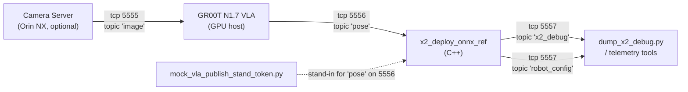

# X2 Deploy ZMQ Wire Protocol

This page is the cross-language source of truth for every ZMQ topic that flows
between the X2 deploy harness, the GR00T VLA, and the various Python helpers.
It is binding for **three** implementations:

* C++ subscribers/publishers under
  [`gear_sonic_deploy/src/g1/g1_deploy_onnx_ref/include/input_interface/`](../../../gear_sonic_deploy/src/g1/g1_deploy_onnx_ref/include/input_interface/)
  and
  [`gear_sonic_deploy/src/g1/g1_deploy_onnx_ref/include/output_interface/`](../../../gear_sonic_deploy/src/g1/g1_deploy_onnx_ref/include/output_interface/)
  (about to be ported to the X2 deploy under
  `src/x2/agi_x2_deploy_onnx_ref/` per Item 1 in the plan).
* Python publisher helpers in
  [`gear_sonic/utils/teleop/zmq/zmq_planner_sender.py`](../../../gear_sonic/utils/teleop/zmq/zmq_planner_sender.py).
* Python decoder helpers in
  [`gear_sonic/utils/teleop/zmq/zmq_packed_message_decoder.py`](../../../gear_sonic/utils/teleop/zmq/zmq_packed_message_decoder.py).

A regression in any one of those three must trip the wire-format gate at
[`tests/test_zmq_pose_loopback.py`](../../../tests/test_zmq_pose_loopback.py).

---

## 1. Why ZMQ (and not pure ROS 2 / DDS)

The X2 deploy is a ROS 2 (AimRT-backed) ament package — its hardware abstraction
layer talks to the AgiBot HAL via ROS 2 topics. Why introduce a second
messaging system at all?

| Concern | ROS 2 / DDS path | ZMQ path |
|---------|------------------|----------|
| Lives on the robot PC alongside `aimdk_msgs` | yes | no |
| Crosses a network boundary to a GPU host | needs DDS multicast or a discovery server | works through any TCP route, including SSH tunnels |
| Late joiners receive a snapshot | yes (DDS history) | no (PUB drops while no SUB connected) |
| Slow-joiner risk | low | medium — must `time.sleep(0.2)` after `connect()` |
| Schema is self-describing on the wire | yes (IDL) | yes (per-message JSON header) |
| Used by the upstream G1 SONIC deploy + Quest3 stack | n/a | yes (production-tested, port 5556 / 5557) |

For VLA we want **isolation** between the GPU host running the diffusion
model and the robot PC running real-time control. ZMQ over TCP gives us that
boundary cleanly. ROS 2 stays on the robot side for HAL traffic; ZMQ carries
the VLA <-> deploy <-> debugger streams. This matches the architecture of the
G1 SONIC deploy, which has run successfully in production for months.

---

## 2. Port + topic map



| Port | Direction | Topic(s) | Producer | Consumer | Purpose |
|------|-----------|----------|----------|----------|---------|
| 5555 | ⇒ | `image` | Camera server | VLA (Python) | Ego-view RGB(-D) frames at 30–50 Hz. Optional for v0 sim runs. |
| 5556 | ⇒ | `pose`, `command`, `planner` | VLA / Quest3 / mock-VLA | C++ deploy | Motion tokens + hand joints; start/stop control flips; locomotion-planner commands. |
| 5557 | ⇒ | `x2_debug`, `robot_config` | C++ deploy | `dump_x2_debug.py`, telemetry / loggers | Per-tick state for offline analysis and the M2 acceptance gate. |
| 5550 | ⇄ | n/a (REQ/REP) | Inference launcher | VLA process | Internal RPC for `gear_sonic.scripts.run_vla_inference`. Not part of the deploy contract. |

The C++ deploy reads ports 5556 / 5557 from CLI flags
(`--zmq-pose-port`, `--zmq-debug-port`, both default to the values above). A
single host runs PUB on 5556 and SUB on 5557, so one TCP route between GPU
and robot is enough.

---

## 3. Common message envelope

Every ZMQ message on every topic is a **single-part** payload with this
layout:

```
[ topic_bytes ] [ 1280-byte JSON header (NUL-padded) ] [ binary fields ]
```

* `topic_bytes` are the topic prefix as UTF-8 (e.g. `b"pose"`). Subscribers
  use `setsockopt(zmq.SUBSCRIBE, "<topic>")` to filter by prefix.
* `HEADER_SIZE = 1280` bytes. Pinned in:
  * `zmq_planner_sender.py` (`HEADER_SIZE`)
  * `zmq_packed_message_decoder.py` (`HEADER_SIZE`)
  * `zmq_packed_message_subscriber.hpp` (`static constexpr size_t HEADER_SIZE = 1280;`)
* The header is right-padded with `\x00` to fill exactly 1280 bytes.
* The JSON header documents the fields that follow:

```json
{
  "v": 4,
  "endian": "le",
  "count": 1,
  "fields": [
    { "name": "motion_token",      "dtype": "f32", "shape": [64] },
    { "name": "left_hand_joints",  "dtype": "f32", "shape": [10] },
    { "name": "right_hand_joints", "dtype": "f32", "shape": [10] },
    { "name": "frame_index",       "dtype": "i64", "shape": [1]  }
  ]
}
```

* `v`: protocol version. v3 = pre-count layout. v4 = current; adds the
  `count` field for batched messages.
* `endian`: `"le"` or `"be"`. Decoders compare against the native CPU
  endianness and byte-swap if they disagree. All current implementations
  produce `"le"`.
* `count`: outer batch dimension. v0 always sends `count=1`.
* `fields[*]`: ordered list. Binary payload concatenates them in this order
  with no padding.

### Supported dtypes

| `dtype` | Size | numpy type | C++ type |
|---------|------|------------|---------|
| `f32` | 4 | `np.float32` | `float` |
| `f64` | 8 | `np.float64` | `double` |
| `i32` | 4 | `np.int32` | `int32_t` |
| `i64` | 8 | `np.int64` | `int64_t` |
| `u8` | 1 | `np.uint8` | `uint8_t` |
| `bool` | 1 | `np.bool_` | `uint8_t` (0/1) |

Adding a new dtype is a four-step change: bump `v`, register it in
`_DTYPE_TO_NUMPY` (Python decoder), extend the C++ decoder, and add a case
to `pack_pose_message` in the Python sender.

---

## 4. Topic schemas

### 4.1 `pose` (port 5556) — VLA → deploy

This is the v0 critical path. Each message represents one inference tick from
the VLA (or mock-VLA).

| Field | dtype | shape | Notes |
|-------|-------|-------|-------|
| `motion_token` | `f32` | `(64,)` | SONIC latent. Fed straight into the SONIC tracking decoder. |
| `left_hand_joints` | `f32` | `(7,)` or `(10,)` | 7 = G1-compat ThreeFinger; 10 = full X2 OmniHand. The deploy's hand-DOF flag (`--hand-dof`) declares which it expects. |
| `right_hand_joints` | `f32` | `(7,)` or `(10,)` | Same DOF as `left_hand_joints`. |
| `frame_index` | `i64` | `(1,)` | Monotonic VLA inference counter. Aids logging + sync with `x2_debug`. |
| `token_state` | `f32` | `(M,)` *(optional)* | Encoder hidden state for the smoke test's autoencoder mode. |

Producer: `gear_sonic/utils/teleop/zmq/zmq_planner_sender.pack_pose_message`
or `gear_sonic/scripts/mock_vla_publish_stand_token.py` for v0 mock runs.

### 4.2 `command` (port 5556) — VLA → deploy

Toggles the deploy between motion-file replay and live VLA streaming, plus
emergency stop.

| Field | dtype | shape | Meaning |
|-------|-------|-------|---------|
| `start` | `u8` | `(1,)` | Latched start request. |
| `stop` | `u8` | `(1,)` | Latched stop request. |
| `planner` | `u8` | `(1,)` | `1` = planner mode (deferred for X2 v0); `0` = streamed-motion / VLA mode. |
| `delta_heading` | `f32` | `(1,)` | Optional yaw target offset. |

Producer: `build_command_message(...)`.

### 4.3 `planner` (port 5556) — VLA → deploy *(deferred for X2 v0)*

X2 v0 ships with `--input-type zmq` hard-coded to streamed-motion mode (the
VLA streams motion tokens directly), so this topic is not consumed by the X2
deploy until we land the v1 dummy planner stop-gap (see "Future Enhancement"
in `vla_training.md`). The topic is preserved here so the Python sender stays
binary-compatible with G1 SONIC, which uses it for locomotion commands.

### 4.4 `x2_debug` (port 5557) — deploy → debugger

Per-tick state snapshot. Mirrors G1's `g1_debug` topic — see
[`zmq_output_handler.hpp`](../../../gear_sonic_deploy/src/g1/g1_deploy_onnx_ref/include/output_interface/zmq_output_handler.hpp)
for the full G1 spec. The X2 variant adapts the joint widths (31 body DOFs,
10 OmniHand DOFs per side) and drops the head-IMU pair G1 doesn't carry.

| Group | Field | dtype | shape | Notes |
|-------|-------|-------|-------|-------|
| meta | `control_loop_type` | `u8` | `(N,)` | UTF-8 bytes of `"cpp"`. |
| meta | `index` | `i64` | `(1,)` | Monotonic deploy tick. |
| meta | `ros_timestamp` | `f64` | `(1,)` | ROS 2 wall-clock seconds; 0 if no ROS. |
| imu | `base_quat` | `f64` | `(4,)` | Base IMU quaternion (w,x,y,z). |
| imu | `base_ang_vel` | `f64` | `(3,)` | rad/s. |
| body | `body_q` | `f64` | `(31,)` | Joint positions in MuJoCo order. |
| body | `body_dq` | `f64` | `(31,)` | Joint velocities. |
| hands | `left_hand_q` / `right_hand_q` | `f64` | `(10,)` | OmniHand DOFs (or `(7,)` if `--hand-dof 7`). |
| hands | `left_hand_dq` / `right_hand_dq` | `f64` | `(10,)` | |
| actions | `last_action` | `f64` | `(31,)` | Body action (scaled + default offsets). |
| actions | `last_left_hand_action` / `last_right_hand_action` | `f64` | `(10,)` | |
| latent | `token_state` | `f64` | `(64,)` | Latest motion token actually consumed by the decoder. |
| safety | `policy_safety_event` | `u8` | `(1,)` | Non-zero when tilt watchdog / soft-start tripped this tick. |
| viz | `body_q_target`, `base_quat_target`, `base_trans_target` | `f64` | `(31,)` / `(4,)` / `(3,)` | Targets the deploy commanded this tick. |
| viz | `body_q_measured`, `left_hand_q_measured`, `right_hand_q_measured` | `f64` | `(31,)` / `(10,)` | Convenience aliases. |

Producer: `ZMQOutputHandler::publish()` (after porting from G1).

### 4.5 `robot_config` (port 5557) — deploy → debugger

Re-published every ~2 s as a msgpack map of policy parameters, joint
mappings, and embodiment flags so late-joining subscribers can reconstruct
the deploy's configuration. The schema is opaque on the wire (msgpack, not
JSON-headered) and is consumed by `state_logger`-style tooling — out of
scope for the M2 gate.

---

## 5. Slow-joiner mitigation

ZMQ PUB drops messages that arrive before any SUB has finished its
SUBSCRIBE handshake. Both the C++ deploy and Python helpers must therefore:

1. **Subscribers first**. Bring up SUB/connect calls *before* the publisher
   produces its first message.
2. **Sleep ≥ 200 ms** between socket creation and the first publish. Both
   `mock_vla_publish_stand_token.py` and the loopback test do this; the C++
   deploy's `ZMQEndpointInterface` handles it inside its constructor.
3. **Late readers OK for `robot_config`**: `ZMQOutputHandler::publish()`
   re-emits `robot_config` every ~2 s on top of its per-tick `x2_debug`
   stream, so a debugger that joins mid-run still gets the deploy config.

---

## 6. Acceptance gates

| Gate | What it proves | How to run |
|------|----------------|-----------|
| `tests/test_zmq_pose_loopback.py` | The Python sender ↔ Python decoder ↔ live PUB/SUB roundtrip is clean. Header size, dtype mapping, topic prefix stripping all match the C++ subscriber. | `.venv/bin/python tests/test_zmq_pose_loopback.py` |
| `mock_vla_publish_stand_token.py` ↔ `dump_x2_debug.py` | The mock-VLA publisher and the dump tool agree on the wire format end-to-end (separate processes). Doubles as a smoke test for the deploy harness once it's running. | See `vla_training.md` runbook section. |
| Three-terminal M2 gate | C++ deploy in sim mode subscribes to mock-VLA on 5556 and publishes `x2_debug` on 5557; the dump tool's `frames_received >= 0.9 * rate * duration` and `max abs(body_q - default_pose) < 0.05 rad`. | (Pending Item 1 C++ port.) |

The first two are passing as of this commit. The third unblocks immediately
once Item 1 lands the ZMQ classes in `agi_x2_deploy_onnx_ref`.

---

## 7. Reference: where each piece is implemented

| Concern | Implementation |
|---------|----------------|
| Wire-format constants (`HEADER_SIZE`, dtype map) | `gear_sonic/utils/teleop/zmq/zmq_planner_sender.py` and `zmq_packed_message_decoder.py` (Python); `zmq_packed_message_subscriber.hpp` (C++). |
| Producer (Python) | `pack_pose_message`, `build_command_message`, `build_planner_message`. |
| Consumer (Python) | `unpack_message` (returns a `DecodedMessage` with named numpy arrays). |
| Producer (C++) | `ZMQOutputHandler` (port to X2 in Item 1). |
| Consumer (C++) | `ZMQEndpointInterface` + `ZMQPackedMessageSubscriber` (port to X2 in Item 1). |
| Mock VLA + state dump | `gear_sonic/scripts/mock_vla_publish_stand_token.py`, `gear_sonic/scripts/dump_x2_debug.py`. |
| Loopback gate | `tests/test_zmq_pose_loopback.py`. |
