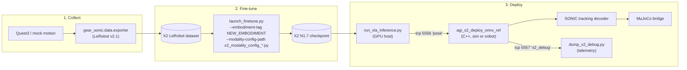
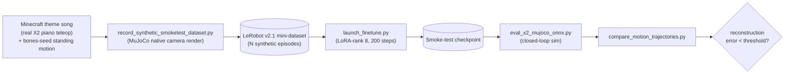

# VLA Training & Deployment on the AgiBot X2 Ultra

> **Status:** sim-only v0 — no real X2 hardware in the loop.

This tutorial is the project-spanning runbook for training and deploying an
Isaac-GR00T N1.7 VLA on the AgiBot X2 Ultra with SONIC whole-body control. It
captures every architectural decision the integration relies on so that
future contributors do not have to rediscover them from chat scrollback.

The companion to this page is the [VLA Workflow](vla_workflow.md) tutorial,
which already covers the equivalent G1 path. Read the differences below
before assuming a step from the G1 tutorial transfers verbatim.



---

## 1. Why this is a non-trivial port

GR00T N1.7 ships with a built-in `unitree_g1_sonic` posttrain embodiment
that the X2 cannot reuse as-is:

| Aspect | G1 (upstream) | X2 (this work) |
|--------|---------------|----------------|
| Body DOFs | 29 | 31 (different leg, waist, head ordering) |
| Hand DOFs | 7 (ThreeFinger) | 10 (OmniHand) |
| Head camera | external Luxonis OAK | native AgiBot RGB-D (sim: MuJoCo native render) |
| Real-time middleware | Unitree SDK 2 + DDS | AgiBot AimRT (RMW-pluggable; default Fast DDS on Humble) |
| Kinematic motion planner | trained, bundled (770 MB ONNX) | **not yet trained** — see §6 |
| Motion-token publisher (deploy) | G1 deploy (`g1_deploy_onnx_ref`) | X2 deploy (`agi_x2_deploy_onnx_ref`), needs ZMQ port (Item 1) |

Section 4 details the dual-variant action-space strategy that lets us still
share infra and ablate against G1.

---

## 2. The autoencoder smoke test (M3)

Running a real GR00T training cycle takes hours-to-days and any silent bug
in the data, embodiment config, or deploy path costs the same. So before
*any* end-user-style data collection, the integration runs an **"autoencoder
smoke test"** — the canonical ML-systems pattern of feeding a known signal
into the pipeline and verifying the output reproduces it.



* **Input motion** — recorded "Minecraft Theme Song" piano performance from
  the production `agitbot-x2-record-and-replay` repo (1476 frames @ 50 Hz =
  ~29.5 s) for arms + hands, overlayed on a bones-seed standing motion for
  the legs/waist. *Caveat:* this dataset only exercises 1 of the 10 finger
  DOFs per hand (DOF 4 = press finger). Item 6 covers full-finger captures.
* **Camera** — MuJoCo's native rendering (no external camera hardware
  required for the smoke test).
* **Language prompt** — a single fixed string for the whole episode:

  ```
  play minecraft music on piano
  ```

  The episode runs from start to finish under that one instruction; we are
  **not** annotating sub-tasks for v0.
* **Variations** — `record_synthetic_smoketest_dataset.py` will produce
  ~30 episodes by applying time-stretch, gaussian joint-position noise,
  phase-shift, and L/R mirror to the base recording. This is enough
  diversity for a tiny LoRA fine-tune to overfit cleanly.
* **Acceptance** — `compare_motion_trajectories.py` computes an L2
  reconstruction error between the recorded action stream and the
  closed-loop MuJoCo rollout. If the error is below the per-DOF threshold,
  the entire data → train → deploy → sim chain is byte-clean.

The implementation lives behind these scripts (created in M3):

* [`gear_sonic/scripts/record_synthetic_smoketest_dataset.py`](../../../gear_sonic/scripts/record_synthetic_smoketest_dataset.py)
  — orchestrator that takes the Minecraft + bones-seed inputs and writes
  the LeRobot v2.1 mini-dataset. Runs against the real recording from
  `agitbot-x2-record-and-replay` when available; falls back to a
  deterministic synthetic trace (multi-frequency sinusoids) so the
  pipeline stays exercisable on machines without the sibling repo.
* [`gear_sonic/scripts/generate_motion_variations.py`](../../../gear_sonic/scripts/generate_motion_variations.py)
  — pure-numpy variation generator for the orchestrator (time stretch,
  Gaussian noise, phase shift, L/R mirror; deterministic per seed).
* [`gear_sonic/scripts/compare_motion_trajectories.py`](../../../gear_sonic/scripts/compare_motion_trajectories.py)
  — reconstruction metric helper used by the M3 acceptance gate.
  Supports `exact`, `resample`, and `shortest` time-alignment modes;
  CLI emits a JSON summary so downstream dashboards can pick it up.
* `gear_sonic/scripts/eval_x2_mujoco_onnx.py` — already present in the
  repo; the smoke test reuses it for the closed-loop rollout (gated on
  the X2 dev box, post-fine-tune).

**M3 acceptance gate status (offline slice):**

* [`tests/test_x2_smoketest_pipeline.py`](../../../tests/test_x2_smoketest_pipeline.py)
  — 15/15 PASS. Covers (1) variation generator determinism + transform
  branches, (2) smoketest dataset round-trip through Isaac-GR00T's
  `LeRobotEpisodeLoader`, and (3) reconstruction-metric correctness on
  identity and perturbed pairs.
* The closed-loop rollout half (record → fine-tune → deploy → sim →
  compare) requires GR00T fine-tune compute + the X2 dev box and is
  gated on M4 / M7.

**Inspection video of the recorded ego-view camera (M3 debug aid):**

The smoketest dataset stores deterministic gradient frames in
`observation.images.ego_view` so the M3 gate stays simulator-free.
To preview what the deploy-time RGB-D camera *would* see when the
recorded body trajectory is replayed,
[`gear_sonic/scripts/render_smoketest_episode_video.py`](../../../gear_sonic/scripts/render_smoketest_episode_video.py)
attaches the URDF `rgbd_head_front` mount to the X2 MJCF
programmatically (no MJCF edit), with the optical axis derived from
the panel STL geometry, and renders the recording through MuJoCo's
native renderer.

Render one episode at the dataset's default 640×480 / 50 fps:

```bash
timeout 60 .venv/bin/python \
    gear_sonic/scripts/render_smoketest_episode_video.py \
    --recording /tmp/x2_smoketest_demo__recorded/episode_0000_recorded.npz \
    --output    /tmp/x2_smoketest_demo__recorded/episode_0000_ego.mp4 \
    --camera ego_view \
    --fps 50
```

Render every episode in a smoketest dataset (e.g. all four episodes of
`build_smoketest_dataset(num_episodes=4)`):

```bash
REC_ROOT=/tmp/x2_smoketest_demo__recorded
for npz in "$REC_ROOT"/episode_*_recorded.npz; do
    out="${npz%_recorded.npz}_ego.mp4"
    timeout 60 .venv/bin/python \
        gear_sonic/scripts/render_smoketest_episode_video.py \
        --recording "$npz" --output "$out" \
        --camera ego_view --fps 50
done
```

Available cameras (all parented to `head_pitch_link`, frames lifted
verbatim from `x2_ultra.urdf`):

| `--camera` | URDF link | Use case |
|------------|-----------|----------|
| `ego_view` (default) / `rgbd_head_front` / `rgbd` | `rgbd_head_front` | AimDK ego-view RGB-D — the v0 deploy target. |
| `stereo_head_front` / `stereo` | `stereo_head_front` | Forehead stereo pair (debug). |
| `rgb_head_center` / `rgb_center` | `rgb_head_center` | Center-mount RGB (debug). |
| `rgb_head_rear` / `rear` | `rgb_head_rear` | Rear-facing RGB (debug). |

Other useful flags: `--width 320 --height 240` for fast spot checks,
`--max-frames 100` to cap rendering, `--no-egl` if the host already
has a desktop GL context.

**Articulated finger rendering (`--with-omnihand`, M3.5):**

The X2 training MJCF deliberately ends each arm at `*_wrist_roll_link`
(31 DOFs) so SONIC, the deploy ONNX, and the AimDK ROS 2 HAL all
agree on the joint surface; finger commands flow out-of-band through
`/aima/hal/joint/hand/command` on the real robot. By default the
renderer therefore shows the body + arm motion only with the static
"dummy fist" stub baked into `*_wrist_roll_link.STL`.

Pass `--with-omnihand` to instead render through the *augmented* MJCF
assembled by
[`gear_sonic/scripts/compose_x2_with_omnihand.py`](../../../gear_sonic/scripts/compose_x2_with_omnihand.py)
(documented in §"Renderer-only OmniHand integration" below):

```bash
timeout 60 .venv/bin/python \
    gear_sonic/scripts/render_smoketest_episode_video.py \
    --recording /tmp/x2_smoketest_demo__recorded/episode_0000_recorded.npz \
    --output    /tmp/x2_smoketest_demo__recorded/episode_0000_ego_with_omnihand.mp4 \
    --camera ego_view --fps 50 \
    --with-omnihand
```

The recording must carry `left_hand_trajectory` + `right_hand_trajectory`
(canonical 10-D each, written by `record_synthetic_smoketest_dataset.py`)
or a single 20-D `hand_trajectory`. Mimic relationships are projected
exactly per frame via `apply_active_hand_qpos`.

M5 (camera plumbing, see §"Camera plumbing (M5)" below) bakes this
same MuJoCo-native render into the LeRobot dataset itself via the
`record_synthetic_smoketest_dataset.py --camera-source mujoco` flag.
With OmniHand articulation on, the policy now actually trains against
the rendered fingers it'll see at deploy time.

### Renderer-only OmniHand integration (M3.5)

**Problem.** The X2 Ultra URDF terminates each arm at `*_wrist_roll_link`
because finger control is opaque to Pinocchio FK on the real robot.
A 10-DOF hand command vector therefore has no kinematic effect in the
renderer — fingers stay static even though `action.{left,right}_hand_joints`
are recorded faithfully. Worse, `*_wrist_roll_link.STL` bakes in a
solid "dummy fist" stub at its tip; naive overlay of an articulated
hand produces a "two hands stacked" artefact.

**Solution.** A renderer-only augmented MJCF assembled in memory:

1. **Vendor** the AgiBot
   [`Omnihand-2025-SDK`](https://github.com/AgibotTech/Omnihand-2025-SDK)
   articulated hand kinematics under
   `gear_sonic/data/assets/robot_description/omnihand/` (left/right
   URDFs + 11 STLs, 10 active + 6 mimic DOFs per side, Mulan PSL v2).
   Active joint order matches `OMNIHAND_FINGER_NAMES_PER_SIDE` in
   `x2_ultra_supplemental_info.py` exactly, so the M1 dataset's 10-D
   hand vector writes to the right qpos slot without remapping.
2. **Clip** the X2 wrist-roll mesh at z = -0.055 m (the natural neck
   between the cylindrical motor casing and the dummy fist; cross-
   section radius drops to ~0.029 m, exactly matching the OmniHand
   palm cuff at 0.028 m). Vendor step:
   [`gear_sonic/scripts/clip_x2_wrist_for_omnihand.py`](../../../gear_sonic/scripts/clip_x2_wrist_for_omnihand.py)
   produces `omnihand/meshes/{side}_wrist_roll_clipped_link.STL` with
   triangle clipping along the cut plane (no end-cap; the palm cuff
   visually covers the seam).
3. **Compose** at runtime in
   [`compose_x2_with_omnihand.py`](../../../gear_sonic/scripts/compose_x2_with_omnihand.py):
   load the X2 spec, swap the wrist-roll *visual* geom to the clipped
   mesh (collision keeps the original so contact behaviour is
   unchanged), `MjSpec.attach()` each OmniHand chain at
   `*_wrist_roll_link` with mount Z = -0.055 m and a two-step **per-side**
   rotation — 180° about the wrist-roll local Y axis (so palm `+Z`
   aligns with wrist `-Z`, fingertips along the forearm) followed by
   ±90° about the wrist-roll local Z axis (the wrist long axis). The
   sign is **per-side**: `+90°` for the right wrist and `-90°` for the
   left wrist, because the X2 left and right `wrist_roll_link` bodies
   are mirrored about the body centerline, so a single signed roll
   would render one palm down and the other palm up. The locked wxyz
   quaternions are
   `_RIGHT_MOUNT_QUAT_WXYZ = (0, √½, +√½, 0)` and
   `_LEFT_MOUNT_QUAT_WXYZ  = (0, √½, -√½, 0)`, pinned by the acceptance
   gate — change them together with the v7 visual audit frames in
   `/tmp/x2_smoketest_demo__recorded/m35_visual_audit/`. Recreate the 6
   URDF mimic relationships per side as MJCF
   `<equality joint polycoef="0 mult 0 0 0">` constraints, and zero
   `contype`/`conaffinity` on every hand geom (purely kinematic).
4. **Project mimic** in `apply_active_hand_qpos` by writing both the
   10 active and 6 passive qpos slots per side directly with the
   multiplier (the equality constraints stay in the model as a
   safety net for callers that step dynamics rather than taking the
   kinematic shortcut, but `mj_forward` does not project onto
   constraints by itself).

**Crucial invariant.** The training MJCF (`x2_ultra.xml`), modality
config, LeRobot dataset schema, and ZMQ wire protocol are *unchanged*
by M3.5. The augmented MJCF lives only inside the renderer process;
M1, M2, M3, M4, the deploy harness, and the SONIC tracking decoder
all keep their 31-DOF body contract.

**Acceptance gate.**
[`tests/test_x2_omnihand_renderer.py`](../../../tests/test_x2_omnihand_renderer.py)
locks **15 invariants**:

1. Augmented model shape (33 X2 + 32 hand bodies; 64 joints; 70 qpos;
   12 mimic equalities).
2. Active-joint parity vs `OMNIHAND_FINGER_NAMES_PER_SIDE` from the
   supplemental info.
3. `apply_active_hand_qpos` projects every mimic relationship exactly
   (passive = multiplier × active).
4. `apply_active_hand_qpos` rejects mis-shaped active vectors.
5. Clipped wrist mesh actually swaps in (visual geom uses
   `*_wrist_roll_clipped_link`; collision keeps the original).
6. Clipped-mesh STL files are present on disk and non-empty.
7. Every hand geom has `contype = conaffinity = 0` (renderer is
   purely kinematic).
8. Renderer accepts split per-side recording keys
   (`{left,right}_hand_trajectory`) and writes a non-empty MP4.
9. Per-side mount quaternions match the documented two-step rotation
   (180° about Y composed with ±90° about Z, sign flipped per side).
   Right: `(0, √½, +√½, 0)`. Left: `(0, √½, -√½, 0)`.
   The legacy `_DEFAULT_MOUNT_QUAT_WXYZ` alias stays bound to the
   right-side value.
10. Training MJCF still loads independently with no clipped-mesh
    leakage and the original 32-joint / 38-qpos / 0-equality shape.
11. **Trainer-side isolation: X2 RobotModel exposes exactly 31
    actuated body joints; both `{left,right}_hand_actuated_joints`
    are empty; no finger token (`thumb`/`index`/`middle`/`ring`/
    `pinky`) leaks into `body_actuated_joints`.**
12. **Trainer-side isolation: `make_x2_modality_config(hand_dof=10)`
    keeps `motion_token`, `left_hand_joints`, and `right_hand_joints`
    as three SEPARATE action keys (not one merged blob); `left_hand`
    and `right_hand` remain distinct from `left_arm` / `right_arm`
    in `DEFAULT_STATE_GROUPS`.**
13. **Codebase-wide isolation: nothing on the trainer / deploy /
    ZMQ / motion-replay path imports
    `compose_x2_with_omnihand`, `build_x2_with_omnihand_spec`, or
    `apply_active_hand_qpos`. Only the renderer, the wrist-clipping
    vendoring step, and the M3.5 test file are allowed importers.**
14. **Wire-format isolation: the mock VLA publisher's
    `NUM_BODY_DOFS == 31` and the stand pose array is exactly 31
    floats -- the C++ deploy `ZmqPoseInputSource` cannot be
    accidentally widened to 31 + 20 by the OmniHand work.**
15. Renderer writes the body trajectory by *named* `qposadr`
    (resolved at model build time), not by `qpos[7:38]`. The
    `MjSpec.attach()` call inserts the left-hand finger hinges
    between `left_wrist_roll_joint` (qadr 28) and
    `right_shoulder_pitch_joint` (now qadr 45 in the augmented
    model), so the old contiguous-slice assumption silently
    corrupted the right arm into the left-hand qpos slots and
    froze the right wrist in place. Exercising the renderer with
    a known-moving recording is the regression test.

**Camera presets.** [`render_smoketest_episode_video.py`](../../../gear_sonic/scripts/render_smoketest_episode_video.py)
ships two families of cameras:

| Family   | Source                  | Visible to policy? | Use for                                                  |
|----------|-------------------------|--------------------|----------------------------------------------------------|
| `head`   | URDF head sensor mounts | yes                | RGB feature stream, ego-view debug renders               |
| `external` | free-floating worldbody, `mode="targetbody"` tracking the pelvis | no               | spectator / inspection videos and acceptance audit stills |

The head presets (`ego_view`, `rgb_head_center`, `rgb_head_rear`,
`stereo_head_front`) are exact copies of the URDF mounts and feed the
modality-config camera tensors. The external presets
(`third_person`/`third_person_front`, `side_view`/`third_person_side`,
`overhead`/`top_down`/`third_person_above`) are inspection-only — they
do **not** appear in the LeRobot dataset schema or the modality config,
so adding more spectator angles never affects training. When the
inspection rubric asks for a "third-person palm-down audit", reach for
`--camera third_person`; when it asks for an ego-view rubric, reach
for `--camera ego_view`.

**Canonical multi-view audit.** Render the same recording through the
ego, front-spectator, and side-spectator cameras to reproduce the M3.5
acceptance trio (used for the "palm-down piano posture" rubric):

```bash
RECORDING=/tmp/x2_smoketest_demo__recorded/episode_0000_recorded.npz
OUTDIR=/tmp/x2_smoketest_demo__recorded

for view in ego_view third_person side_view; do
    case $view in
        ego_view)     tag=ego ;;
        third_person) tag=3rd ;;
        side_view)    tag=side ;;
    esac
    timeout 90 .venv/bin/python \
        -m gear_sonic.scripts.render_smoketest_episode_video \
        --recording "$RECORDING" \
        --output    "$OUTDIR/episode_0000_${tag}_with_omnihand_v8.mp4" \
        --camera "$view" --fps 50 --with-omnihand
done
```

The three resulting MP4s should each weigh in at *more than* a couple
of hundred KB; a sub-100 KB file from an external preset is the
canonical signature of a camera pointing away from the robot (the
exact regression that introduced `EXTERNAL_CAMERAS` — see the
`build_camera_quat`/`add_camera_to_spec` split in
[`render_smoketest_episode_video.py`](../../../gear_sonic/scripts/render_smoketest_episode_video.py)).

### Camera plumbing (M5)

**Problem.** The M3 orchestrator
([`record_synthetic_smoketest_dataset.py`](../../../gear_sonic/scripts/record_synthetic_smoketest_dataset.py))
was simulator-free by design: it filled
`observation.images.ego_view` in the LeRobot v2.1 dataset with a
deterministic gradient frame so the *data* pipeline could be exercised
on hosts without MuJoCo / OpenGL. That kept the M1 + M3 acceptance
gates portable, but it also meant the v0 fine-tune (M4) was training
on synthetic colour ramps instead of the actual ego camera the policy
sees at deploy time. Useful as an autoencoder smoke test, useless as a
behaviour gate.

**Solution.** A per-frame render service plus a one-flag swap in the
orchestrator. Three pieces:

1. **`MujocoFrameRenderer`** in
   [`render_smoketest_episode_video.py`](../../../gear_sonic/scripts/render_smoketest_episode_video.py)
   — the per-frame entry point. Builds the OmniHand-augmented MJCF + EGL
   render context + `mujoco.Renderer` once on `__init__`, then exposes
   `render_frame(body_q, left_active, right_active) -> (480, 640, 3) uint8`.
   Used by both the existing `render_episode` MP4 writer (now a thin loop)
   and the M5 dataset-time camera plumbing path. Implements the context
   manager protocol for clean EGL teardown.
2. **`FrameProvider` indirection** in
   [`record_synthetic_smoketest_dataset.py`](../../../gear_sonic/scripts/record_synthetic_smoketest_dataset.py)
   — a tiny `Protocol` with two implementations:
   `_GradientFrameProvider` (M3 deterministic gradient, default) and
   `_MujocoFrameProvider` (one `MujocoFrameRenderer` reused across every
   frame of every episode). Both return `(EGO_VIEW_HEIGHT, EGO_VIEW_WIDTH, 3)`
   `uint8`, so the LeRobot **schema is identical** between the two —
   `meta/info.json::features` is byte-equal regardless of camera
   source. Only the pixel content differs.
3. **`--camera-source {gradient,mujoco}` CLI flag.** Default
   `gradient` keeps backward-compat: every existing M3 acceptance gate
   continues to run on hosts without MuJoCo. Opt-in `mujoco` builds a
   render-backed dataset:

```bash
timeout 900 .venv/bin/python \
    gear_sonic/scripts/record_synthetic_smoketest_dataset.py \
    --output-dir /path/to/x2_smoketest_lora_mujoco \
    --num-episodes 30 --seed 0 \
    --camera-source mujoco
```

The orchestrator builds one `MujocoFrameRenderer` at the start of the
run, reuses it across all episodes (the EGL context and model compile
cost are paid once), and tears it down on the way out.
`script_config.camera_source` is recorded in `meta/info.json` for
provenance, so any downstream consumer can tell at-a-glance which
provider a dataset came from.

**Crucial invariant.** The LeRobot dataset schema, the modality
config, the wire protocol, and the fine-tune CLI are *unchanged* by
M5. A `--camera-source mujoco` dataset is a drop-in replacement for a
`--camera-source gradient` dataset — same `episodes/`, same
`videos/chunk-XXX/observation.images.ego_view/episode_NNNNNN.mp4`
layout, same parquet columns, same per-frame tensor shapes, just
different pixels in the MP4s.

**Verification under env_isaaclab.** A 4-episode mujoco-backed
dataset round-trips cleanly through Isaac-GR00T's
`LeRobotEpisodeLoader` with the X2 10-DOF modality config
side-loaded:

```bash
.venv/bin/python gear_sonic/scripts/record_synthetic_smoketest_dataset.py \
    --output-dir /tmp/x2_m5_lora_mujoco --num-episodes 4 --max-frames 80 \
    --camera-source mujoco

conda activate env_isaaclab
PYTHONPATH=external_dependencies/Isaac-GR00T:. python -c "
import gear_sonic.data.x2_modality_config_10dof  # side-load X2 modality
from gr00t.configs.data.embodiment_configs import MODALITY_CONFIGS
from gr00t.data.embodiment_tags import EmbodimentTag
from gr00t.data.dataset.lerobot_episode_loader import LeRobotEpisodeLoader
mc = MODALITY_CONFIGS[EmbodimentTag.NEW_EMBODIMENT.value]
loader = LeRobotEpisodeLoader(
    dataset_path='/tmp/x2_m5_lora_mujoco',
    modality_configs=mc, video_backend='torchcodec',
)
ep = loader[0]
assert ep['video.ego_view'].iloc[0].shape == (480, 640, 3)
print(ep['video.ego_view'].iloc[0].mean(axis=(0,1)))
# -> [~81, ~108, ~120] (sky-blue background + robot in centre)
"
```

If the dataset were still gradient-backed, the means would land near
`[~127, ~128, ~127]`. Anything close to `[81, 108, 120]` confirms the
LeRobot loader is decoding native MuJoCo pixels.

**Fine-tune ignition smoke (M5 ↔ M4 parity).** The 30-episode
mujoco-backed dataset was pushed through `launch_finetune.py` with the
exact same recipe the M4 smoke used (50 steps, `--skip-weight-loading`,
selective full fine-tune of projector + diffusion head). It runs
clean on the RTX 5090 and produces metrics statistically
indistinguishable from the gradient-backed run, which is the right
answer for an architecture-only smoke (random init = visual stream
content cannot move the loss yet):

| metric                          | M4 (`/tmp/x2_smoketest_lora`, gradient) | M5 (`/tmp/x2_smoketest_lora_mujoco`, mujoco) |
|---------------------------------|-----------------------------------------|----------------------------------------------|
| max steps                       | 50                                      | 50                                           |
| train_runtime                   | 13.65 s                                 | 13.82 s                                      |
| train_steps_per_second          | 3.664                                   | 3.618                                        |
| train_samples_per_second        | 14.66                                   | 14.47                                        |
| `loss @ step 10/20/30/40/50`    | 1.113 / 1.107 / 1.114 / 1.120 / 1.118   | 1.112 / 1.105 / 1.114 / 1.119 / 1.117        |
| final mean train_loss           | 1.114                                   | 1.113                                        |
| `grad_norm @ step 50`           | 0.6949                                  | 0.6847                                       |
| Total DiT parameters            | 550,386,688                             | 550,386,688                                  |
| shards generated                | 19                                      | 19                                           |
| checkpoint-50 `model.safetensors` | 6.78 GB                               | 6.78 GB                                      |

**Reproduce the M5 fine-tune smoke** (≈30 s wall, 17 MB dataset on
disk including the 30 MP4s):

```bash
.venv/bin/python gear_sonic/scripts/record_synthetic_smoketest_dataset.py \
    --output-dir /tmp/x2_smoketest_lora_mujoco \
    --num-episodes 30 --max-frames 200 --seed 0 \
    --camera-source mujoco

conda activate env_isaaclab
PYTHONPATH=external_dependencies/Isaac-GR00T:. python \
    external_dependencies/Isaac-GR00T/gr00t/experiment/launch_finetune.py \
    --base-model-path nvidia/GR00T-N1.7-3B \
    --dataset-path /tmp/x2_smoketest_lora_mujoco \
    --embodiment-tag NEW_EMBODIMENT \
    --modality-config-path gear_sonic/data/x2_modality_config_10dof.py \
    --no-tune-llm --no-tune-visual \
    --tune-projector --tune-diffusion-model \
    --num-gpus 1 \
    --output-dir /tmp/x2_n17_smoke50_mujoco \
    --shard-size 256 \
    --episode-sampling-rate 1.0 \
    --max-steps 50 \
    --global-batch-size 4 \
    --learning-rate 0.0001 \
    --warmup-ratio 0.05 \
    --save-steps 50 \
    --skip-weight-loading
```

The architecture-only smoke is intentionally insensitive to the
content of `observation.images.ego_view`. The pixel content starts
mattering once `--skip-weight-loading` is dropped (real N1.7 weights
+ the visual encoder unfrozen via `--tune-visual`); that's the M7
closed-loop gate, after `nvidia/GR00T-N1.7-3B` is fully cached
locally.

**Acceptance gate.**
[`tests/test_x2_camera_plumbing.py`](../../../tests/test_x2_camera_plumbing.py)
locks **14 invariants**:

1. Camera-source identifiers are stable: `CAMERA_SOURCE_GRADIENT == "gradient"`,
   `CAMERA_SOURCE_MUJOCO == "mujoco"`, `CAMERA_SOURCES == ("gradient", "mujoco")`.
2. `make_frame_provider("gradient")` returns `_GradientFrameProvider`.
3. `make_frame_provider("bogus")` raises `ValueError` with the offending
   value + both valid options in the message.
4. Gradient provider returns `(EGO_VIEW_HEIGHT, EGO_VIEW_WIDTH, 3) uint8`.
5. `MujocoFrameRenderer.render_frame` returns
   `(EGO_VIEW_HEIGHT, EGO_VIEW_WIDTH, 3) uint8`, exposes `body_qposadr`
   as a length-31 `int64` table, and has `with_omnihand=True` by default.
6. **Determinism**: same `(body_q, left_active, right_active)` -> two
   consecutive `render_frame` calls produce byte-identical pixels.
   Catches accidental dependence on residual `qvel` or random seeded
   visual effects.
7. **Pixel divergence**: a MuJoCo render of the X2 stand pose has
   mean absolute pixel diff > 30 vs `_make_synthetic_ego_view(0, T)`.
   Guards against silent fallback to the gradient path under
   `camera_source="mujoco"`.
8. **Schema invariance**: `build_smoketest_dataset(camera_source="gradient")`
   and `build_smoketest_dataset(camera_source="mujoco")` produce
   `meta/info.json::features` dicts that compare equal — the LeRobot
   schema does not drift across camera sources.
9. **Provenance**: both datasets record `script_config.camera_source`
   matching the source they were built with.
10. `SmoketestRunSummary.camera_source` matches the requested source.
11. The mujoco-backed dataset's MP4 decodes (via cv2 to keep libav
    state separate from the exporter's PyAV writer; see the
    `_decode_mp4_with_cv2` docstring) to `(T, H, W, 3) uint8` frames
    whose first frame has mean abs diff > 30 vs the gradient pattern.
12. The gradient-backed dataset's MP4 decodes to frames whose first
    frame has mean abs diff < 5 vs `_make_synthetic_ego_view(0, T)`
    (within H.264 quality=8 tolerance) — locks the M3 default
    behaviour.
13. **Lifecycle**: caller-supplied frame providers are NOT closed by
    `build_smoketest_dataset` (ownership stays with the caller, e.g.
    pytest fixtures sharing one EGL context across multiple dataset
    builds). Validated with a `_CountingProvider` stub.
14. **Fail-fast**: `build_smoketest_dataset(camera_source="bogus")`
    raises `ValueError` *before* creating the output directory.

The mujoco-dependent invariants (5-7, 11) skip cleanly when `mujoco`
isn't importable (CI hosts without OpenGL); the provider-factory
invariants (1-4, 8-10, 12-14) still run there.

Run via:

```bash
.venv/bin/python -m pytest tests/test_x2_camera_plumbing.py -v
```

---

## 3. Embodiment registration (M0 → M5)

Isaac-GR00T's embodiment registry expects either:

1. A new entry in the upstream `EmbodimentTag` enum + `MODALITY_CONFIGS`
   dict (requires upstream PR), or
2. A side-loaded `register_modality_config(...)` call mutating the registry
   in-process via the trainer's `--modality-config-path` CLI flag.

X2 v0 takes path (2) — see
[`gear_sonic/data/x2_modality_config.py`](../../../gear_sonic/data/x2_modality_config.py).
Two thin wrappers register the same dataset under two action-space variants:

* [`gear_sonic/data/x2_modality_config_7dof.py`](../../../gear_sonic/data/x2_modality_config_7dof.py)
  — 7-DOF hands. Matches `unitree_g1_sonic`. Useful for cross-embodiment
  ablations that compare against the upstream G1 SONIC checkpoint.
* [`gear_sonic/data/x2_modality_config_10dof.py`](../../../gear_sonic/data/x2_modality_config_10dof.py)
  — 10-DOF hands. The full X2 OmniHand surface; the v0 target.

Both variants register against `EmbodimentTag.NEW_EMBODIMENT`, so the
training command becomes:

```bash
# IMPORTANT: launch_finetune.py runs under env_isaaclab (PyTorch
# 2.7.0+cu128, sm_120 / RTX 5090 ready), not the uv-managed .venv
# (PyTorch 2.6.0+cu124, only sm_50-90).
conda activate env_isaaclab
PYTHONPATH=external_dependencies/Isaac-GR00T:. python \
    external_dependencies/Isaac-GR00T/gr00t/experiment/launch_finetune.py \
    --base-model-path nvidia/GR00T-N1.7-3B \
    --dataset-path /path/to/x2_lerobot_dataset \
    --embodiment-tag NEW_EMBODIMENT \
    --modality-config-path gear_sonic/data/x2_modality_config_10dof.py \
    --num-gpus 1 \
    --output-dir /tmp/x2_n17_run1 \
    --shard-size 1024 \
    --episode-sampling-rate 0.1 \
    --max-steps 2000 \
    --tune-projector --tune-diffusion-model \
    --color-jitter-params brightness 0.3 contrast 0.4 saturation 0.5 hue 0.08
```

### Dual-env model (.venv vs `env_isaaclab`)

The X2 VLA pipeline intentionally splits across two Python
environments, because they pin **incompatible torch builds** and
slightly different versions of `lerobot` / `mujoco`. Mixing them
breaks the M3.5 acceptance gates:

| Env              | Python | torch         | Hosts                                                     | Use for                                                 |
|------------------|--------|---------------|-----------------------------------------------------------|---------------------------------------------------------|
| `.venv` (uv)     | 3.10   | 2.6.0+cu124 (sm_50-90)  | `gear_sonic`, `mujoco 3.x`, our exporter, the smoketest renderer | M1 (LeRobot exporter), M2 (ZMQ smoke), M3 (synthetic data + render), M3.5 (OmniHand). All 34 acceptance gates run here. |
| `env_isaaclab` (conda) | 3.11   | 2.7.0+cu128 (sm_120 ready) | `gr00t` (Isaac-GR00T), `transformers 5.0`, `peft`, `albumentations`, `lerobot 0.3` | M4 (LoRA fine-tune on RTX 5090), inference / closed-loop rollout (M7). |

`env_isaaclab` does **not** run the M3 / M3.5 acceptance suite cleanly
— mujoco 3.7's URDF parser produces different mesh paths, and
`lerobot.common.*` was renamed in 0.3.x. That's expected; the suite is
the responsibility of `.venv`. The dataset on disk is the only handoff
between the two envs.

#### transformers 5.x compat shim (M4)

Isaac-GR00T pins `transformers==4.57.3` (see
`external_dependencies/Isaac-GR00T/gr00t/eval/sim/SimplerEnv/setup_SimplerEnv.sh`),
but `env_isaaclab` ships transformers 5.0. In 4.5x the
`Qwen3VLForConditionalGeneration` wrapper exposed
`.language_model` / `.visual` directly (resolved by the wrapper's
`__getattr__`). In 5.x both submodules moved one level deeper to
`model.language_model` / `model.visual`, and the outer wrapper no
longer forwards those names — five call sites in
`qwen3_backbone.py` raise `AttributeError` as a result.

This is **not** a regression introduced by the X2 work. It affects every
Isaac-GR00T user on any Blackwell-ready stack (where transformers 5 is
forced by PyTorch 2.7+cu128). It's tracked as a future upstream fix; in
the meantime, we install a class-level monkey-patch from our own
codebase so we don't have to touch the vendored Isaac-GR00T tree:

```13:32:gear_sonic/data/_x2_groot_compat.py
"""transformers 5.x compat shim for Isaac-GR00T's Qwen3 VLA backbone.

Why this file exists
--------------------

Isaac-GR00T pins ``transformers==4.57.3`` (see
``external_dependencies/Isaac-GR00T/gr00t/eval/sim/SimplerEnv/setup_SimplerEnv.sh``)
and accesses the inner Qwen3 vision and language sub-models directly, e.g.::

    self.model = Qwen3VLForConditionalGeneration.from_pretrained(...)
    while len(self.model.language_model.layers) > select_layer: ...
    self.model.visual.requires_grad_(False)

In transformers 4.5x those attributes resolved through
``Qwen3VLForConditionalGeneration.__getattr__`` to the inner
``Qwen3VLModel``, so ``model.language_model`` and ``model.visual`` worked.
"""
```

The shim itself is two class-level `@property` descriptors that forward
the legacy attribute names to the new deep path:

```126:140:gear_sonic/data/_x2_groot_compat.py
    Qwen3VLForConditionalGeneration.language_model = property(
        lambda self: self.model.language_model
    )
    Qwen3VLForConditionalGeneration.visual = property(
        lambda self: self.model.visual
    )
    setattr(Qwen3VLForConditionalGeneration, _APPLIED_FLAG_ATTR, True)
```

This is a class-level descriptor (not an instance-level attribute
assignment), so `torch.nn.Module`'s `__setattr__` doesn't register the
forwarded children as duplicate sub-modules — `safetensors` sees the
inner parameters under exactly one key during checkpoint save, just like
on transformers 4.x. An earlier attempt that did instance-level
forwarding (`self.model.language_model = inner.language_model`) broke
safetensors with `shared tensors` errors precisely because of this.

The shim is invoked as an import-time side effect of the X2 modality
side-loaders (`x2_modality_config_{7,10}dof.py`), so any code that
registers the X2 embodiment automatically gets the shim. It's
idempotent and a no-op on transformers 4.x.

##### Removing the shim

When upstream `NVIDIA/Isaac-GR00T` adopts transformers 5.x natively
(either by switching to the new attribute path or by adopting a
helper similar to ours in `qwen3_backbone.py`):

1. Run the M4 acceptance gate at
   `tests/test_x2_n17_finetune_smoke.py::test_qwen3vl_compat_shim_does_not_register_duplicate_submodules`
   without importing `_x2_groot_compat` and confirm it still passes.
2. Delete `gear_sonic/data/_x2_groot_compat.py` and the two
   `apply_qwen3vl_transformers5_compat()` calls in
   `x2_modality_config_{7,10}dof.py`.
3. Drop this subsection from the doc.

##### Verification command (5-step architecture-only fine-tune)

```bash
conda activate env_isaaclab
PYTHONPATH=external_dependencies/Isaac-GR00T:. python \
    external_dependencies/Isaac-GR00T/gr00t/experiment/launch_finetune.py \
    --base-model-path nvidia/GR00T-N1.7-3B \
    --dataset-path /tmp/x2_smoketest_lora \
    --embodiment-tag NEW_EMBODIMENT \
    --modality-config-path gear_sonic/data/x2_modality_config_10dof.py \
    --output-dir /tmp/x2_n17_smoke \
    --skip-weight-loading \
    --max-steps 5 --global-batch-size 2 --save-steps 5 \
    --shard-size 256 --episode-sampling-rate 1.0 \
    --no-use-wandb --tune-projector --tune-diffusion-model
```

Expected result: `Trainable parameters: 1,188,912,256 (47.35%)` and a
`train_loss` line with `Model saved to /tmp/x2_n17_smoke`. The loss
will be ~1.1 and *will not* decrease meaningfully because
`--skip-weight-loading` initialises the model randomly; this gate
checks that the pipeline lights up, not that it learns. For real
fine-tuning, drop `--skip-weight-loading`, raise `--max-steps`, and
let the pretrained N1.7-3B weights download from Hugging Face.

The recommended workflow is therefore:

```bash
# Build the dataset under .venv
.venv/bin/python -m gear_sonic.scripts.record_synthetic_smoketest_dataset \
    --output-dir /tmp/x2_smoketest_demo --num-episodes 30

# Fine-tune under env_isaaclab
conda activate env_isaaclab
PYTHONPATH=external_dependencies/Isaac-GR00T:. python \
    external_dependencies/Isaac-GR00T/gr00t/experiment/launch_finetune.py \
    --dataset-path /tmp/x2_smoketest_demo --embodiment-tag NEW_EMBODIMENT \
    --modality-config-path gear_sonic/data/x2_modality_config_10dof.py \
    --output-dir /tmp/x2_n17_smoke --max-steps 200 \
    --lora-rank 16 --lora-alpha 32
```

The exact wire schema the dataset must satisfy is enumerated in the
[X2 ↔ Isaac-GR00T Data Contract](../references/x2_isaac_groot_data_contract.md)
and pinned by the M0 acceptance gate at
[`tests/test_groot_contract.py`](../../../tests/test_groot_contract.py).

---

## 4. Two-variant action space

Both LoRA fine-tunes draw from the **same** physical recording — a single
collection campaign produces one LeRobot v2.1 dataset on disk:

```
parquet["action"]  shape (T, 31 + 64 + 10 + 10 + ...)
                                              \___ left hand 10 DOFs (raw OmniHand)
```

The 7-DOF view is reconstructed at training time by slicing the same parquet
column with different `start/end` offsets in `meta/modality.json`. The
`x2_modality_config_7dof.py` file selects 7 of the 10 DOFs (the ones whose
joint indices line up with the G1 ThreeFinger). No re-recording is required
to switch between variants.

This pattern unlocks the GR00T cross-embodiment story:

* **7-DOF run** — train against `unitree_g1_sonic`-style head, evaluate against
  the G1 checkpoint to quantify embodiment transfer.
* **10-DOF run** — production model for X2 OmniHand manipulation.

---

## 5. Deploy & ZMQ contract (M1 → M2)

The X2 deploy harness (`agi_x2_deploy_onnx_ref`, C++) is the canonical
runtime for both real-robot operation and the MuJoCo sim mode. Today it
loads a fused [encoder + decoder] ONNX and replays motion from a `.x2m2`
file. Item 1 in the plan adds a *second* path that swaps the encoder for a
ZMQ subscriber consuming SONIC motion tokens emitted by the VLA (or the
mock-VLA helper).

The wire format for the new subscriber is documented in
[X2 Deploy ZMQ Wire Protocol](../references/x2_zmq_protocol.md). The
relevant ports are:

| Port | Direction | Topic | Purpose |
|------|-----------|-------|---------|
| 5556 | VLA → deploy | `pose` | 31-D body refs + root quat + 64-D motion token + L/R hand joints per inference tick. |
| 5557 | deploy → debugger | `x2_debug` | Per-tick state snapshot used by the M2 acceptance gate. |

For v0 the C++ deploy still runs the fused encoder ONNX in-process, so it
treats incoming `motion_token` as a passthrough payload and drives the
tokenizer from `joint_pos_mj` + `root_quat_xyzw`. The wire format is
forward-compatible with v1 (split encoder/decoder ONNXs) -- the same
message will be consumed token-only once that work lands.

**M2 acceptance gate (three-terminal mock-VLA test):**

```bash
# Terminal 1 — sim deploy with the new --vla profile
cd gear_sonic_deploy
./deploy_x2.sh --sim --vla \
    --vla-zmq-port 5556 --vla-zmq-topic pose \
    --vla-debug-port 5557 --vla-debug-topic x2_debug

# Terminal 2 — mock VLA (publishes joint_pos_mj + root_quat_xyzw + motion_token)
.venv/bin/python gear_sonic/scripts/mock_vla_publish_stand_token.py \
    --port 5556 --topic pose --rate 50 --hand-dof 10

# Terminal 3 — telemetry dump
.venv/bin/python gear_sonic/scripts/dump_x2_debug.py \
    --port 5557 --topic x2_debug --duration 10 \
    --rate 50 --json-out /tmp/x2_m2_summary.json
```

The gate passes when `dump_x2_debug.py` reports:

* `frames_received >= 0.9 * rate * duration`,
* `max abs(body_q - default_pose) < 0.05 rad`,
* `safety_events == 0`.

This proves the post-VLA path (ZMQ → C++ deploy → SONIC decoder → MuJoCo)
is sound *before* a single training step has run. Even more importantly, it
keeps regressions in the wire format detectable in seconds rather than after
hours of fine-tune compute. The Python ↔ Python loopback at
[`tests/test_zmq_pose_loopback.py`](../../../tests/test_zmq_pose_loopback.py)
runs this same envelope without the C++ deploy and is suitable for CI.

> **Mock-VLA caveat for v0:** the publisher emits a *constant* stand-still
> token every tick. The deploy's safety stack (soft-start ramp + tilt
> watchdog) is what keeps MuJoCo upright; the token itself does no work. To
> exercise non-trivial dynamics inside the sim before training a real VLA,
> swap the publisher for `gear_sonic/scripts/play_x2_motion_mujoco.py` (which
> already streams pre-recorded tokens) once Item 1 lands.

---

## 5a. SONIC architecture & dataset labeling

The two preceding sections describe **what flows on the wire** at deploy
time. This section steps back to explain **how the SONIC tracking model is
split**, **which half lives where**, and **what the recorder writes into
the LeRobot dataset as the VLA's supervision target** — i.e. why the next
recorded episode is training-ready as written and not a kinematic-only
shell that you have to label later.

### 5a.1 SONIC is one model with two halves

```
   ┌──────────────────── SONIC tracking model ───────────────────┐
   │                                                             │
   │     ┌─────────────┐         ┌─────────────┐                 │
   │     │   ENCODER   │ ──────► │    FSQ      │ ──► motion_token│
   │     │  (10-frame  │         │  quantizer  │       (64-D)    │
   │     │ future ref  │         │             │                 │
   │     │  → latent)  │         │             │                 │
   │     └─────────────┘         └─────────────┘                 │
   │            ▲                                                │
   │            │                                                │
   │   tokenizer_obs (680-D)                                     │
   │   = 10 future frames × (31 jpos + 31 jvel + 6 ori)          │
   │                                                             │
   │                       ┌─────────────┐                       │
   │   motion_token ─────► │   DECODER   │ ──► joint targets     │
   │                       │   (actor)   │     (delta_pos)       │
   │                       └─────────────┘                       │
   │                              ▲                              │
   │                              │                              │
   │                       proprio + history                     │
   │                                                             │
   └─────────────────────────────────────────────────────────────┘
```

The encoder maps a 680-D 10-frame future-reference window to a 64-D
FSQ-quantized token. The decoder ("actor") maps a token plus current
proprio back to delta joint targets. Both halves were trained jointly,
but they land in different artifact files for distribution:

| File | Size | What's inside | Used by |
|------|------|---------------|---------|
| `model_step_NNNNNN_g1.onnx` | ~58 MB | **Fused** actor: SONIC encoder + FSQ + decoder, all stitched into one ONNX graph (PPO-style export) | C++ deploy actor at inference time |
| `model_step_NNNNNN.pt` | ~398 MB | Full PyTorch checkpoint: actor + **encoder weights** + critic + optimizer state | Training, evaluation, **and the inline tokenizer in the recorder** |

The encoder weights are inside the ONNX (fused into the actor graph),
but they're also independently extractable from the `.pt` via the key
prefix `actor_module.encoders.g1.module.*` (see
[`gear_sonic/scripts/sonic_motion_token_labeler.py`](../../../gear_sonic/scripts/sonic_motion_token_labeler.py)
`_load_actor`). The recorder reuses those `.pt` weights to label
`action.motion_token` so the column the VLA learns to predict is
byte-identical to what the deploy actor's internal encoder emits from
the same wire snapshot.

> **G1 vs X2 packaging note.** G1 ships *two separate ONNX files*
> (`encoder.onnx` + `policy.onnx`) so a deploy can swap the encoder
> at runtime via `--encoder-model` and a multi-modal observation
> config. X2 ships *one fused ONNX* because the X2 release was
> trained on a single encoder modality (retargeted body_q) and the
> PPO export pipeline fuses the graph for inference simplicity. The
> recorder closes the gap on the dataset side: the YAML config at
> `gear_sonic/data/encoder/x2_observation_config.yaml` mirrors G1's
> `observation_config.yaml` schema, so the artifact story is the
> same across both robots even though the deploy packaging differs.

### 5a.2 Where each half lives in your pipeline

```
┌──────────────────────────────────────────────────────────────────────────┐
│   RECORDING TIME                                                         │
│   (laptop / dev box)                                                     │
│                                                                          │
│   Quest 3 ──► quest3_manager ──► arm/hand body_q (commanded)             │
│                                                                          │
│   Quest 3 ──► quest3_manager ──► locomotion_cmd                          │
│                                       │                                  │
│                                       ▼                                  │
│                              x2_heuristic_planner                        │
│                                       │                                  │
│                  body_pose +  joint_pos_mj_future (current + 9 future)   │
│                                       │                                  │
│                                       ▼                                  │
│                          ┌─── X2DatasetRecorder ───┐                     │
│                          │   ┌─────────────────┐   │                     │
│                          │   │ X2EncoderObs    │ ◄─┼── YAML-driven      │
│                          │   │ Builder         │   │   gather from      │
│                          │   │ (registry)      │   │   x2_observation_  │
│                          │   └────────┬────────┘   │   config.yaml      │
│                          │            │            │                     │
│                          │   tokenizer_obs (680-D) │                     │
│                          │   = real planner future │                     │
│                          │            │            │                     │
│                          │            ▼            │                     │
│                          │   ┌─────────────────┐   │                     │
│                          │   │ SONIC ENCODER   │ ◄─┼── loaded from .pt  │
│                          │   │ (encoder weights│   │   (extracted from  │
│                          │   │  from 398 MB    │   │    actor_module.   │
│                          │   │  checkpoint)    │   │    encoders.g1.*)  │
│                          │   └────────┬────────┘   │                     │
│                          │            │            │                     │
│                          │       motion_token      │                     │
│                          │            │            │                     │
│                          └────────────┼────────────┘                     │
│                                       ▼                                  │
│                              parquet: action.motion_token (GT label)     │
└──────────────────────────────────────────────────────────────────────────┘
                                       │
                                       ▼
┌──────────────────────────────────────────────────────────────────────────┐
│   VLA TRAINING                                                           │
│   (cloud / GPU box, batched)                                             │
│                                                                          │
│        parquet ──► VLA ──► predicted_token                               │
│                                  │                                       │
│                                  │   loss against action.motion_token    │
│                                  ▼                                       │
│                            (no SONIC involved here at all)               │
└──────────────────────────────────────────────────────────────────────────┘
                                       │
                                       ▼
┌──────────────────────────────────────────────────────────────────────────┐
│   INFERENCE / DEPLOY                                                     │
│   (real robot or sim deploy)                                             │
│                                                                          │
│        camera + proprio ──► VLA ──► motion_token                         │
│                                          │                               │
│                                          │ ZMQ (pose topic, 5556)        │
│                                          ▼                               │
│                              ┌── C++ deploy ──┐                          │
│                              │  ┌──────────┐  │                          │
│                              │  │  SONIC   │ ◄┼── loaded from .onnx     │
│                              │  │ DECODER  │  │                          │
│                              │  │  (actor) │  │                          │
│                              │  └────┬─────┘  │                          │
│                              │       │        │                          │
│                              │  joint targets │                          │
│                              └───────┬────────┘                          │
│                                      ▼                                   │
│                              motors on the X2                            │
└──────────────────────────────────────────────────────────────────────────┘
```

The `.pt` is your **dataset-building tool**: it runs on the recording
laptop only. Once the labels are baked into the parquet, the `.pt`
never needs to leave the dev box. The robot itself only ever sees the
`.onnx`. Two practical consequences:

* **No extra weight on the robot.** The deploy keeps shipping the same
  ~58 MB ONNX. No new memory footprint at the edge.
* **Encoder version is locked at record time.** The `.pt` you used to
  label episode 0 is *baked into* the dataset (as the actual token
  values). If you later swap to a newer SONIC checkpoint for the
  deploy, your old recordings stay self-consistent — you just need to
  re-record (or re-label offline) any data you want to use against the
  new tracker.

### 5a.3 Where retargeting happens (Quest 3 → X2 body_q)

The "Quest 3 → quest3_manager → body_q" arrow in the diagrams above
hides two distinct retargeting paths owned by separate components:

```
┌──────────────────────────────── quest3_manager_x2.py ───────────────────────────────┐
│                                                                                     │
│   raw Quest 3 frame                                                                 │
│   { head_pose, L/R wrist_pose, L/R finger_curls, L/R trigger,                       │
│     L/R thumbstick, A/B/X/Y/clicks }                                                │
│                                                                                     │
│       ┌────────────────────────────┐         ┌──────────────────────────────────┐   │
│       │  IntentDecoder             │         │  Retargeter (x2_retarget_pipeline│   │
│       │  (intent_decoder.py)       │         │    .py)                          │   │
│       │                            │         │  ┌────────────────────────────┐  │   │
│       │  Inputs:                   │         │  │ VRArmTeleopCalibrated      │  │   │
│       │   • L/R thumbsticks        │         │  │ (calibrated DLS arm IK)    │  │   │
│       │   • A/B/X/Y/clicks         │         │  │ wrist 6-DoF (head-rel.)    │  │   │
│       │                            │         │  │   ──► 7 joints per arm     │  │   │
│       │  Outputs:                  │         │  └─────────────┬──────────────┘  │   │
│       │   • LocomotionCommand      │         │                │                 │   │
│       │     (walk / turn / step /  │         │  ┌─────────────▼──────────────┐  │   │
│       │      hold_torso(pitch,yaw))│         │  │ FingerSignalFilter +       │  │   │
│       │   • mode transitions       │         │  │ x2_hand_retarget           │  │   │
│       │                            │         │  │ XRHand 5 curls + thumb opp │  │   │
│       │  ► sent over ZMQ to        │         │  │   ──► 10-DOF OmniHand cmd  │  │   │
│       │    x2_heuristic_planner    │         │  └─────────────┬──────────────┘  │   │
│       │    (separate process)      │         │                │                 │   │
│       └────────────┬───────────────┘         │  ┌─────────────▼──────────────┐  │   │
│                    │                         │  │ compose_body_q             │  │   │
│                    │                         │  │ start: DEFAULT_STAND_POSE  │  │   │
│                    │                         │  │   slot[15:22] ← left arm   │  │   │
│                    │                         │  │   slot[22:29] ← right arm  │  │   │
│                    │                         │  │ Output: 31-D X2 body_q     │  │   │
│                    │                         │  └────────────────────────────┘  │   │
│                    │                         └────────────────┬─────────────────┘   │
│                    │  legs/waist sourced                      │  arms+hands         │
│                    │  from planner via ZMQ                    │  sourced here       │
│                    └──────────────► merge in publish loop ◄───┘                     │
│                                                │                                    │
│                                                ▼                                    │
│                            merged 31-D X2 body_q (MuJoCo joint order)               │
│                            + L/R hand 10-DOF                                        │
└────────────────────────────────────────────────┬────────────────────────────────────┘
                                                 │
                                                 ▼
                          (recorder, deploy, dataset all consume this)
```

The two pipelines are split by latency / planning-horizon needs:

* **Arms** are direct kinematic retargeting (per-tick IK, no planning) —
  happens in-process inside the manager via
  [`Retargeter.step()`](../../../gear_sonic/utils/teleop/x2_retarget_pipeline.py).
* **Legs / waist** need a state machine (gait cycle, primitive
  sequencing) — that lives in a separate planner process and is driven
  by **decoded operator intent** rather than raw poses.

The merge point in
[`gear_sonic/scripts/quest3_manager_x2.py`](../../../gear_sonic/scripts/quest3_manager_x2.py)
is where the two paths fuse into the single 31-D X2 body_q vector that
becomes `action.body_q_mj` and gets fed to the SONIC encoder for
`action.motion_token`.

### 5a.4 Why the label is encoded from *commanded* body_q, not *observed*

The recorder feeds the encoder the **planner's real 10-frame future
window** (current commanded `body_q_mj` stacked in front of 9 future
planner frames) — not the observed body_q from `x2_debug`, and not a
freeze-pose tile of the current body_q. `action.*` is the operator's
intent; `observation.*` is the robot's result. The motion_token must
live on the intent side. Four reasons, in order of importance:

1. **Behavior cloning targets actions, not next-state observations.**
   At inference time the VLA emits a control signal (motion_token).
   Training labels must be in the same space — i.e. *what the operator
   commanded*, encoded into the same token format the VLA must learn
   to produce. Labels from observed body_q would teach the VLA to
   predict where the robot *was*, not where the operator *wanted it
   to go*.
2. **Encoding observed body_q is circular.** The robot pose at frame
   N is the *result* of the previous tick's token being decoded. Re-
   encoding it asks "what token, when decoded, would best reproduce
   the pose the previous token already produced?" — you'd be
   training the VLA on the identity map of SONIC's own low-pass
   behavior, with a one-tick lag baked in.
3. **Tracking lag corrupts observed body_q for label purposes.** The
   deploy's tracking actor has 50–200 ms of latency between command
   and execution. Labeling frame N with observation N offsets the
   label in time from the operator's intent, biasing the VLA toward
   "where the robot catches up to the operator" rather than where
   the operator went.
4. **The encoder was trained on clean intent.** SONIC's encoder
   consumed reference motion clips during training, not simulation
   outputs with tracking error / contact noise / sensor drift.
   Commanded body_q is in-distribution; observed body_q is
   slightly off-manifold and produces noisier tokens.

The dataset still captures the observed proprio — it just lives on
the observation side of the row, where it belongs:

```
parquet row at frame N:
   observation.state          ← from x2_debug (what the robot is doing)
   observation.images.ego_view ← rendered against observation.state
   observation.images.front_cam← world-fixed wide-angle view
   action.body_q_mj            ← commanded (operator intent)
   action.motion_token         ← SONIC.encode(planner 10-frame future
                                              starting at frame N)
                                              ↑ THE NEW LABEL
   action.left_hand_q          ← commanded
   action.right_hand_q         ← commanded
   action.task                 ← language string
```

The supervision target is **multi-frame**: the encoder sees the next
0.9 s of operator intent at every recorded tick, exactly mirroring the
deploy actor's internal encoder input. So the VLA training pipeline
gets a clean state→intent mapping with no temporal off-by-one, no
double-pass through SONIC, and no observed-state leakage into the
action namespace — and the labels are semantically aligned with the
policy the deploy will run at inference time.

### 5a.5 Wrapper integration: auto-resolving the .pt and the YAML

The wrapper
[`run_x2_quest3_planner_stack.sh`](../../../gear_sonic/scripts/run_x2_quest3_planner_stack.sh)
auto-resolves both the SONIC `.pt` and the encoder-observation YAML.
The `.pt` is derived from the deploy ONNX path it already takes via
`--model` (verified against the live VLA demo path):

```text
ONNX:  /.../h200-iter-25000-sphere-feet-20260501/exported/model_step_025000_g1.onnx
PT:    /.../h200-iter-25000-sphere-feet-20260501/model_step_025000.pt
```

— strip `/exported/` and the `_g1.onnx` suffix, append `.pt`. The
YAML defaults to the canonical config that ships in the repo:

```text
ENCODER_CONFIG="${REPO_ROOT}/gear_sonic/data/encoder/x2_observation_config.yaml"
```

The wrapper preflights both paths: if the `.pt` is missing and the
operator did not pass `--no-sonic-checkpoint` (the kinematic-only
escape hatch for smoke tests), the run aborts before any process is
spawned. Same gate for the YAML — missing file is a hard fail unless
the operator passed `--encoder-config ''` (the freeze-pose escape
hatch). The startup banner shows the result:

```text
motion_token     : ON  (.../model_step_025000.pt, cuda:0)
encoder_config   : .../x2_observation_config.yaml, modes=[retargeted_body_q], multi-frame 10x68 -> 680-D
```

The two escape hatches surface as:

```text
motion_token     : DISABLED (action.motion_token = zeros; dataset will not be VLA-trainable)
encoder_config   : (unused; tokenizer DISABLED above)
```

```text
motion_token     : ON  (.../model_step_025000.pt, cuda:0)
encoder_config   : DEPRECATED freeze-pose (--encoder-config '' was passed)
```

— so an operator never silently produces a zero-token dataset *or* a
freeze-pose-token dataset.

### 5a.6 G1 parity: same schema, different deploy packaging

X2 and G1 follow the **same labeling contract** at the dataset level
even though their deploy artifacts are packaged differently:

| Aspect | G1 (release) | X2 (release) |
|---|---|---|
| Deploy artifact | `encoder.onnx` + `policy.onnx` (two files) | `actor.onnx` (one fused file) |
| Encoder modality switch | Multi-modal at runtime (g1, teleop, smpl) | Single modality at training time |
| Encoder config | `gear_sonic_deploy/policy/release/observation_config.yaml` | `gear_sonic/data/encoder/x2_observation_config.yaml` |
| YAML schema | `encoder.encoder_observations` + `encoder.encoder_modes` | Same fields, restricted to `retargeted_body_q` |
| Inline tokenizer (recorder) | Not applicable — G1 ships a separate offline labeler | `OnlineSonicTokenizer.from_checkpoint_with_config` |

The schema match is intentional: when the X2 release re-trains the
encoder with additional modalities (e.g. SMPL human pose, VR-only
sparse points), the recorder's
[`X2EncoderObsBuilder`](../../../gear_sonic/utils/teleop/x2_encoder_obs_builder.py)
registry can drop in additional gather functions without changing the
recorder's API or the dataset schema — adding a modality is a YAML +
registry edit, not a recorder rewrite.

---

## 5b. Live closed-loop demo (M5 v0)

Once M0–M4 are green, the M5 acceptance gate is the **first end-to-end
run** with a real fine-tuned VLA on the wire — no mock publisher, no
canned tokens. The full session wrap-up (architecture diagram, what
worked, what didn't, code changes by file, and the leftover-issues
list) lives at:

* [Milestone — 2026-05-08: Live VLA → SONIC sim (M5 v0)](../user_guide/milestones/2026-05-08_live_vla_sonic_sim_v0.md)

Quick-start (sim only, requires fine-tune checkpoint at
`/tmp/x2_n17_finetune_v1`):

```bash
RUN_DIR=/tmp/c5_demo_live MAX_DURATION=60 \
MAX_TARGET_DEV=0.10 TARGET_LPF_HZ=4.0 INFERENCE_MIN_PERIOD_S=0.8 \
bash gear_sonic/scripts/run_live_vla_demo.sh
```

The orchestrator spawns three processes — the live VLA bridge
([`gear_sonic/scripts/live_vla_publish_motion_token.py`](../../../gear_sonic/scripts/live_vla_publish_motion_token.py)),
the C++ deploy under `deploy_x2.sh sim --vla --sim-with-omnihand`, and
[`dump_x2_debug.py`](../../../gear_sonic/scripts/dump_x2_debug.py) for
telemetry — and tails each into `$RUN_DIR/{bridge,deploy,runner}.log`,
producing `ego_view.mp4`, `front_view.mp4`, and `dump.csv` for offline
analysis. See the milestone page for the full debug playbook and the
known v0 limitations (mode-collapsed VLA, ~15 s sim freeze, residual
1 Hz oscillation).

---

## 5c. VR teleop dataset capture (Quest 3 → X2)

The full operator runbook lives in its own document:
**[X2 Dataset Record and Replay](x2_dataset_record_and_replay.md)**.

That doc covers:

* the closed-loop architecture (Quest 3 → DLS IK → SONIC FSQ →
  ZMQ → C++ deploy → MuJoCo);
* the `record_x2_dataset.sh` co-launcher and its
  `--teleop-only` / `--sim-viewer` flags;
* the Quest 3 controller cheat-sheet (A engage, B start, X save, Y
  discard);
* the LeRobot v2.1 schema landed on disk (`observation.state`,
  `observation.images.ego_view`, `action.motion_token`, …);
* three replay recipes (parquet inspection, ego_view MP4, and
  re-publishing saved tokens to a fresh deploy);
* acceptance tests, troubleshooting, and pointers into the
  implementation files.

A one-liner for a record session, for context:

```bash
bash gear_sonic/scripts/record_x2_dataset.sh \
    --output-dir /path/to/quest3_dataset_v0 \
    --task "pick up the red block from the table" \
    --sonic-checkpoint /home/stickbot/x2_cloud_checkpoints/h200-iter-25000-sphere-feet-20260501/model_step_025000.pt
```

For everything else (operator workflow, on-disk schema, replay,
troubleshooting), see [X2 Dataset Record and Replay](x2_dataset_record_and_replay.md).

---

## 6. Future Enhancement: X2 Kinematic Planner + Dummy Planner Stop-Gap

> *Decision recorded as part of the v0 plan: VLA streams motion tokens
> directly via Protocol-v4 `pose` messages. We do **not** add a kinematic
> planner to the X2 deploy until v1.*

### Architectural context

Upstream G1 SONIC has two distinct on-bot models:

1. **Tracking policy (the "actor / encoder / decoder")** — what we colloquially
   call SONIC. This consumes proprio + reference motion and emits the
   31/29-DOF joint targets. The 22k-step X2 SONIC checkpoint we already use is
   exactly this model. The SONIC paper trained the G1 variant for ~9k GPU
   hours, and we re-trained on a small subset for ~500 GPU hours.
2. **Kinematic planner** — a separate generative model (770 MB ONNX for G1)
   that consumes high-level commands (`mode`, `direction`, `speed`,
   `target_height`, ...) and emits the 0.1 s-spaced reference motion the
   tracking policy then follows. The planner is what makes "walk forward at
   0.5 m/s while raising the right arm" expressible without re-training the
   policy. Its training compute is **not** disclosed by NVIDIA.

NVIDIA's own VLA integration plugs the LLM into the *planner's* command API
— that is, the VLA emits high-level control commands (mode, target velocity,
pose hints) and the planner does the heavy kinematic reasoning. This makes
the LLM's life easier (it doesn't have to know joint geometry) and matches
how GR00T-N1.7's pretraining data was prepared.

### Why X2 has no planner today

The X2 SONIC tracking policy is trained, validated against the 22k MuJoCo
checkpoint, and shipping. The planner is **not**: NVIDIA has not released
training code or data for new-embodiment planners (the
[new embodiments guide](https://nvlabs.github.io/GR00T-WholeBodyControl/user_guide/new_embodiments.html)
explicitly stops at SONIC tracking), and recreating it from scratch is a
research undertaking outside the scope of v0.

### v0 (this plan): Protocol-v4 motion-token streaming

To unblock training and deploy without a planner, we let the VLA emit the
SONIC latent motion token *directly*. The C++ deploy treats the incoming
motion token the same way it would treat the planner's output — bypass the
planner entirely and feed the latent into the decoder.

Trade-offs:

* (+) Works today with the existing X2 SONIC checkpoint.
* (+) Mirrors `unitree_g1_sonic` action layout, so the dataset is reusable
  with the upstream G1 checkpoint for ablations (§4).
* (–) The LLM has to learn "which 64-D vector means walk-while-grasp" from
  scratch, instead of standing on a planner that already knows locomotion
  primitives. v0 demos compensate by keeping tasks compact (single Minecraft
  episode, sim-only, fixed camera viewpoint).

### v1 stop-gap: dummy planner

As soon as we want richer locomotion behavior (multi-task walk + manipulation,
held-out terrains), we will introduce a "dummy planner" that:

* Consumes the same high-level command surface as G1's planner (mode,
  movement, facing, speed, height).
* Maps it onto a small library of pre-recorded X2 motions (the existing
  bones-seed corpus + Minecraft variations).
* Emits SONIC reference frames at 50 Hz so the tracking policy can follow.

This is mechanical engineering, not new research, and it lets the VLA shift
from raw motion tokens to high-level commands without waiting for a fully
trained kinematic planner.

### Long-term: real X2 kinematic planner

A real X2 planner needs:

* A large-scale motion dataset for X2 (currently we only have ~hundreds of
  hours of teleop + bones-seed vs. G1's training corpus of millions of frames).
* Access to (or replication of) NVIDIA's planner training stack.

When that work happens, the v1 dummy planner is a drop-in replacement target
— same command schema, just better motion quality.

---

## 7. Command Execution Discipline

This project's tooling can hang silently in places that are very hard to
recover from interactively (MuJoCo viewers, docker builds, ROS 2 daemons,
SDK enumeration). Every command an agent or human runs from this tutorial
must be wrapped in a hard wall-clock budget. The minimum protocol:

* Wrap every potentially long-running command with `timeout`:

  ```bash
  timeout 300 ./gear_sonic_deploy/deploy_x2.sh sim --input-type zmq
  ```

* For interactive sim/viewer runs, prefer the `--autostart-after N` and
  `--duration` flags so the harness stops itself.
* Background dev servers (Quest3 manager, mock-VLA publisher) must run with
  an explicit `--duration` or be wrapped in `timeout`.
* When something hangs, **kill the process** rather than waiting and
  re-investigate from a clean shell — the deploy's safety stack drops PD
  gains within 200 ms of `SIGTERM`, so this is safe to do mid-run.

The mock-VLA helper and `dump_x2_debug.py` both honor `--duration 0`
(forever) explicitly so it is obvious to the operator whether they are
opting into an open-ended run.

---

## 8. Cross-references

* [X2 ↔ Isaac-GR00T Data Contract](../references/x2_isaac_groot_data_contract.md)
* [X2 Deploy ZMQ Wire Protocol](../references/x2_zmq_protocol.md)
* [VLA Workflow (G1)](vla_workflow.md) — the upstream G1 walkthrough that
  this tutorial diverges from for X2-specific concerns.
* [Data Collection tutorial](data_collection.md) — Quest3 + camera server
  recording loop (referenced by Items 2/3 in the plan).
* M0 acceptance gate: [`tests/test_groot_contract.py`](../../../tests/test_groot_contract.py).
* M1 acceptance gate (LeRobot v2.1 round-trip): [`tests/test_x2_lerobot_exporter.py`](../../../tests/test_x2_lerobot_exporter.py).
* M2 wire-format gate (Python loopback): [`tests/test_zmq_pose_loopback.py`](../../../tests/test_zmq_pose_loopback.py).
* M2 sim-smoke gate (mock-VLA wire format + bash flags): [`tests/test_x2_zmq_vla_smoke.py`](../../../tests/test_x2_zmq_vla_smoke.py).
* M2 C++ port plan + offline syntax-check + on-robot acceptance checklist:
  [`docs/source/references/x2_zmq_cpp_port_plan.md`](../references/x2_zmq_cpp_port_plan.md).
* M3 acceptance gate (smoketest pipeline offline slice):
  [`tests/test_x2_smoketest_pipeline.py`](../../../tests/test_x2_smoketest_pipeline.py).
* M3.5 OmniHand renderer composer + qpos helper:
  [`gear_sonic/scripts/compose_x2_with_omnihand.py`](../../../gear_sonic/scripts/compose_x2_with_omnihand.py)
  + wrist-clip vendor step
  [`gear_sonic/scripts/clip_x2_wrist_for_omnihand.py`](../../../gear_sonic/scripts/clip_x2_wrist_for_omnihand.py).
* M3.5 acceptance gate (augmented MJCF + mimic projection + training
  MJCF isolation): [`tests/test_x2_omnihand_renderer.py`](../../../tests/test_x2_omnihand_renderer.py)
  — 15/15 PASS.
* M4 acceptance gate (env_isaaclab fine-tune wiring + transformers 5.x
  compat shim): [`tests/test_x2_n17_finetune_smoke.py`](../../../tests/test_x2_n17_finetune_smoke.py)
  — 5/5 PASS under `env_isaaclab`, skipped under `.venv`.
* M5 per-frame render service:
  [`MujocoFrameRenderer`](../../../gear_sonic/scripts/render_smoketest_episode_video.py).
* M5 camera-plumbing CLI surface:
  [`record_synthetic_smoketest_dataset.py --camera-source {gradient,mujoco}`](../../../gear_sonic/scripts/record_synthetic_smoketest_dataset.py).
* M5 acceptance gate (camera-source flag + per-frame parity +
  no-schema-drift): [`tests/test_x2_camera_plumbing.py`](../../../tests/test_x2_camera_plumbing.py)
  — 14/14 PASS under `.venv`.
* OmniHand vendored assets + provenance:
  [`gear_sonic/data/assets/robot_description/omnihand/README.md`](../../../gear_sonic/data/assets/robot_description/omnihand/README.md).
