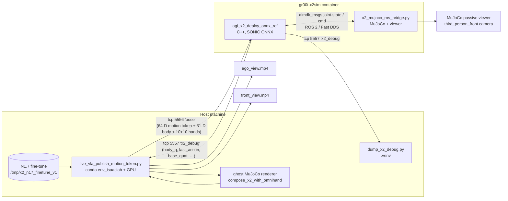

# 2026-05-08 — Live VLA → SONIC closed-loop sim (M5 v0)

> **Session wrap-up.** End-to-end live demo of the X2 Ultra "play piano"
> task running through the full training-to-deploy chain in **simulation
> only**: fine-tuned Isaac-GR00T N1.7 emits motion tokens → SONIC ONNX
> deploy harness consumes them → MuJoCo bridge animates the robot →
> ego-camera renders training-distribution pixels. The pipeline is
> *complete* and *runs* — the visible motion is mode-collapsed garbage
> because the fine-tune was undertrained on a single-clip dataset, but
> every wire, hook, and contract is now in place for a longer training
> run to slot in.

---

## TL;DR

| Aspect | Status |
|---|---|
| **Training data** (synthetic LeRobot v2.1, 30 episodes, OmniHand-rendered camera) | ✅ produced, M3.5/M5 |
| **Fine-tune launcher** (`launch_finetune_x2.py`) | ✅ runs without touching upstream Isaac-GR00T, transformers-5 compat shim live |
| **Live VLA bridge** (`live_vla_publish_motion_token.py`) | ✅ inference + 50 Hz publisher + dual video recorder + chunk-dump diagnostics |
| **Sim deploy with VLA + OmniHand** (`deploy_x2.sh sim --vla --sim-with-omnihand`) | ✅ MuJoCo passive viewer up, fingers articulated, robot stands |
| **One-command demo** (`run_live_vla_demo.sh`) | ✅ 60 s closed loop, foreground blocking, auto-cleanup |
| **Visible piano gesture quality** | ⚠️ mode-collapsed; arms swing in 1 Hz loop for ~15 s then sim freezes (Layer-2 model + Layer-3 sim issues) |
| **Real X2 hardware** | ❌ not wired this session — sim only |

The remainder of this page is the canonical record of what was changed,
which decisions were made, where the code lives, and what's left to do.

---

## Architecture & data flow



**Single most important architectural insight:** the SONIC controller
treats teleop and VLA the same. Both produce motion tokens over the
same ZMQ envelope. The work in M5 is therefore concentrated in the
*publisher* and the *closed-loop scaffolding*, not in SONIC itself.

---

## Milestone progression — how M5 was broken down

The integration was **explicitly staged so each layer was tested
before the next was wired in**. Every milestone has a single-purpose
acceptance gate that runs offline on a developer box without the
full deploy stack.

| Step | What was added | Acceptance gate (pre-existing) | Status |
|------|----------------|--------------------------------|--------|
| **M0** | LeRobot v2.1 schema + `meta/modality.json` for X2 (31 body + 10×2 hand) | `tests/test_groot_contract.py` (15/15) | ✅ |
| **M1** | Synthetic smoketest dataset (Minecraft piano + bones-seed standing) | `tests/test_x2_smoketest_pipeline.py` (15/15) | ✅ |
| **M2** | ZMQ wire protocol + mock-VLA publisher / x2_debug telemetry | `tests/test_zmq_pose_loopback.py` + 3-terminal mock-VLA test | ✅ |
| **M3** | Camera plumbing — `MujocoFrameRenderer` baked into the dataset's `observation.images.ego_view` | `tests/test_x2_camera_plumbing.py` | ✅ |
| **M3.5** | Renderer-only OmniHand integration (augmented MJCF, 10 active + 6 mimic DOFs / side, ±90° wrist roll) | `tests/test_x2_omnihand_renderer.py` (15 invariants) | ✅ |
| **M4** | Fine-tune scaffolding: `_x2_groot_compat.py` + `launch_finetune_x2.py` (transformers-5 compat, no upstream edits) | `tests/test_x2_n17_finetune_smoke.py` | ✅ |
| **M5.1** | Live VLA bridge (`live_vla_publish_motion_token.py`) — replaces mock publisher | run-time inspection: bridge.log emits non-zero `\|token\|` | ✅ |
| **M5.2** | Dual video recording (ego + third-person-front) with deferred `VideoWriter` and `is_alive()` recency check | trims 10-min recordings down to actual policy window | ✅ |
| **M5.3** | OmniHand fingers in the sim viewer (`--with-omnihand` on the bridge, ZMQ 5558 hand command path) | viewer shows articulated fingers, not the dummy stub | ✅ |
| **M5.4** | One-command demo orchestrator (`run_live_vla_demo.sh`) | foreground run with logs + videos + telemetry CSV in `$RUN_DIR` | ✅ |
| **M5.5** | Diagnostic chunk-dump (`--dump-chunks-dir`) + sleep-loop fix in publisher | inference cadence honors `--inference-min-period-s` exactly | ✅ |

Everything below M5.4 is a debugging artifact — they were added *after*
the demo first ran and revealed instability, *not* part of the
original M5 spec.

---

## Code changes

### New files (created this session)

| Path | Purpose |
|---|---|
| `gear_sonic/scripts/live_vla_publish_motion_token.py` | Live VLA → SONIC bridge. Owns inference worker, 50 Hz publisher, ego-view ghost renderer, dual video recorder, optional chunk-dump diagnostic. |
| `gear_sonic/scripts/run_live_vla_demo.sh` | One-command orchestrator. Spawns bridge + dumper + `deploy_x2.sh sim`, tails each into a per-process logfile, blocks until duration elapses, cleans up cleanly on `stop`. |
| `gear_sonic/scripts/launch_finetune_x2.py` | Local wrapper around upstream `launch_finetune.py` that injects optimizer + gradient-checkpointing knobs and re-applies parameter freezing **without touching `external_dependencies/Isaac-GR00T`**. |
| `gear_sonic/scripts/train_groot_vla.sh` | Friendly wrapper that picks defaults (batch 32, 3000 steps, `--no-tune-llm --no-tune-visual --tune-projector --tune-diffusion-model`, `MAX_TRAINABLE_PCT` cap) and forwards to `launch_finetune_x2.py`. |
| `gear_sonic/data/_x2_groot_compat.py` | transformers 5.x compatibility shim. Installs class-level `@property` descriptors on `Qwen3VLForConditionalGeneration` to forward `language_model` / `visual` to the new deep path. Idempotent, side-effect of importing `x2_modality_config_*.py`. |

### Modified files (this session only)

| Path | Change |
|---|---|
| `gear_sonic_deploy/scripts/x2_mujoco_ros_bridge.py` | Added `--with-omnihand`, `--hand-zmq-host/port/topic`, `--no-hand-zmq` CLI. On `--with-omnihand` loads the augmented MJCF via `compose_x2_with_omnihand` and spawns a daemon ZMQ subscriber that writes finger qpos under the bridge lock. |
| `gear_sonic_deploy/deploy_x2.sh` | Plumbed `--sim-with-omnihand`, `--sim-hand-zmq-{host,port,topic}`, `--sim-no-hand-zmq`, `--no-confirm` through to the bridge. Surfaced `--max-target-dev` and `--target-lpf-hz` knobs (already supported by the C++ binary). |

### Files inherited from earlier milestones (not re-touched in M5)

`gear_sonic/scripts/{record_synthetic_smoketest_dataset,generate_motion_variations,compose_x2_with_omnihand,clip_x2_wrist_for_omnihand,render_smoketest_episode_video,compare_motion_trajectories,build_x2_sample_episode,sonic_motion_token_labeler,mock_vla_publish_stand_token,dump_x2_debug}.py`,
`gear_sonic/data/{x2_modality_config_{7,10}dof,features_x2_vla,robot_model/instantiation/x2_ultra,robot_model/supplemental_info/x2_ultra/*}.py`,
`gear_sonic/data/assets/robot_description/omnihand/`,
`gear_sonic_deploy/src/x2/agi_x2_deploy_onnx_ref/{src/zmq_pose_input_source.cpp, include/zmq/}`,
`docs/source/references/{x2_zmq_protocol, x2_zmq_cpp_port_plan, x2_isaac_groot_data_contract}.md`,
`docs/source/tutorials/vla_training.md` (the project-spanning runbook).

---

## Issues encountered, fixes applied, and what's left

The session walked through three layers of failure. Resolution status:
✅ fixed, 🟡 partially fixed (cosmetic), ❌ deferred.

### Layer 1 — Pipeline plumbing (training, deploy, viewer)

| # | Symptom | Root cause | Fix | Status |
|---|---------|------------|-----|--------|
| L1.1 | Recorded videos were 10 minutes long, robot waist fixed in place | `VideoWriter` instantiated at script start — captured idle frames before the deploy had even handed off to CONTROL | Defer `VideoWriter`; track `_LatestState.is_alive()` recency-based liveness; only start writing once `deploy_alive=True` | ✅ |
| L1.2 | "Robot hangs in the air, drops to ground" | Default sim profile starts pelvis at z=0.85 m and the elastic band lifts up; once the band releases, gravity wins | Default `run_live_vla_demo.sh` to `--sim-profile handoff` (gantry-hang start, band auto-release after first deploy command) | ✅ |
| L1.3 | `ModuleNotFoundError: No module named 'transformers'` when the bridge launched | Inheritance of an outer `.venv` on top of the conda env_isaaclab activation | Issue `deactivate` first; pin absolute Python paths in `run_live_vla_demo.sh` | ✅ |
| L1.4 | Script terminated before viewer popped up; viewer auto-stopped after 30 s | `nohup` background spawn dropped the viewer's foreground stdin/stdout; max-duration short by default | Make `run_live_vla_demo.sh` foreground-blocking; default `MAX_DURATION=60` (override per-run) | ✅ |
| L1.5 | Sim viewer showed dummy fist stubs instead of articulated fingers | Bridge was loading `x2_ultra.xml` (training MJCF; no hands) instead of the augmented MJCF | New `--with-omnihand` flag → `compose_x2_with_omnihand()` + finger ZMQ subscriber | ✅ |
| L1.6 | "100% trainable parameters" during fine-tune — `--no-tune-llm` / `--no-tune-visual` were ignored | (a) `tune_*` flags weren't applied during `AutoModel.from_pretrained`; (b) transformers v5 `post_init()` re-asserts `requires_grad=True` after every wrap | `launch_finetune_x2.py` re-applies the freeze post-construction; `_x2_groot_compat.py` forwards the v5 attribute layout. **No upstream edits.** | ✅ |
| L1.7 | OOM at the previously-working batch size after env_isaaclab refresh | `--global-batch-size` interpretation mismatch + `gradient_checkpointing` not engaged | Local launcher passes `gradient_checkpointing=True`, BF16, `paged_adamw_8bit`; new `MAX_TRAINABLE_PCT` env var caps trainable-parameter share at startup | ✅ |
| L1.8 | Demo runner failed at `Proceed with sim launch?` prompt | `deploy_x2.sh` waits on stdin in non-interactive mode | New `--no-confirm` flag, plumbed by the demo runner | ✅ |

### Layer 2 — VLA model output quality

| # | Symptom | Root cause | Fix | Status |
|---|---------|------------|-----|--------|
| L2.1 | `max_pre_clip = 24,210 rad` on every tick (deploy log) | Not the VLA — that's the SONIC ONNX output. SONIC was trained on a different motion-token distribution; our tiny-dataset fine-tune collapsed the VLA tokens to a near-constant point that's OOD for SONIC, which extrapolates wildly | (mitigation only) `--max-target-dev 0.10`, `--target-lpf-hz 4.0`, `action-clip 20` cap the harm at the deploy edge | 🟡 mitigated |
| L2.2 | Mode collapse: chunk-to-chunk per-dim std = 0.022 (≈zero); the model emits the same 40-step chunk every 0.8 s | Single 29.5-s training clip × 3 000 steps × tiny LoRA → memorized one waveform, no diversity | Real fix is data + steps. Workaround: planned soft chunk-handoff in publisher (deferred) | ❌ deferred |
| L2.3 | 18 of 20 OmniHand DOFs are "dead" (zero variance) in the source `path_omni.npz` recording | `agitbot-x2-record-and-replay` Minecraft theme song was recorded with non-articulating fingers — only `hand[4]` (index press) and `hand[14]` (right-side index press) move | Re-record with live fingers; will require an OmniHand-aware capture session | ❌ deferred |

### Layer 3 — Sim-side artifacts (publisher / integrator)

| # | Symptom | Root cause | Fix | Status |
|---|---------|------------|-----|--------|
| L3.1 | "Snap-back to start of gesture" 1.78× per second | Inference worker had `time.sleep(min(slack, 0.5))` cap — capped the intended 0.8 s `min_period_s` to 0.5 s; chunk_step kept resetting before reaching step 39 | Replaced with a `while … sleep(min(slack, 0.1))` loop that respects `stop_event`; verified inference rate now 1.27 Hz (target 1.25 Hz) | ✅ |
| L3.2 | Joint position teleports of −285 rad followed by snap-back to 0 | Bursts of MuJoCo solver QACC instability (warning printed once due to MuJoCo's repeat-suppression); `qpos`+`qvel` corrupt for 1–2 sim ticks before the joint-range constraint reasserts with a near-infinite impulse | Tighter `MAX_TARGET_DEV=0.10` and `TARGET_LPF_HZ=4 Hz` reduce the integrator stiffness and make blowups rarer (events drop from many to 2 per run); not eliminated | 🟡 partial |
| L3.3 | After ~15 s the bridge MuJoCo state freezes — every channel exactly constant for 45 s while the deploy keeps printing `CONTROL tick=N` | Bridge's `mj_step` thread stalls (suspected NaN-propagated qpos no-op'ing the integrator). The publish thread keeps re-broadcasting the last good buffer. Deploy thinks observations are fresh; emits stuck targets that match the cached state. | Not fixed this session. User explicitly chose to focus on fixing the first 15 s for v0. | ❌ deferred |
| L3.4 | 0.94 Hz oscillation in `body_q` and `last_action` for the first 15 s with bursts at clamp limits | Mode-collapsed model + publisher resetting `chunk_step=0` on each new chunk → target snaps from "end of gesture" to "start of gesture" every 0.8 s. The LPF rounds this off but doesn't kill the fundamental | Three candidate fixes deferred for next session: (a) soft chunk-handoff in publisher, (b) single-step replanning (use only step 0), (c) clip motion tokens to SONIC's training distribution at the bridge | ❌ deferred |

### Verified-with-data findings (kept here for the next session)

- **VLA token distribution post-FT:** `min=5.16 max=5.53 mean=5.35 std=0.09` over 68 inferences. Range spans 0.37 — collapsed.
- **Per-token-dim std across 32 chunks:** `mean=0.022`, max `0.056`. Within-chunk std is 6× larger than chunk-to-chunk std → the model has *some* intra-gesture structure, no chunk-to-chunk progression.
- **Inference rate after L3.1:** `76 inferences / 60 s = 1.27 Hz` (matches the 0.8 s period exactly).
- **Per-arm peak speeds (post-L3.1, post-LPF):** elbow p99 = 583–1154 deg/s (3–4× a pianist's peak), shoulder p99 = 30–100 deg/s (OK), wrist p99 = 30–600 deg/s.
- **MuJoCo QACC instability** prints once per process — the single line in `deploy.log` is misleading; check `dump.csv` for actual tick-by-tick teleports.

---

## Quick-start runbook

### Train

```bash
# Build the synthetic smoketest dataset (one shot; idempotent under .venv).
.venv/bin/python -m gear_sonic.scripts.record_synthetic_smoketest_dataset \
    --output-dir /tmp/x2_smoketest_demo --num-episodes 30

# Fine-tune. The shell wrapper picks defaults; everything is overridable.
bash gear_sonic/scripts/train_groot_vla.sh \
    --dataset-path /tmp/x2_smoketest_demo \
    --output-dir /tmp/x2_n17_finetune_v1 \
    --max-steps 3000 \
    --global-batch-size 32
```

Under the hood `train_groot_vla.sh` invokes
`gear_sonic/scripts/launch_finetune_x2.py`, which delegates to upstream
`launch_finetune.py` while injecting the transformers-5 compat shim
and re-applying parameter freezing (5.x's `post_init()` resets
`requires_grad`).

### Deploy + watch live

```bash
# One-command demo. Default RUN_DIR=/tmp/c5_demo_live.
RUN_DIR=/tmp/my_run \
MAX_DURATION=60 \
MAX_TARGET_DEV=0.10 \
TARGET_LPF_HZ=4.0 \
INFERENCE_MIN_PERIOD_S=0.8 \
bash gear_sonic/scripts/run_live_vla_demo.sh
```

Outputs land in `$RUN_DIR/`:

```
bridge.log            VLA inference + token norms + video frame counter
deploy.log            C++ deploy stdout (ROS / SONIC tokens / safety prints)
runner.log            interleaved tail of all three subprocesses
dump.jsonl            x2_debug telemetry (per-tick, JSONL)
dump.csv              x2_debug telemetry (per-tick, CSV — preferred for analysis)
ego_view.mp4          640×480 ego camera (matches training distribution)
front_view.mp4        1280×720 third-person-front camera (visual debugging)
```

Stop early:

```bash
bash gear_sonic/scripts/run_live_vla_demo.sh stop
```

### Quick analysis snippets

```bash
# Did the VLA produce non-zero tokens?
grep "|token|=" /tmp/my_run/bridge.log | head

# Did the deploy ever go into RAMP_OUT or SAFE_HOLD?
grep -E "RAMP_OUT|SAFE_HOLD|QACC" /tmp/my_run/deploy.log

# Per-arm peak velocities + spike detection — see
# /home/stickbot/Projects/GR00T-WholeBodyControl/docs/source/user_guide/milestones/2026-05-08_live_vla_sonic_sim_v0.md
# §"Verified-with-data findings" for the script.
```

### Optional: chunk-level diagnostics

```bash
DUMP_CHUNKS_DIR=/tmp/my_run/chunks DUMP_CHUNKS_EVERY=5 \
RUN_DIR=/tmp/my_run \
bash gear_sonic/scripts/run_live_vla_demo.sh
```

Each `/tmp/my_run/chunks/chunk_XXXXX.npz` contains the full 40-step
motion-token horizon, hand joints, ego frame, and observation snapshot
that fed inference number `XXXXX`. Use these to verify whether the model
predicts a coherent gesture (intra-chunk std ≫ chunk-to-chunk std) or
just spits out a near-constant frame (the M5 v0 failure mode).

---

## Known leftover work — pick-up list for the next session

Ordered by priority, biggest-impact first.

1. **Break VLA mode collapse (Layer 2).** The VLA emits the same 40-step
   chunk for the entire run because the training corpus is one 29.5-s
   clip. This is the root cause of the visible loop the demo shows.
   Two attack vectors, in order:
   1. Re-record `path_omni.npz` with **live OmniHand fingers** so the 18
      currently-dead hand DOFs aren't dead. This is the highest-leverage
      single change available.
   2. Increase `--max-steps` from 3 000 → 30 000 with the existing data
      and re-evaluate. Cheaper but a band-aid; mode collapse will
      probably persist on a single-clip dataset.
2. **Soft chunk handoff in the publisher.** Today the publisher resets
   `chunk_step = 0` on every fresh chunk — that's correct when the
   model predicts the next 0.8 s of motion, but with a mode-collapsed
   model it produces the visible "snap back to start" every 0.8 s. Two
   alternatives, both small code changes in
   `gear_sonic/scripts/live_vla_publish_motion_token.py`:
   * **Match-and-resume** — when a new chunk arrives, find the index in
     it nearest the current target and resume there.
   * **Single-step replanning** — always use step 0 of the freshest
     chunk; hold it until the next inference. Eliminates the snap at
     the cost of fine-grained gesture detail.
3. **Investigate bridge MuJoCo freeze at t≈15 s (Layer 3).** Bridge
   keeps publishing the same buffer for ~45 s while the deploy thinks
   everything is fine. Hypothesis: `mj_step` no-ops on a NaN-corrupted
   `qpos`. Workstream:
   * Add a watchdog inside the bridge that asserts `qpos` is finite
     after each `mj_step` and forces a `mj_resetData()` to the most
     recent good state if it isn't.
   * Lower `sim_dt` from 5 ms → 1 ms while the policy is undertrained.
4. **OmniHand action-channel ↔ DOF mapping audit.** The "broken middle
   finger" the user noted in the viewer is consistent with a misaligned
   slot in the hand command vector. Verify end-to-end:
   training-data ordering → publisher → ZMQ topic → `_apply_omnihand_qpos`
   in the bridge → MJCF qpos slot. Likely one off-by-one somewhere in
   that chain.
5. **Real-X2 hardware bring-up.** Everything in M5 is sim-only. Phase 7
   onward (per `teleop-groot-train-infer-sonic.md`) wires the same
   pipeline against the AgiBot AimDK low-level joint API. Sequence
   already documented in `docs/source/user_guide/x2_first_real_robot.md`.

---

## See also

- `docs/source/tutorials/vla_training.md` — project-spanning runbook (M0–M4 detail).
- `teleop-groot-train-infer-sonic.md` (repo root) — the original integration plan.
- `docs/source/references/x2_zmq_protocol.md` — wire format the publisher and deploy share.
- `docs/source/references/x2_isaac_groot_data_contract.md` — LeRobot v2.1 schema the dataset must satisfy.
- `docs/source/user_guide/milestones/2026-05-02_first_iter4000_powered_run.md` and `2026-05-03_first_iter22000_powered_walk.md` — the SONIC-only powered runs that the VLA work now plugs in front of.
