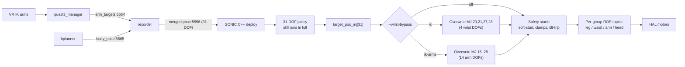

# 2026-06-08 - Full-arm SONIC bypass (`--wrist-bypass=ik-arms`)

> **Session focus.** After
> [`2026-06-07_wrist_offset_v1.md`](2026-06-07_wrist_offset_v1.md) cut the
> calibration-time wrist-orientation error from 120 deg to ~10 deg, the
> remaining teleop-quality blocker was **SONIC's whole-arm policy
> output fighting the operator** on slow workspace-corner targets.
> The existing `--wrist-bypass=ik` (4 wrist DOFs) was the proven
> surgical pattern; this milestone generalises it to the **full 14-DOF
> arm** while keeping legs+waist+head under SONIC for balance.

---

## TL;DR

| Symptom (before) | Cause | Fix (v1) |
|---|---|---|
| With wrist offsets calibrated, the kinematic teleop arms tracked VR IK cleanly. On the real-robot teleop path (SONIC in the loop) the **shoulder + elbow** still drifted toward the policy's comfort pose, especially on slow-arm-low and reach-back targets that are sparse in SONIC's training distribution. | SONIC's 31-DOF policy outputs all body targets coherently; the existing `--wrist-bypass=ik` only patches the **4 wrist DOFs** in `target_pos_mj` after policy. Shoulders / elbows / wrist_yaw still go through SONIC. | Add a new mode `--wrist-bypass=ik-arms` that extends the same surgical override to **all 14 arm DOFs (MJ 15..28)**. SONIC still drives legs (0..11), waist (12..14), and head (29..30) for balance. |

---

## What landed

### C++ deploy (single source of truth for sim + real)

The `agi_x2_deploy_onnx_ref` binary is the same code in both targets - only the actuator backend changes (ROS HAL on PC2 vs MuJoCo inside docker_x2). One C++ change covers both.

- [`gear_sonic_deploy/src/x2/agi_x2_deploy_onnx_ref/include/wrist_bypass.hpp`](../../../../gear_sonic_deploy/src/x2/agi_x2_deploy_onnx_ref/include/wrist_bypass.hpp):
  - New `kBypassedArmMjDofs` (14 entries, MJ 15..28, both shoulders + elbows + wrist_yaw + wrist_pitch + wrist_roll).
  - New templated `ApplyIkBypass<N>` helper; existing `ApplyWristBypass` becomes a thin wrapper around it for the 4-DOF set.
  - New `ApplyArmBypass` wrapper for the 14-DOF set.
- [`gear_sonic_deploy/src/x2/agi_x2_deploy_onnx_ref/src/x2_deploy_onnx_ref.cpp`](../../../../gear_sonic_deploy/src/x2/agi_x2_deploy_onnx_ref/src/x2_deploy_onnx_ref.cpp):
  - `enum class WristBypass { Off, Ik, IkArms };`
  - CLI parser accepts `"ik-arms"`; usage block + validation updated.
  - `OnControl` branches on the enum and calls the right helper. Telemetry counters (`wrist_bypass_tick_count_`, `wrist_bypass_max_delta_`) are **reused** across both modes - the periodic status line label stays `wrist_bypass_*` for backward-compatible log parsing, but the underlying number reflects the selected slot set.
- [`gear_sonic_deploy/src/x2/agi_x2_deploy_onnx_ref/test/test_obs_builder.cpp`](../../../../gear_sonic_deploy/src/x2/agi_x2_deploy_onnx_ref/test/test_obs_builder.cpp):
  - New `TestArmBypassOverridesExactly14Slots` pins the MJ index table per slot, asserts every non-arm slot stays untouched, and validates the truthful max-delta return.
  - New `TestArmBypassIsSupersetOfWristBypass` guards against a maintainer accidentally re-ordering the arm array and dropping a wrist slot, silently regressing the wrist-pitch/-roll fix that's been in production since v2.

### Python lock-step port

[`gear_sonic/utils/teleop/wrist_bypass.py`](../../../../gear_sonic/utils/teleop/wrist_bypass.py) mirrors the C++ contract (per its own "keep the two implementations in lock-step" docstring):

- New `BYPASSED_ARM_MJ_DOFS` constant.
- New `apply_arm_bypass()` thin wrapper.
- Module docstring updated with both sets and the design link.

### Wrapper scripts (CLI surface)

- [`gear_sonic_deploy/scripts/x2_pc2_daemons.sh`](../../../../gear_sonic_deploy/scripts/x2_pc2_daemons.sh): `X2_WRIST_BYPASS` env-var help + usage block list `ik-arms`. The env-var passthrough was already a free string; only the help text changed.
- [`gear_sonic/scripts/run_x2_quest3_planner_stack.sh`](../../../../gear_sonic/scripts/run_x2_quest3_planner_stack.sh): `--wrist-bypass` defaults to `ik`; comment above the default points at this milestone for the `ik-arms` use case.

### Commands cheatsheets

- [`pick_place_commands.md`](../../../../pick_place_commands.md): new section showing the `--wrist-bypass ik-arms` invocation for the daemon start.

---

## How to enable

### Sim rollout first (recommended)

The docker_x2 sim image already has a built binary cached in
`/workspace/sonic/gear_sonic_deploy/install/agi_x2_deploy_onnx_ref` from
the initial build session (commit `70afdb3`, ~10s incremental colcon),
and the CLI parser was verified end-to-end: `--wrist-bypass ik-arms`
accepted, garbage rejected with the updated error message. To re-build
after any C++ changes:

```bash
# From the host, inside docker_x2
cd gear_sonic_deploy/docker_x2
docker compose run --rm x2sim bash -c \
    "source /opt/ros/humble/setup.bash && \
     cd /workspace/sonic/gear_sonic_deploy && \
     colcon build --packages-select agi_x2_deploy_onnx_ref \
         --base-paths src/x2/agi_x2_deploy_onnx_ref \
         --cmake-args -DONNXRUNTIME_ROOT=/opt/onnxruntime"
```

Then run the planner stack against the rebuilt binary:

```bash
./gear_sonic/scripts/run_x2_quest3_planner_stack.sh --wrist-bypass ik-arms
```

Validate in MuJoCo:

- Arms should now track VR IK 1:1 even on slow workspace-corner targets.
- `wrist_bypass_max_dev_rad` on the periodic status line reflects **arm** delta (not just wrist) - large numbers are normal, they're the whole point of the bypass.
- Leg balance should look qualitatively the same as `--wrist-bypass=ik`. Stress-test with fast arm sweeps to see how hard the leg policy compensates.

### Real-robot rollout

```bash
# On PC2 (no docker, native colcon)
cd ~/agi_x2_deploy_ws
colcon build --packages-select agi_x2_deploy_onnx_ref --symlink-install
source install/setup.bash

# Restart daemon with the new mode
./gear_sonic_deploy/scripts/x2_pc2_daemons.sh restart \
    --wrist-bypass ik-arms --model /path/to/model.onnx
```

Always do sim validation first. On the real robot, keep a spotter / mechanical fixture in the loop for the first few minutes - this is the first time the full arm output is driven by something other than SONIC and the leg policy has only ever been trained against SONIC arms.

**Rollback**: one daemon restart away.

```bash
./gear_sonic_deploy/scripts/x2_pc2_daemons.sh restart --wrist-bypass ik
```

---

## Architecture



**Critical invariant**: the tokenizer obs still sees the **IK reference** for all 31 DOFs in every mode. The override only changes the final per-tick PD target. The leg policy is therefore conditioned on the same arm motion the robot is actually executing - the divergence is only between "what policy *output*" and "what motors do", identical compromise to the wrist bypass that's been in production since 2026-05.

---

## Stability caveats

1. **Larger inertial effect than wrist bypass.** Wrists barely affect CoM; shoulders / elbows do. The leg policy was trained assuming arms execute its commanded trajectory. If your IK targets are similar to what SONIC would have commanded, the bypass is approximately a no-op; if they're aggressively different (fast reach-backs, deep squats), the legs may compensate more than they would in pure-SONIC mode.
2. **The safety stack still wraps you.** Soft-start ramp, `--max-target-dev-arm` clamp, and the tilt-trip force-to-default branch all sit DOWNSTREAM of the override. Keep `--max-target-dev-arm` conservative on first rollouts.
3. **Telemetry watch**: the `wrist_bypass_max_dev_rad` field on the status line now reports the full arm delta. A persistently large delta means SONIC and your IK are asking for very different things - the **legs were planning for SONIC's version**. Note it, slow your motions if needed.
4. **VLA training implications**: as with the wrist bypass, the dataset's `action.body_q_mj` will record the **executed** (= IK-bypassed) arm pose and `action.body_q_mj_pre_sonic` will record the IK reference. The two are identical for bypassed DOFs - this is the same artifact the wrist bypass already creates and the v2/v3 trainers already handle. See [`2026-05-10_sonic_loop_v1_schema.md`](2026-05-10_sonic_loop_v1_schema.md) for the canonical column semantics.

---

## What we deliberately deferred

> Open this section first when we come back to whole-arm bypass. Each
> item is a concrete iteration we left on the table on purpose.

1. **Per-DOF granularity.** Today the mode is binary: 4 wrists or 14 arms. A future `--bypass-mj '15,16,18,20,21,27,28'` (free MJ-index list) would let us, say, bypass shoulders + wrists but leave elbows under SONIC for grip-strength conservation.
2. **Separate per-group telemetry counters.** Right now `wrist_bypass_*` is reused across both modes - cheap, but a downstream log parser can't tell wrist-only from full-arm without the daemon CLI context. Add `arm_bypass_ticks` / `arm_bypass_max_dev_rad` siblings if anyone needs that distinction.
3. **Live mode toggle via ZMQ.** Switching modes today requires a daemon restart (~3-5 s of safe-idle + soft-start). If anyone finds themselves flipping mid-session, a `recorder_cmd`-style ZMQ control channel is the cleanest path.
4. **CLI rename for clarity.** `--wrist-bypass=ik-arms` is technically a misnomer (it bypasses the whole arm, not just wrists). A future `--ik-bypass {off,wrists,arms}` would be cleaner, with `--wrist-bypass` kept as a deprecated alias for 1-2 releases. Skipped here to keep the surface area surgical.

---

## File checklist (review hint)

| File | Change |
|---|---|
| [`gear_sonic_deploy/src/x2/agi_x2_deploy_onnx_ref/include/wrist_bypass.hpp`](../../../../gear_sonic_deploy/src/x2/agi_x2_deploy_onnx_ref/include/wrist_bypass.hpp) | New `kBypassedArmMjDofs`, templated `ApplyIkBypass<N>`, `ApplyArmBypass` |
| [`gear_sonic_deploy/src/x2/agi_x2_deploy_onnx_ref/src/x2_deploy_onnx_ref.cpp`](../../../../gear_sonic_deploy/src/x2/agi_x2_deploy_onnx_ref/src/x2_deploy_onnx_ref.cpp) | `WristBypass::IkArms` enum + CLI + validation + control-loop branch |
| [`gear_sonic_deploy/src/x2/agi_x2_deploy_onnx_ref/test/test_obs_builder.cpp`](../../../../gear_sonic_deploy/src/x2/agi_x2_deploy_onnx_ref/test/test_obs_builder.cpp) | 2 new tests: full-arm overrides + wrist subset invariant |
| [`gear_sonic/utils/teleop/wrist_bypass.py`](../../../../gear_sonic/utils/teleop/wrist_bypass.py) | Lock-step port: `BYPASSED_ARM_MJ_DOFS`, `apply_arm_bypass` |
| [`gear_sonic_deploy/scripts/x2_pc2_daemons.sh`](../../../../gear_sonic_deploy/scripts/x2_pc2_daemons.sh) | env-var help + usage list `ik-arms` |
| [`gear_sonic/scripts/run_x2_quest3_planner_stack.sh`](../../../../gear_sonic/scripts/run_x2_quest3_planner_stack.sh) | Comment above `WRIST_BYPASS="ik"` default points at this doc |
| [`pick_place_commands.md`](../../../../pick_place_commands.md) | New entry for the `--wrist-bypass ik-arms` daemon start |
