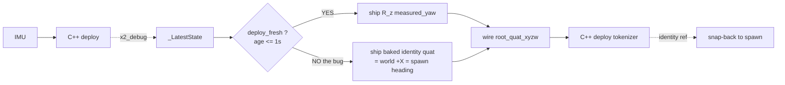
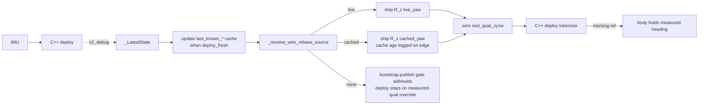

# 2026-06-23 — VLA bridge holds last-good live `root_quat` across `x2_debug` stalls

> **Status: ✅ Real-robot validated 2026-06-23.** Operator launched
> `run_x2_vla_runtime.sh --pc2-host …` from progressively non-zero
> physical headings, manually nudged the robot to new orientations
> mid-session, and confirmed the body holds heading instead of
> snapping back to the SONIC-boot frame. No more "robot resets to
> spawn heading on every wifi blip" symptom under autonomous VLA.

> **Session focus.** A regression of the heading-stability symptom
> first triaged on [2026-06-07](2026-06-07_vla_bridge_heading_stability_and_head_lock.md):
> the robot still snaps back to spawn heading on every nudge during a
> VLA session, and on first start, because the bridge silently reverts
> the wire `root_quat_xyzw` to identity whenever `x2_debug` stalls for
> more than 1 second. Fix lifts the kplanner's "hold last good
> measured value" pattern into the bridge so a stale `x2_debug` stream
> never drags the robot back to world +X.
>
> **Subsystem reference.** This milestone is one entry in a longer
> story about how the X2 stack keeps the wire's `root_quat_xyzw`
> honest across the four laptop / PC2 wire publishers. For the
> full architectural picture (all four publishers, the two patterns
> they use, the deploy-side bootstrap escape hatch, the diagnostic
> tooling, the historical timeline, and the dormant recorder bug),
> see
> [`x2_heading_stability_and_yaw_rebase`](../../references/x2_heading_stability_and_yaw_rebase.md).

---

## TL;DR

| Symptom (before) | Cause | Fix |
|---|---|---|
| On VLA start the robot rotates back toward its boot-time heading. Mid-session, manually nudging the robot to a new heading causes it to snap right back. Quest3 / VR teleop is unaffected by the same x2_debug stalls. | The bridge's yaw-rebase + waist_yaw pin were both gated on `deploy_fresh` (`_LatestState.is_alive`, 1 s freshness). On the `not deploy_fresh` branch the wire shipped the baked `cur_quat` from the idle clip — identity = world +X = spawn heading. Any >1 s `x2_debug` stall (wifi blip, GPU stall, recovery window after first PUB) silently published identity, and the C++ deploy commanded the body back. | Cache the last-known live `base_quat_wxyz` + `body_q_mj` in the inference loop, updated whenever `deploy_fresh` is True. Resolve the rebase source via `_resolve_wire_rebase_source` each tick: prefer the live snapshot, fall back to the cache, only fall back to identity if no `x2_debug` has ever arrived. A stale cached yaw is strictly better than identity because identity is a known-wrong orientation. |
| The one-shot `yaw_rebase_logged` flag printed "yaw-rebase ACTIVE" once at the first activation and was then sticky for the entire bridge lifetime. A mid-session regression to identity (the bug above) left no operator-visible signal. | The sticky-once log was designed for the original boot-window-only activation path; it never tracked the live → stale → recovered cycle. | Promote the logger to a state-transition emitter (`_log_rebase_source_transition`): one line at the `none → live` edge (ACTIVE, with yaw), one at `live → cached` (STALE, with cache age in ms), one at `cached → live` (RECOVERED). No spam on same-state ticks. |

---

## Why the Quest3 / VR stack didn't show the symptom

The kplanner (`gear_sonic/scripts/x2_kplanner.py`) reads its pose
feedback from a `pose_deque` of timestamped observations and **only
overwrites `current_root_wxyz` when a fresh sample is available**:

```python
age_s = time.monotonic() - latest_obs.t_mono
if age_s <= float(pose_feedback_max_age_s):
    current_root_wxyz = _yaw_only_wxyz_from_pelvis(
        latest_obs.pelvis_qpos_wxyz
    )
```

If `age_s` exceeds the threshold, the refresh is **skipped** —
`current_root_wxyz` retains its previous value. That's the "hold last
good" semantics that protect Quest3 / VR teleop sessions from this
exact failure mode. The comment at `x2_kplanner.py:1046-1048` calls it
out explicitly:

> snap-back protection still comes from the IDLE_LOOP yaw refresh and
> the new IDLE → PLAYING transition seed (both yaw-only, both writing
> to `current_root_wxyz` only, never to the model's neural buffer).

The VLA bridge had the opposite shape — it actively reverted to
identity on every stall. This fix lifts the kplanner's pattern into
the bridge.

A related (but different) pattern exists in the PC2 watchdog at
[`gear_sonic_deploy/scripts/x2_pose_watchdog.py:460-615`](../../../gear_sonic_deploy/scripts/x2_pose_watchdog.py):
it caches the last measured yaw with a configurable
`--x2-debug-max-age-s` (default 0.5 s) and falls back to identity if
the cache exceeds the cutoff. We did NOT lift that pattern because
the 0.5 s default would reproduce the bug; the kplanner's
indefinite-hold semantics are what's actually needed.

---

## What landed

### Bridge — `gear_sonic/scripts/live_vla_publish_motion_token.py`

1. **`_WireRebaseSource` dataclass + `_resolve_wire_rebase_source` helper.** Frozen dataclass with `base_quat_wxyz`, `body_q_mj`, `source` (`"live"` / `"cached"` / `"none"`), and `cache_age_s`. Pure function; testable directly.
2. **Cache + resolve in the tick body.** After `state.snapshot()`, update `last_known_base_quat_wxyz` / `last_known_body_q_mj` / `last_known_x2_debug_monotonic` when `deploy_fresh`. Resolve the source for every tick. The cache is one-way sticky — once we've ever seen an `x2_debug` frame, the only transitions are `none → live`, `live → cached` (stall), and `cached → live` (recovery).
3. **Swap the yaw-rebase gate (Section H, ~line 3460).** Changed `if deploy_fresh:` to `if rebase_source.base_quat_wxyz is not None:`. The wire `root_quat_xyzw` + `root_quat_xyzw_future` now track the cached live yaw across arbitrary stalls.
4. **Swap the waist_yaw pin gate (Section F, ~line 3345).** Changed `if deploy_fresh and bool(np.isin(WAIST_YAW_IDX, _freeze_idx)):` to `if rebase_source.body_q_mj is not None and bool(np.isin(WAIST_YAW_IDX, _freeze_idx)):`. Slot 12 now pins to the cached measured waist_yaw during stalls instead of reverting to `idle_stand[0]` (~33° off `DEFAULT_STAND_POSE`, which was the original waist-yaw click failure).
5. **`_log_rebase_source_transition` helper + initial state tracking.** Replaces the one-shot `yaw_rebase_logged` flag with a transition-edge logger. Three operator-visible lines (`ACTIVE` / `STALE` / `RECOVERED`); no per-tick spam.
6. **What is NOT changed.** `_LatestState.is_alive` semantics, `DEPLOY_ALIVE_STALE_THRESHOLD_S`, the recorder shutdown gate, motion_token gating, hand-delta metrics, the tracking-feedback gate at `tracking_active = (... and deploy_fresh and ...)`, and the bootstrap-safe publish gate at `state.received_any` — all keep their existing `deploy_fresh` / `received_any` shape because they have correct semantics for their use case.

### Tests — `tests/test_live_vla_bridge_yaw_hold_last_good.py`

25 new tests pinning:

- `none` source when no `x2_debug` has ever arrived (bootstrap-publish gate handles this case at the outer wire-send).
- `live` source on fresh tick, parameterised across yaw ∈ {-179°…+179°}; cache is bypassed even when populated.
- Returned arrays are copies (so the inference loop can mutate `cur_jpos` without aliasing into the snapshot buffer).
- `cached` source with correct `cache_age_s` for stalls of 5 s and `10 × DEPLOY_ALIVE_STALE_THRESHOLD_S` (= 10 s); no revert to identity.
- Recovery picks up the new measured yaw on the very next fresh tick.
- Waist_yaw pin uses the cached slot-12 value (not the live snapshot, which is identity/default during a stall).
- State-transition logger fires exactly one line per edge; same-state ticks are silent.
- End-to-end lifecycle: `none → live → live → cached → cached → live` emits one ACTIVE + one STALE + one RECOVERED line.
- `_LatestState.snapshot()` returns the LAST stored values even when not alive (the bridge's cache-update-when-fresh + resolve-source-always pattern relies on this).
- `_WireRebaseSource` is frozen.

---

## Bridge-side behaviour, before and after

### Before



### After



---

## Verification

### Unit tests

```
pytest tests/test_live_vla_bridge_yaw_hold_last_good.py -x
```

Should report **25 passed**.

### Manual on the real robot

1. Boot the robot, take it through normal MC2 → SONIC handoff.
2. Manually rotate the robot to some non-zero heading (e.g. -45°).
3. Launch the bridge with the LAN-isolation-fixed wrapper:
   ```
   ./gear_sonic/scripts/run_x2_vla_runtime.sh \
       --pc2-host 192.168.86.32 \
       --model …
   ```
4. Confirm the body holds the manual heading. The bridge log should
   print:
   ```
   [live-VLA] withholding pose publish until first x2_debug frame arrives ...
   [live-VLA] first pose publish (tick=N); x2_debug seen, root_quat now tracks live heading.
   [live-VLA] root_quat yaw-rebase ACTIVE: ... (yaw=-45.0deg)
   ```
5. Disconnect wifi briefly to trigger an `x2_debug` stall (or simulate
   it by killing the PC2 deploy then restarting). The bridge log
   should print:
   ```
   [live-VLA] root_quat yaw-rebase STALE: x2_debug silent >1.0s; holding cached base_quat (cache age=N ms). Wire will NOT revert to identity (no snap-back to spawn heading).
   ```
   The robot must NOT snap back. On recovery:
   ```
   [live-VLA] root_quat yaw-rebase RECOVERED: x2_debug back online; resuming live yaw tracking.
   ```

If the body snaps back to spawn heading during step 4 or 5, the fix
has regressed — capture `${RUN_DIR}/bridge.log` and the
`x2_debug_trace.csv` around the snap moment.

---

## Known dormant bug NOT fixed this turn

The recorder's `X2DatasetRecorder._compute_idle_root_quat_xyzw` in
[`gear_sonic/utils/teleop/x2_dataset_recorder.py:3354-3438`](../../../gear_sonic/utils/teleop/x2_dataset_recorder.py)
has the **same** identity-fallback shape as the old VLA bridge code:
it gates on `_LatestState.snapshot()`'s `alive` bool and returns
`None` (= identity quat) on stalls. During normal VR teleop the
recorder runs in relay mode (passing through the kplanner's
already-protected `current_root_wxyz`), so the identity-fallback path
is only hit during recorder-generated idle frames (gesture gaps,
idle-stand fallback), which haven't bitten anyone in a long time and
weren't part of the symptom we were debugging here.

If the recorder ever becomes the sole wire publisher again during a
long session with x2_debug stalls, the same snap-back will return.
Fix shape would be identical to this one: cache the last-known
`base_quat_wxyz` and use it instead of `None` on `not alive`. Filed
for the next session that touches the recorder.

---

## Cross-references

- Bootstrap-safe publish gate (the previous heading-stability fix that this complements): [`2026-06-07_vla_bridge_heading_stability_and_head_lock.md`](2026-06-07_vla_bridge_heading_stability_and_head_lock.md).
- C++ deploy's bootstrap-only measured-quat override (lives in `x2_deploy_onnx_ref.cpp:2608-2625`, complements but doesn't replace this bridge-side fix because it only fires on `LastReceivedMonotonicS() < 0`, i.e. once at boot).
- Kplanner's hold-last-good pattern at `gear_sonic/scripts/x2_kplanner.py:2816-2821`.
- PC2 watchdog's cache-with-max-age pattern at `gear_sonic_deploy/scripts/x2_pose_watchdog.py:460-615`.
- LAN-isolation prerequisite that lets us run sim-mode VLA without driving the real robot: [`2026-06-23_pose_pub_lan_isolation.md`](2026-06-23_pose_pub_lan_isolation.md).
