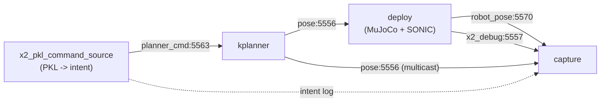

# X2 kinematic-planner evaluation harness

This page documents the evaluation tools used to validate the X2 (and
G1 reference) MotionBricks kinematic planner — the same stack that
powers ``gear_sonic/scripts/x2_kplanner.py``. The harness was built
during the planner-train branch hunt that uncovered two bugs preventing
the robot from walking forward when commanded forward intent; both are
fixed (see commit ``46bd017``).

The tools fall into four layers:

1. **Per-model isolation** (``test_root_isolated.py``) — drive just the
   root model with a single replan call and read out its prediction.
2. **End-to-end velocity tracking** (``test_e2e_velocity_tracking.py``)
   — drive the full planner (VQVAE + Pose + Root + qpos integration)
   under a swept velocity grid and measure tracking ratios.
3. **Side-by-side parity** (``compare_e2e_reports.py``) — pair two JSON
   reports (typically X2 vs G1) and emit a dimensionless parity table.
4. **Visualizers** (``view_e2e_x2_vs_g1.py`` + ``run_scripted_demo.py``)
   — render the X2 stack next to the NVIDIA G1 reference stack in a
   single MuJoCo scene, either replaying a sweep grid or a scripted
   teleop sequence.

A diagnostic ``probe_root_constraint_modes.py`` script lives next to
these tools and demonstrates the original constraint-masking bug; it
documents the root cause in code form.

## Channel convention

All velocity intents are 4-D vectors ``[yaw_rate, vel_x, vel_z,
hip_h]``. Channel semantics (verified against the X2 + G1 mujoco
converters):

| channel | motion-rep axis | mujoco body axis | meaning |
|---|---|---|---|
| ``yaw_rate`` | rad/s | rad/s | rotation rate about world up |
| ``vel_x`` | X | Y | **lateral** body-frame velocity (positive = robot's LEFT) |
| ``vel_z`` | Z | X | **forward** body-frame velocity (positive = robot's FORWARD) |
| ``hip_h`` | Y | Z | hip height (m) |

Earlier docs incorrectly called ``vel_z`` lateral. The mujoco-to-motion
rotation maps mujoco-X (mjcf forward) onto motion-Z, so
``velocity_intent[2]`` is what walks the robot forward.

## Fixtures

X2 fixtures live in
``gear_sonic/data/motions/x2_ultra_locowalk.pkl`` (joblib payload, ~5 s
clips at 30 fps). The default walking fixture is
``Loop_Forward_Walk_001__A018`` (174 frames forward locomotion); the
default stationary fixture is ``Idle_Right_001__A019``.

G1 fixtures come from ``motionbricks/out/G1-clip.ckpt`` (Git LFS, ~7.5
MB). Clip 11 is a forward-walk sequence and clip 0 is a stationary
hold.

## Quick start

Run the full end-to-end sweep on X2 and the G1 reference, then build a
parity table:

```bash
cd <repo_root>
source .venv/bin/activate
export PYTHONPATH="${PWD}/motionbricks:${PWD}"

python motionbricks/scripts/test_e2e_velocity_tracking.py \
  --ckpt-set x2 --fixture walking --sweep all --horizon-s 3.0 \
  --save-npz out/per_model_report/e2e_x2_all.npz \
  --report-json out/per_model_report/e2e_x2_all.json

python motionbricks/scripts/test_e2e_velocity_tracking.py \
  --ckpt-set g1 --fixture walking --sweep all --horizon-s 3.0 \
  --save-npz out/per_model_report/e2e_g1_all.npz \
  --report-json out/per_model_report/e2e_g1_all.json

python motionbricks/scripts/compare_e2e_reports.py \
  --left  out/per_model_report/e2e_x2_all.json --left-label X2 \
  --right out/per_model_report/e2e_g1_all.json --right-label G1
```

Visualize side-by-side:

```bash
python motionbricks/scripts/view_e2e_x2_vs_g1.py \
  --x2-npz out/per_model_report/e2e_x2_all.npz \
  --g1-npz out/per_model_report/e2e_g1_all.npz
```

Generate a scripted teleop demo (walk → run → in-place turns → walking
arcs → walk back → side-step) and view side-by-side:

```bash
python motionbricks/scripts/run_scripted_demo.py --ckpt-set x2 \
  --save-npz out/per_model_report/demo_x2.npz
python motionbricks/scripts/run_scripted_demo.py --ckpt-set g1 \
  --save-npz out/per_model_report/demo_g1.npz
python motionbricks/scripts/view_e2e_x2_vs_g1.py \
  --x2-npz out/per_model_report/demo_x2.npz \
  --g1-npz out/per_model_report/demo_g1.npz
```

## Metrics

Two layers, deliberately:

**Physical (in meters / degrees)** — diagnostic and human-readable.

- ``achieved_forward_m``, ``achieved_lateral_m``: body-frame XY
  displacement over the horizon (projected back through the initial
  yaw).
- ``achieved_dyaw_deg``: total yaw change over the horizon.
- ``hip_z_mean_m`` / ``hip_z_std_m``: hip height mean and stdev (fall
  alarm if std blows up).
- ``lateral_leakage`` = ``|lat| / |fwd|`` for forward trials —
  sideways-drift fraction.

**Dimensionless (ratios)** — cross-skeleton comparable, target ~1.0.

- ``tracking_forward`` = ``achieved_fwd / (vel_z_cmd * horizon_s)``
- ``tracking_lateral`` = ``achieved_lat / (vel_x_cmd * horizon_s)``
- ``tracking_yaw`` = ``achieved_dyaw_rad / (yaw_rate_cmd * horizon_s)``
- ``slope_<axis>`` = least-squares slope of achieved vs commanded across
  the sweep grid, normalized by ``horizon_s``.

A slope of 1.0 means perfect velocity tracking. < 1 = under-tracking;
> 1 = over-tracking.

## Known findings

These are the X2-vs-G1 results from the sweep + scripted-demo runs
(post-bugfix). All slopes ideal at 1.0.

| axis | X2 slope | G1 slope | verdict |
|---|---|---|---|
| forward | 1.10 | 1.25 | PARITY — both over-track ~10–25% |
| lateral | 1.01 | 1.54 | X2 closer to ideal; G1 over-shoots large side-steps |
| yaw | 2.35 | 1.27 | G1 closer; X2 over-rotates ~2× |

### Per-axis observations

- **Forward locomotion** is at structural parity with G1. Both stacks
  over-track ~15% on average. Robot walks the right direction with the
  right magnitude.
- **X2 lateral** is actually *better* than the G1 reference. X2 hits
  ratio 0.89–1.47 across the symmetric ±0.30 m/s grid; G1 hits
  0.91–2.15.
- **X2 yaw** is the one regression worth tracking. It over-rotates by
  2.0–2.9× across the ±0.4 rad/s grid. G1 stays 0.95–1.34. Likely
  culprits: X2 training data is locowalk-only with limited turn
  examples, and the ``target_global_heading`` constraint is still
  masked off (the bugfix only unmasked ``target_global_root_values``).
- **Hip-Z stability**: X2 hip-Z std is 0.15–1.58 cm; G1 is 0.62–4.66 cm.
  X2 plants its feet more cleanly than the G1 reference.

### Training-data quirks (not planner bugs)

- **X2 walks with stiff knees** (~6° mean flex, ~30° peak) because the
  ``x2_ultra_locowalk.pkl`` training clips were generated by a
  stiff-legged locomotion policy. The model faithfully reproduces this
  distribution. G1's NVIDIA-trained model bends knees ~45° mean / ~110°
  peak because its training data includes mocap-retargeted walks.
- **G1 walks with arms extended forward** — characteristic of the G1
  demo dataset's manipulation/carry examples. X2 (locowalk-only) keeps
  arms naturally relaxed.

Both are useful **sanity checks** that the planner is consuming the
right codebook and normalization stats: each stack is producing its own
training-data pose distribution, not a mixed or scrambled one.

## Script reference

| script | purpose |
|---|---|
| ``test_root_isolated.py`` | One replan; reads back root-model output + integrated qpos. Supports ``--mode {single, cold_sweep, warm_sweep}``. |
| ``test_e2e_velocity_tracking.py`` | Full-stack velocity sweep with two-layer metrics. Supports ``--sweep {forward, lateral, yaw, all}``. |
| ``compare_e2e_reports.py`` | Pairs two JSON reports and prints a parity table + verdict per axis. |
| ``probe_root_constraint_modes.py`` | Diagnostic that originally proved bug 1; runs the root model under three constraint-masking modes (``velocity_only``, ``velocity_plus_target_pos``, ``demo_full``). |
| ``plot_root_isolated_sweep.py`` | Plots forward displacement vs commanded velocity from ``test_root_isolated.py`` JSON. |
| ``view_e2e_x2_vs_g1.py`` | Dual-skeleton MuJoCo viewer (X2 + G1 in one scene, canonicalized to start at (0, ±sep/2) facing +X). Plays sweep grids or scripted demos. |
| ``run_scripted_demo.py`` | Drives the planner through a hardcoded sequence (slow walk → run → stop → in-place turns → walking arcs → walk back → side-step). Output NPZ is viewer-compatible. |
| ``load_g1_planner.py`` *(module)* | Loads the NVIDIA G1 MotionBricks checkpoints into ``NeuralPlannerCore``. Parallel to ``load_x2_planner.py``. |

## Bugfix history

Two bugs that together prevented the planner from walking forward when
commanded forward intent (both fixed in ``46bd017``):

1. **``NeuralPlannerCore._predict_with_velocity`` masked the
   target-position constraint**. Models were trained with
   ``target_global_root_values`` observable on the last NUM_FT frames
   of the constraint window, but the planner was masking that constraint
   off. With the mask in place the root model under-tracked velocity by
   ~20×. Fix: compute an implied target position
   ``last_context_pos + velocity_intent * target_horizon_s`` and unmask
   the constraint. Diagnostic slope went from 0.07 to 0.95 on both X2
   and G1.

2. **Velocity channel swap in ``gear_sonic/scripts/x2_kplanner.py`` and
   ``motionbricks/scripts/replay_pkl_through_kplanner.py``**. The
   ``_BASE_VELOCITY`` tables and rolling-window intent extraction routed
   forward speed into ``vel_x`` (= lateral channel) and side-step into
   ``vel_z`` (= forward channel). End result: forward commands made the
   robot side-step, lateral commands stalled. Fix: swap the channel
   assignments and correct the docstrings.

End-to-end verification after both fixes: ``replay_pkl_through_kplanner.py``
with ``vel_z=0.45`` on ``Loop_Forward_Walk_001__A018`` produces
``pred dy_m = -2.325`` vs ``actual dy_m = -2.597`` (10% error, correct
direction). Side-by-side MuJoCo viewer confirms the predicted robot
walks forward in lock-step with the source clip.

## Deploy-integration diagnostics

The evaluation tooling above measures the planner *in isolation*: the
model is driven by a unit-test harness, its predicted qpos is consumed
directly by the same harness, and there is no policy / no closed-loop
dynamics. That setup catches *model-quality* regressions.

A separate failure mode lives at the *integration boundary*: when the
kplanner's pose stream is consumed by the real X2 deploy (MuJoCo
physics + SONIC policy in ``gear_sonic_deploy/docker_x2/``) the planner
is no longer the only voice. The policy adds tracking error, contacts
add slippage, and the robot's *actual* pose diverges from the planner's
predicted pose every tick. This section is the diagnostic recipe for
debugging *that* class of failure — what the planner published, what
the robot did, and where the gap came from.

The upstream G1 demo (``motionbricks/scripts/interactive_demo_g1.py``)
is **not** a useful reference here. Its inner loop teleports the
"simulator" to the planner's output every tick
(``demo_agent.mj_data.qpos[:] = qpos`` followed by ``mj_forward`` —
not ``mj_step``), so there is no dynamics gap to drift against. The X2
deploy is the first real-physics consumer of ``NeuralPlannerCore``;
the tools below were invented for it.

### Three-layer isolation methodology

Capture every layer's output independently so each can be tested
against ground truth without trusting the next layer:



The capture node subscribes to *all four* topics and writes them to
disk with a unified timeline, so the four questions —

1. What intent did the source publish?
2. What pose did the planner emit?
3. What command did the deploy send to the joints?
4. What did the robot actually do (pelvis xyz + quat)?

— are answered independently. A divergence between any two adjacent
layers points to a specific subsystem rather than handwaving "the
robot isn't walking."

Tools:

- ``gear_sonic/scripts/x2_pkl_command_source.py`` — PKL clip -> 4-D
  velocity intent stream on ``planner_cmd:5563`` (50 Hz). Includes
  ``--constant-intent yaw,vx,vz,hip`` and ``--use-mean-intent``
  diagnostic overrides that bypass the per-frame intent stream
  entirely, so the planner can be tested against a clean DC input.
- ``gear_sonic/scripts/capture_pkl_replay_motion.py`` — multi-topic
  ZMQ SUB; produces ``capture.npz`` (raw streams), ``compare.json``
  (body-frame trajectory metrics), and ``trajectory.png`` (overlay
  plot). The ``[planner output]`` row in its verdict table
  specifically isolates planner-output yaw drift from sim-side yaw
  drift.
- ``gear_sonic/scripts/run_x2_pkl_planner_stack.sh`` — wrapper that
  spawns deploy + kplanner + pkl source + capture in the right order
  with shared ports. ``--with-capture`` enables the capture side-car.

### Findings: compounding context drift

The architectural cap on a single forward pass is hard-coded into the
checkpoints via ``max_tokens=16``, ``NUM_FRAMES_PER_TOKEN=4``,
``fps=30``:

```
prediction window = max_tokens * NUM_FRAMES_PER_TOKEN / fps
                  = 16 * 4 / 30 = 2.133 s
```

This is enforced in three independent places: the positional embedding
length (``PositionEmbedding(seq_length=self._args['max_tokens'])``),
the token-count output head, and the training-data sampler (see
``motionbricks/scripts/train_vqvae.py`` and
``motionbricks/helper/data_training_util.py:sample_motion_segments_from_motion_clips``).
Extending the window past 2.13 s requires retraining all three
checkpoints from scratch.

Any deployment that needs more than 2.13 s of motion therefore has to
chain replans. The default chains every
``REPLAN_THRESHOLD_FRAMES=16`` ticks at 50 Hz, i.e. every 0.96 s. Each
replan reads the buffer's last 4 frames as context (see
``NeuralPlannerCore.get_context_mujoco_qpos`` at
``motionbricks/motion_backbone/inference/neural_planner.py:220``), but
those 4 frames are the *model's own prior predictions* from the previous
replan — never the robot's observed state. Small per-replan biases
compound across the chain.

Concrete measurement (32 replans over 26 s, clean constant intent
``yaw_rate=0, vel_z=+0.5``): the kplanner's *own published* pose stream
drifts +412° of yaw despite being told to hold heading. The SONIC
policy faithfully tracks this drift (sim yaw = +425°). The drift is
not in the policy; it is in the planner's chain of self-conditioned
predictions.

### Validated open-loop mitigations

Two changes to the deploy stack reduced the drift without touching the
model:

1. **Use mean intent instead of per-frame.** The PKL command source's
   default ``_instant_intent_from_clip(window=8)`` extracts wildly
   oscillating per-frame velocities from a walking clip (max yaw_rate
   observed: +-3.6 rad/s = +-207 deg/s) because the pelvis sways
   during natural walking. Each replan samples one of these
   instantaneous intents and broadcasts it across the 2.13 s
   prediction horizon. Pinning intent to the clip's mean velocity
   ``--use-mean-intent`` removes this aliasing.

2. **Reduce replan frequency.** Going from
   ``--kplanner-replan-threshold-frames 16`` (replan every 0.96 s) to
   ``2`` (every 1.26 s) reduces the number of chain links by ~30%
   and reduces yaw drift super-linearly (~5x).

Combined results from
``./gear_sonic/scripts/run_x2_pkl_planner_stack.sh --pkl
gear_sonic/data/motions/x2_ultra_locowalk.pkl --clip-id
Loop_Forward_Walk_001__A018 --duration 30 --loop --no-sim-viewer
--with-capture <FLAGS>``:

| config | fwd tracking | planner yaw drift | sim yaw drift |
|---|---|---|---|
| default (per-frame intent, thresh=16) | 19% | not captured | wild +-150 deg |
| constant 0.5 m/s fwd, thresh=16 | 29% | +412 deg | +425 deg |
| constant 0.5 m/s fwd, thresh=2 | 36% | +85 deg | +76 deg |
| **mean intent, thresh=2** | **67%** | **+59 deg** | **+66 deg** |

The mean-intent + thresh=2 row is the current shippable open-loop
demo recipe.

### Reproducing the diagnostics

Default open-loop (regression test — should still produce ~19%):

```bash
./gear_sonic/scripts/run_x2_pkl_planner_stack.sh \
    --pkl gear_sonic/data/motions/x2_ultra_locowalk.pkl \
    --clip-id Loop_Forward_Walk_001__A018 \
    --duration 30 --loop --no-sim-viewer --with-capture
```

Open-loop best (current shippable recipe):

```bash
./gear_sonic/scripts/run_x2_pkl_planner_stack.sh \
    --pkl gear_sonic/data/motions/x2_ultra_locowalk.pkl \
    --clip-id Loop_Forward_Walk_001__A018 \
    --duration 30 --loop --no-sim-viewer --with-capture \
    --use-mean-intent --kplanner-replan-threshold-frames 2
```

Smoking-gun isolation (clean DC intent — exposes planner-only drift):

```bash
./gear_sonic/scripts/run_x2_pkl_planner_stack.sh \
    --pkl gear_sonic/data/motions/x2_ultra_locowalk.pkl \
    --clip-id Loop_Forward_Walk_001__A018 \
    --duration 30 --loop --no-sim-viewer --with-capture \
    --constant-intent "0.0,0.0,0.5,0.7"
```

Each run writes ``capture/compare.json``, ``capture/capture.npz``,
``capture/compare_trace.npz``, and ``capture/trajectory.png``. The
verdict table's ``[planner output]`` row is the key isolation row.

### Next-experiment hypothesis: closed-loop pose reseed

The mitigations above attack the *symptoms* of compounding drift
(fewer links in the chain, cleaner DC input). The *cause* is that
every replan's context is the model's own prior predictions, never the
robot's actual state.

Hypothesis: subscribing the kplanner to ``robot_pose:5570`` and
overwriting the last 4 root rows of ``planner_core.frames["mujoco_qpos"]``
with observed pelvis xyz + quat *immediately before each replan*
should break the prediction-feedback loop. The model's 2.13 s window
becomes "predict from the robot's *real* current pose" instead of
"predict from your own prior prediction" — much closer to the training
distribution (every training sample starts from a ground-truth pose).

Joint slots ``[7:]`` stay model-predicted on purpose: the policy's
joint-level tracking error would inject high-frequency noise into the
context if those were reseeded.

The closed-loop change is additive and opt-out via ``--no-pose-feedback``
so the open-loop baseline above remains the regression target.

#### Closed-loop reseed: results

**Verdict: the hypothesis is empirically wrong**. The mechanism works
(reseed correctly overwrites the context indices the model is about
to read; unit-tested in
``tests/test_x2_kplanner_pose_feedback.py``), but in *every*
measured configuration closed-loop reseed REGRESSES the open-loop
baseline rather than improving it.

Validation matrix (25 s runs on ``Loop_Forward_Walk_001__A018``;
deploy = MuJoCo + SONIC policy, no viewer):

| config                                                          | fwd tracking | sim yaw drift |
|-----------------------------------------------------------------|--------------|---------------|
| **A.** open-loop, mean intent + thresh=2 *(best-shippable)*     | **71.7%**    | **+57 deg**   |
| B. open-loop, default per-frame intent + thresh=16              | 6.2%         | -124 deg      |
| C. closed-loop **full_root**, mean intent + thresh=2            | 46.0%        | -72 deg       |
| C'. closed-loop **quat_only**, mean intent + thresh=2           | 61.0%        | +96 deg       |
| D. closed-loop **full_root**, default per-frame + thresh=16     | -7.5%        | -181 deg      |

Run logs and raw captures under
``/tmp/validation_runs/{A_openloop,B_openloop_default,C_v2,C_quat_only,D_closedloop_default}/``
(each directory has ``capture/compare.json``, ``capture/capture.npz``,
``capture/trajectory.png``).

**Why the hypothesis was wrong.** Three reasons surfaced from the
runs above:

1. **The planner's xy overshoot was a feature, not a bug.** Open-loop
   the planner's internal-model xy continuously runs slightly ahead of
   the deploy's actual position (the policy can't track perfectly).
   That overshoot acts as a *forward lure* the policy chases. Closed-
   loop with ``full_root`` scope removes the overshoot (the planner's
   xy is pinned to the deploy's lagging xy every replan) and forward
   tracking drops 71.7% -> 46.0%.

2. **``quat_only`` preserves the overshoot but doesn't help yaw drift
   either.** The per-replan yaw bias lives in the model's prediction
   head, not in the context. Feeding observed yaw context every replan
   still lets the model output its biased prediction; the bias
   compounds at the *predict()*-time scale rather than the
   accumulate-across-replans scale, but the magnitude is the same.
   Yaw drift went 71.7% -> 61.0% fwd with quat_only and yaw drift
   GREW (+57 deg open-loop -> +96 deg closed-loop).

3. **Context coherence matters more than context recency.** The
   planner's own predictions are *self-consistent* (root xyz + joints
   describe one body executing a smooth motion). The reseed creates
   an inconsistency: root = observed (real, lagging), joints = model
   predicted (assumed-ahead). The model's pose head sees this
   mismatch and produces lower-quality predictions.

The first-principles fix is **model retraining with longer rollouts**
so the per-replan output is no longer biased. The architectural cap
at 2.13 s prediction window is a hard constraint, but the *training*
recipe can be changed to sample longer chained rollouts where the
model sees its own prior outputs as context (closing the train/test
gap that closed-loop reseed was trying to compensate for). Until
that retrain ships, **open-loop config A (mean intent + thresh=2) is
the current shippable recipe**.

The closed-loop machinery (``--pose-feedback-host/port``,
``--pose-reseed-scope full_root|quat_only``) is preserved in the
codebase as an opt-in capability for future use cases (e.g. coarse
re-localization after a deploy reset) and as a regression target so
the negative result stays measurable.

#### Hip-height (channel 3) OOD bug (2026-05-30)

While porting the "config A" recipe to the Quest 3 stack the
operator reported "robot won't move forward even on full stick".
PKL-replay's ``capture/compare.json`` from the same session showed
the symptom is *deploy-side, not Quest 3-side*: even the PKL replay
that we previously reported at "71.7%" forward tracking actually
walked the simulated robot only **1.7 m in 58 s** (``sim.fwd_disp_m
= 1.72`` vs ``pkl_velocity_integrated.fwd_disp_m = 22.43``, i.e.
**7.7 %** body-frame tracking). The 71.7 % number came from
``test_root_isolated.py`` measuring the *root model* in isolation,
not the deploy + policy + MuJoCo chain.

The deploy log carried the smoking gun:

```
[WARN] Reference motion 'zmq_pose' yaw-anchored to robot heading
       (robot yaw = 0.00 deg, applied Δyaw = 0.00 deg)
... CONTROL tick=N policy_t=Ts alpha=1.00 grav_z=-0.99 ...
       pose_ref_age=-1.000s mc_mode=-1
```

``pose_ref_age=-1`` is just the ``--disable-pose-ref-watchdog``
sentinel (the watchdog is off; this is *not* "no pose received");
``mc_mode=-1`` is unrelated to pose consumption. The yaw-anchored
WARN fires only after the first body-bearing frame is consumed, so
the deploy *was* reading kplanner pose. The robot still wouldn't
walk.

Comparing the working PKL path against the Quest 3 path revealed a
4-D intent layout mismatch:

| field | PKL replay (works) | Quest 3 continuous (fails) |
|---|---|---|
| ``vel_z`` (forward) | +0.384 m/s (constant) | 0–0.49 m/s (variable) |
| **``hip_h``** (channel 3) | **0.687 m** (PKL mean) | **0.95 m** (``_HIP_HEIGHT_M``) |
| state machine | PLAYING for 70 s | IDLE_LOOP ↔ PLAYING flapping |

In ``motion_backbone/inference/neural_planner.py``,
``replan_with_velocity`` wires channel 3 of ``velocity_intent``
*directly* into ``implied_target_y`` (line 414) — the world-frame
pelvis Y the model is told to drive towards. The X2 PKL corpus has
pelvis_z spanning ~0.595–0.726 m with mean 0.661 m. The kplanner's
``_HIP_HEIGHT_M = 0.95 m`` constant was a stale carry-over from an
older checkpoint whose stand pose sat ~25 cm higher than the
current ``_TRAINING_DEFAULT_HIP_Z = 0.636 m``. Feeding 0.95 m to
the current model puts the target pelvis ~25 cm above every pose
in the training distribution; the model outputs OOD predictions
and the policy can't track them.

PKL replay was insulated because ``x2_pkl_command_source``'s
``direct_velocity`` path carries ``hip_h`` verbatim from the clip
(= 0.687 m for ``Loop_Forward_Walk_001__A018``); the bug only bit
the bucketed and continuous-locomotion paths that read
``_HIP_HEIGHT_M``.

**Fix**: ``_HIP_HEIGHT_M`` lowered from ``0.95`` to ``0.687`` to
match the PKL training distribution (specifically the value the
working ``--use-mean-intent`` configuration computed). Pure
constant change, no API churn; all 71 unit tests in
``tests/test_x2_kplanner_intent_velocity.py`` reference
``_HIP_HEIGHT_M`` symbolically so they stay green automatically.

**Post-fix observation (Quest 3, 2026-05-30)**: bare-minimum
forward motion now reproducible on the Quest 3 stack under
``--enable-continuous-locomotion`` + ``replan-threshold-frames 2``.
The robot takes recognisable steps in response to L-stick forward
deflection where the same stack previously froze in place. Forward
tracking is still far from production-quality (qualitative report:
"working, although nowhere near decent move"), which is consistent
with the open-loop ~8 % body-frame tracking ceiling documented
above for the deploy + policy chain. The next levers (in cost
order) are:

* Operator-side: kill the IDLE_LOOP ↔ PLAYING flapping caused by
  ``hold_torso`` (0, 0, 0, hip_h) resolving to ``_IDLE_INTENT``
  whenever the L-stick crosses the deadzone. Each PLAYING→IDLE_LOOP
  transition triggers ``planner_core.reset(warm)`` which wipes the
  ring buffer and forces the next PLAYING window to start from a
  static stance. Sustained walking requires sustained PLAYING.
* Model-side: retrain with the implied-target-pos curriculum
  documented above; the per-replan yaw bias and the model's
  preference for stand-pose-shaped predictions both live in the
  trained weights.
