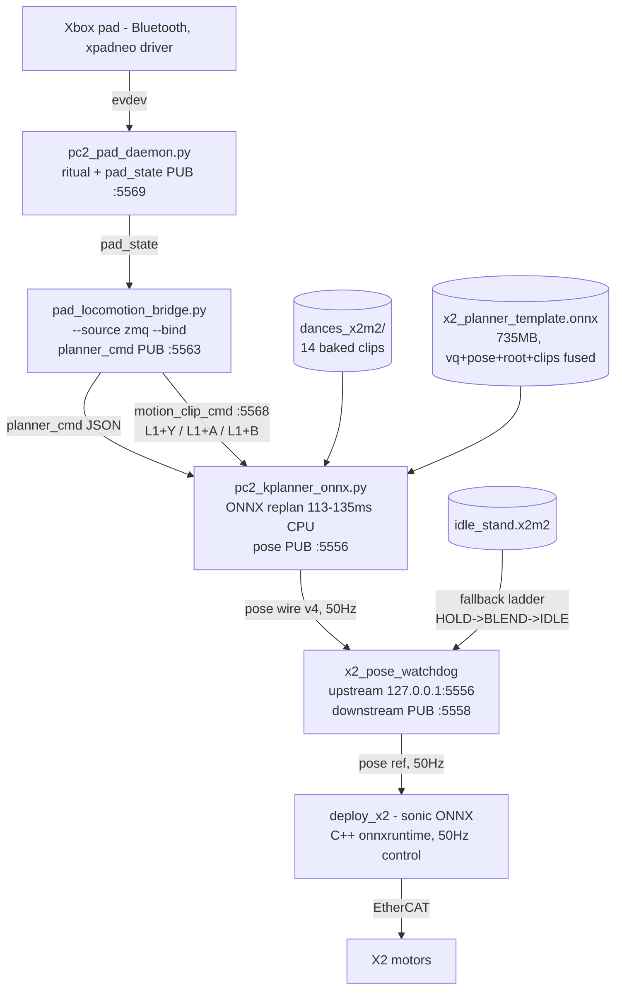
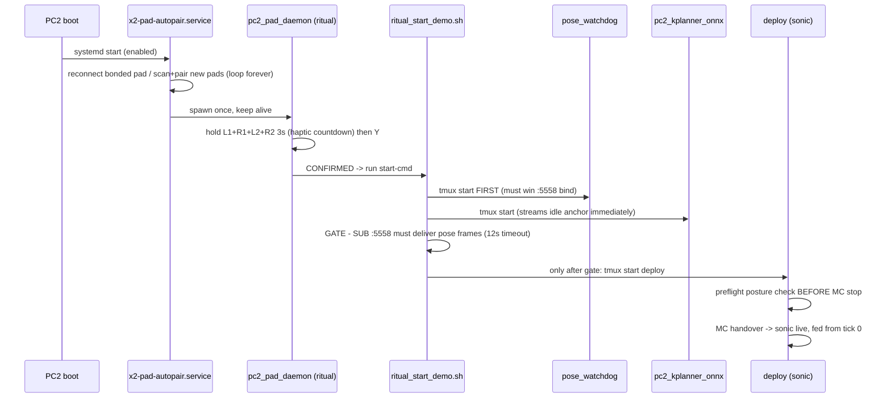

# PC2 Untethered Demo Stack — Runbook

**Status: VALIDATED ON HARDWARE (2026-07-17) — full laptop-free loop confirmed: boot autopair →
pad ritual → gated ignition → sonic → ONNX-planner drive → 14-dance cycling → idle, with the
orientation-snap fixed.** Companion to [pc2_onboard_stack_plan.md](pc2_onboard_stack_plan.md)
(the original plan) and `x2_upgraded_demo_commands.md` (laptop-mode golden commands).

The entire demo loop — gamepad pairing, sonic ignition ritual, kplanner stick driving, and a
14-dance library — runs on the robot's own Jetson Orin NX (PC2). No laptop, no wifi dependency,
no torch on the robot.

---

## 1. Architecture

### Runtime data flow (all on PC2)



### Boot / ignition chain



### Why each safety stage exists (all learned the hard way, 2026-07-17)

| stage | protects against | incident |
|---|---|---|
| watchdog starts first | `pose_proxy` winning the `:5558` bind race → watchdog dead → sonic unreferenced | collapse #2 |
| pose-stream gate before deploy | deploy taking MC with no idle reference stream (`pose_ref_age=-1`) | collapse #2 |
| deploy preflight | igniting a lying/wrong-posture robot (aborts BEFORE MC stop) | validated on hardware |
| never `tmux kill-session` a live deploy | instant torque drop on a standing robot; stop must re-engage MC first | collapse #3 |
| bridge 0.5s stale → failsafe | pad BT drop mid-drive → robot idles, autopair reconnects | by design |
| planner yaw-rebase (see §7) | sonic twisting the body to world +X at ignition (orientation snap) | orientation-snap incident |

## 7. Orientation-snap fix (measured-yaw rebase)

**Symptom (recurring):** at ignition the robot violently twists toward one fixed direction
instead of holding the heading it started in.

**Cause:** the planner published its idle root orientation as **world-identity** `[1,0,0,0]`.
SONIC's tokenizer computes `rel = inv(measured) · reference`, so on a robot facing any heading
other than world +X, an identity reference tells the policy to rotate to world +X. The
watchdog already fixes this for its OWN fallback states (`x2_pose_watchdog.py:52-74`, rebases
the `R_z(0)` idle clip by the `x2_debug` measured yaw) — but it forwards **LIVE** upstream
frames verbatim. The ONNX planner streams LIVE continuously, so the watchdog's rebase never
runs; the planner has to rebase itself.

**Fix (in `pc2_kplanner_onnx.py`):** the planner SUBs the deploy's `x2_debug` PUB (:5557),
captures the robot's ignition yaw **θ₀ once**, and pre-multiplies every published root quat
(current + 9 futures, idle/drive/dance) by `R_z(θ₀)` via `rebase_quats_xyzw_by_yaw`. A *constant*
θ₀ applied to the planner's *integrated* root is correct and never double-counts the planner's
own turn integration.

**Ordering (critical):** the deploy (the `x2_debug` source) starts **after** the planner (the
pre-deploy gate is satisfied by the watchdog's COLD_IDLE, not by the planner). So the planner
stays **silent** until the first `x2_debug` frame arrives — the watchdog holds the robot at its
measured heading during the wait — then latches θ₀ and begins publishing rebased LIVE frames.

Flags: `--x2-debug-port 5557` (0 disables), `--no-yaw-rebase` (sim, no deploy → no `x2_debug`),
`--yaw-capture-timeout-s 30` (silent-wait fail-safe). Log line on success:
`measured-yaw rebase ARMED: ignition heading XX deg`. Regression test:
`scratchpad/test_yaw_rebase.py` (mock `x2_debug`, incl. late-arrival = deploy ordering).

---

## 2. Controls (Xbox or PS5, auto-detected)

Buttons below are **Xbox** indices (the robot's bonded pad). DualSense laptop-sim equivalents
in parens; the bridge auto-detects locally-attached pads, and the ZMQ-fed robot pad defaults to
the Xbox map.

| input | action |
|---|---|
| hold L1+R1+L2+R2 3s → 3 buzzes → release → **Y** | ignition ritual (8s window; other face button disarms; 30s cooldown) |
| hold **L2** (deadman, one-handed) + left stick | drive via kplanner (speed locked 0.3; right stick X = yaw) |
| L1+R1 both while driving | e-stop chord → sticks dead |
| **L1+Y** (Triangle), deadman released | next dance in the 14-clip easy library (+firm buzz) |
| **L1+A** (Cross) | previous dance |
| **L1+B** (Circle) | stop dance → 2s idle hold → planner resumes (+weak blip) |
| pad power off / BT loss | robot idles (watchdog ladder); autopair reconnects; press pad button to wake |

DualSense indices confirmed on this SDL 2.28: Cross=0, Circle=1, Square=2, Triangle=3, L1=4,
R1=5, L2/R2 = axes 2/5. Speed nudges (R1 faster / L1 slower, clamp 0.2–1.0) are **suppressed**
in `--lock-speed` demo mode; drop `PAD_LOCK_SPEED` to enable.

No screen needed: 1/sec pulses = arming; 800ms strong buzz = ignition; single buzz = event;
double buzz = ready (laptop-mode scripts only). Dance-trigger buzz is local-pad only (the
ZMQ-fed robot pad has no rumble path through the bridge; ritual buzzes come from the daemon).

### Sim validation (run the DEPLOYED ONNX graph against MuJoCo before any hardware change)

```bash
./gear_sonic/scripts/sim_onnx_planner.sh          # template graph (slow_walk) + pad + dances
PLANNER=velocity ./gear_sonic/scripts/sim_onnx_planner.sh   # velocity graph
```

One command: swaps `pc2_kplanner_onnx.py` (the exact PC2 runtime + graph) into the sim stack's
planner slot via `KPLANNER_ONNX`. SIM-ONLY (pose wire loopback; never add `--pc2-host`). Needs a
pad visible to pygame before launch. Rebase is off in sim (no `x2_debug`); set
`KPLANNER_YAW_REBASE=1` only with a mock `x2_debug` harness.

---

## 3. PC2 inventory

```
/home/run/getsolo/
├── pc2_pad_daemon.py            # ritual + pad_state PUB (PS5-aware, hot-plug)
├── x2_pad_autopair.py           # boot daemon: pair/reconnect loop, spawns ritual
├── pad_locomotion_bridge.py     # sticks -> planner_cmd; dance chords
├── pc2_kplanner_onnx.py         # torch-free planner runtime — HAS G1-parity handoff fix
│                                #   (30->50Hz resample + 8-frame blend), shipped 2026-07-18
├── ritual_start_demo.sh         # LAPTOP-FREE gated ignition (active start-cmd)
├── ritual_start_sonic.sh        # laptop-upstream variant (kplanner on laptop)
├── start_x2_deploy_ritual.sh    # PC2-RESIDENT deploy launcher for the rituals:
│                                #   --no-confirm baked in (chord + pose gate are
│                                #   the operator confirmation). Rituals use THIS,
│                                #   never log/start_x2_deploy.sh, which every
│                                #   laptop daemons `start` regenerates with that
│                                #   session's flags (2026-07-29 blocked ignition:
│                                #   a body without --no-confirm parked the deploy
│                                #   at a y/N gate no gamepad can answer).
├── start_x2_pose_watchdog_local.sh  # watchdog w/ --upstream-host 127.0.0.1
├── policies/agibot_x2_sonic.onnx    # DEPLOYED sonic (+ timestamped .bak_*). Currently the
│                                #   2026-07-16 dance-finetune (~3k). Softland NOT deployed.
├── softland_checkpoints/        # STAGED softland .pt (iter4000 + latest/4800 + config.yaml)
│                                #   -- NOT runnable as .pt; needs .pt->ONNX per the SONIC
│                                #      deploy-swap flow below before it can be deployed.
├── log/start_x2_*.sh            # autogenerated per-daemon tmux bodies (regenerated
│                                #   by laptop x2_pc2_daemons.sh start — local variants
│                                #   above are clobber-proof copies; the RITUALS must
│                                #   never point here for the deploy)
└── planner_stack/
    ├── gear_sonic/              # package root (PYTHONPATH=planner_stack)
    ├── motionbricks/            # code only
    ├── venv -> ../venv          # python: numpy, zmq, joblib, onnxruntime 1.23.2, pygame
    └── models/
        ├── planner_onnx/x2_planner_{template,velocity}.onnx + parity_report
        │                        #   DEPLOYED: g1ret vq+pose 250k + FT root 250k (see below)
        ├── dances_x2m2/*.x2m2   # 14 baked easy dances
        ├── kplanner/{vqvae,pose,root}/  # raw 250k ckpts synced (NOT used at ONNX runtime)
        └── kplanner_idle_anchor_g1teleop_v2.pkl
```

### Current on-robot state (as of 2026-07-18)

| piece | on robot | note |
|---|---|---|
| planner runtime (`pc2_kplanner_onnx.py`) | ✅ **handoff-fixed** | 30→50Hz resample + blend live (markers=9). Fixes the 1.67× foot-slip. |
| planner ONNX (all 4 modes) | ✅ deployed | **g1ret** vq+pose 250k + **FT** root 250k. FT pose 250k now recovered → full-FT re-export pending. |
| sonic deploy model | ✅ current | 2026-07-16 dance-finetune (~3k). **Softland NOT deployed.** |
| softland 4k/4800 | ⚠️ **staged `.pt` only** | in `softland_checkpoints/`; un-A/B'd; needs `.pt`→ONNX swap flow to deploy. |
| 14 dances, v2 anchor, pad/ritual/udev/bluez/xpadneo | ✅ | unchanged from the 2026-07-17 bring-up. |

System-level (survives reboot):
- `systemd`: `x2-pad-autopair.service` (enabled; `--start-cmd ritual_start_demo.sh`;
  `TimeoutStopSec=5` because pygame wedges SIGTERM)
- `udev`: `/etc/udev/rules.d/99-xbox-xpadneo.rules` + `/usr/local/bin/xbox-rebind-xpadneo.sh`
  (forces xpadneo over the misparsing hid-microsoft on every BT reconnect)
- kernel module: `hid-xpadneo.ko` (v0.9.6, built for 5.15.148-tegra) in
  `/lib/modules/$(uname -r)/extra/` + `/etc/modules-load.d/xpadneo.conf`
- bluez **5.66** built from source (`/usr/lib/bluetooth/bluetoothd`, stock 5.64 at `.bak_5.64`);
  `/etc/bluetooth/main.conf`: `JustWorksRepairing = always`, `Privacy = device`

### What's baked into the ONNX graphs (2026-07-17 export)

| component | checkpoint |
|---|---|
| VQVAE tokenizer | `vqvae_g1ret_250k.ckpt` |
| Pose model (matched pair with vqvae) | `pose_g1ret_250k.ckpt` |
| Root model | FT g1teleop `root/model-step=0250000.ckpt` (turning fix) |
| Clip templates (idle/slow_walk/walk/run) | `motionbricks/out/X2-clip.ckpt` |

Parity vs torch: 8/8 cases ≤ 7.7e-5 rad. Orin CPU replan: 113–135ms (budget 1400ms). The
matched-pair rule is absolute: **a pose model only works with the vqvae it was trained
against** (mixing produced noise + closed-loop back-stepping).

> **FT pose 250k recovered (2026-07-17)** — the FT g1teleop pose 250k (matched pair with the
> FT vqvae) is back locally (recovered from the Nebius disk via the GPU→CPU conversion). The
> deployed graph still uses **g1ret** vq+pose; re-export the **full FT trio** (FT vqvae + FT
> pose 250k + FT root 250k) via `export_x2_planner_onnx.py --verify` and ship per §4 to upgrade.

> **Handoff fix (2026-07-18)** — the deployed `pc2_kplanner_onnx.py` now includes the G1-parity
> 30 Hz→50 Hz output resampling + 8-frame blend. This eliminates the 1.67×-too-fast reference
> that caused foot slippage / lost motion (sonic couldn't track the over-fast reference). Full
> writeup: [`docs/experiments/kplanner_sonic_handoff_g1_parity.md`](../docs/experiments/kplanner_sonic_handoff_g1_parity.md).
> Any re-shipped runtime MUST carry this fix (grep for `get_next_frame_resampled`).

---

## 4. Runbook: after retraining (new kplanner models)

1. **Download with integrity gate** (lesson: a truncated ckpt cost us the FT pose 250k):
   ```bash
   rsync -az --partial ubuntu@<node>:<run_dir>/checkpoints/model-step=<N>.ckpt ~/x2_cloud_checkpoints/<dest>/
   python3 -c "import zipfile; zipfile.ZipFile('<file>').namelist(); print('INTACT')"
   ```
   Never run two downloads of the same file; never re-download over a good copy unverified.
2. **Re-export** (laptop, env_isaaclab; vqvae+pose MUST be a matched pair):
   ```bash
   /home/stickbot/miniconda3/envs/env_isaaclab/bin/python \
     motionbricks/scripts/export_x2_planner_onnx.py \
     --vqvae-ckpt <vq.ckpt> --pose-ckpt <pose.ckpt> --root-ckpt <root.ckpt> \
     --clip-ckpt motionbricks/out/X2-clip.ckpt \
     --out-dir ~/x2_cloud_checkpoints/planner_onnx --mode both --verify
   ```
   **Do not ship unless `--verify` reports all parity cases PASS** (< 1e-4 rad, npf exact).
3. **Sim-test the new models in torch first** (`/tmp/launch_sim_fttrio.sh` pattern — FT-trio
   sim launcher with the new ckpts; drive it, check start-slip/turning/idle-anchor behavior).
4. **Ship** (robot LAN wire = 10.0.1.41 is ~50× faster than robogym wifi):
   ```bash
   rsync -az --partial --info=progress2 ~/x2_cloud_checkpoints/planner_onnx/ \
     run@10.0.1.41:/home/run/getsolo/planner_stack/models/planner_onnx/
   ```
5. **PC2 smoke without the robot** (no deploy — safe anytime):
   ```bash
   ssh run@10.0.1.41   # then, checking each stage:
   tmux new -d -s pc2_kplanner "PYTHONPATH=/home/run/getsolo/planner_stack \
     /home/run/getsolo/venv/bin/python /home/run/getsolo/pc2_kplanner_onnx.py \
     --onnx /home/run/getsolo/planner_stack/models/planner_onnx/x2_planner_template.onnx \
     --planner-mode slow_walk"
   tmux new -d -s x2_pose_watchdog "bash /home/run/getsolo/start_x2_pose_watchdog_local.sh"
   # expect: runtime log 'onnx backend ready'; watchdog 'state=LIVE';
   # frames on :5556 and :5558; synthetic planner_cmd -> 'Replanning with mode' lines
   tmux kill-session -t pc2_kplanner; tmux kill-session -t x2_pose_watchdog
   ```
6. **Hardware**: robot standing (app), operator beside it, pad ritual. Watch
   `~/getsolo/log/ritual_fired.log` (GATE PASSED → x2_deploy STARTED) and the deploy pane.

### After retraining SONIC (deploy model swap)

Unchanged from the established flow: export .pt→ONNX locally (env_isaaclab; needs config.yaml
beside the ckpt; parity gate via `reexport_x2_g1_onnx.py` + `dump_isaaclab_step0` with the SAME
checkpoint), then copy to `PC2:/home/run/getsolo/policies/agibot_x2_sonic.onnx` **with a
timestamped `.bak_*` of the previous model first**. Never swap while sonic is running (the file
is only read at deploy start, but keep the discipline).

### Adding/changing dances

```bash
# bake (laptop): one x2m2 per motion key
/home/stickbot/miniconda3/envs/env_isaaclab/bin/python <scratch>/bake_dances.py  # per-key loop over
#   gear_sonic_deploy/scripts/export_motion_for_deploy.py --in <single-key.pkl> --out <key>.x2m2
rsync -az ~/x2_cloud_checkpoints/dances_x2m2/ run@10.0.1.41:/home/run/getsolo/planner_stack/models/dances_x2m2/
```
The bridge's `--clip-keys` list (built in `ritual_start_demo.sh` from the x2m2 dir listing)
picks them up automatically on next ignition.

---

## 5. Troubleshooting

| symptom | cause / fix |
|---|---|
| pad won't pair (`AuthenticationFailed`) | agent died mid-pair: pairing needs ONE persistent `bluetoothctl -a NoInputNoOutput` session through the whole pair; bluez ≥5.66 + `JustWorksRepairing=always` already installed |
| pad connects, no input events | wrong HID driver claimed it (hid-generic silent; hid-microsoft **misparses** — one press = 4 codes). udev rule should rebind to xpadneo; check `readlink /sys/bus/hid/devices/*045E:0B13*/driver` |
| pad events but daemon blind | input device re-registered on a NEW event node after driver rebind — restart `x2-pad-autopair` |
| no rumble | rumble over BT requires xpadneo (works); stock drivers = no BT rumble |
| runtime: `No module named gear_sonic` | `PYTHONPATH=/home/run/getsolo/planner_stack` (the parent of the package dir) |
| runtime: `invalid load key` on anchor | joblib missing in venv (anchor pkl is joblib-compressed) |
| deploy `pose_ref_age=-1` in VLA mode | NORMAL (that counter is the file-reference path); the real health signal is the watchdog `state=LIVE`/`IDLE_CLIP` + the ignition gate |
| watchdog `Address already in use :5558` | something else bound it first (pose_proxy race). Demo ignition starts watchdog first by design; don't add proxy back |
| service stuck `deactivating` | pygame ignores SIGTERM; `systemctl kill -s SIGKILL x2-pad-autopair` (TimeoutStopSec=5 bounds it) |
| stopping sonic | NEVER kill the deploy tmux session on a standing robot — use the vendor stop path (`x2_pc2_daemons.sh stop`, re-engages MC) with hands on the robot |

## 8. Known gaps / next steps

- ✅ Full laptop-free hardware loop validated 2026-07-17 (ignition, drive, 14-dance cycle,
  orientation-snap fix). Pad→bridge ZMQ link confirmed live.
- FT pose 250k lost locally (truncated by a mid-write kill) and node 187 down → graphs use
  g1ret vq+pose + FT root. Re-export with full FT trio when the node returns (§4 runbook).
- Quest/VR on robot AP (X2-ROBOT / x2demo2026, staged) — separate demo track, untouched by this.
- PC2 `idle_stand.x2m2` pose ≠ v2 idle anchor pose → possible small arm shift in the brief
  watchdog-hold window before the planner takes over (cosmetic; known).
- Yaw θ₀ is captured once at ignition (open-loop after that) — matches x2_kplanner's default;
  no continuous closed-loop pose reseed (reseed regressed turns/xy on hardware, see stack notes).
- Dance-trigger rumble is local-pad only; add a rumble path through `pc2_pad_daemon` if the
  robot pad should buzz on dances (ritual buzzes already work).
