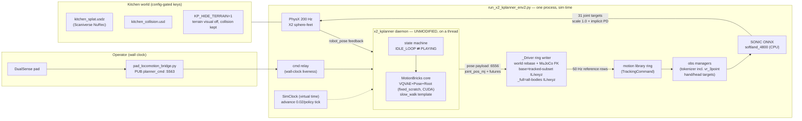
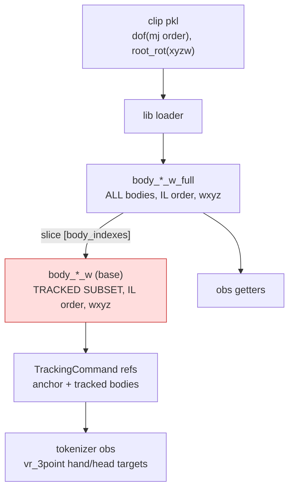
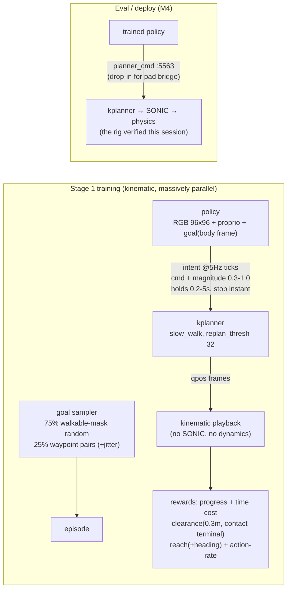

# Kitchen-Sim Session Record — Porting the X2 Planner Stack to IsaacLab for Navigation Training

**Date:** 2026-07-21 → 22 (one continuous session)
**Goal:** Run the battle-tested MuJoCo pipeline — AgiBot X2 + SONIC (whole-body RL tracker) + MotionBricks kplanner (neural planner) — inside IsaacLab, in a Gaussian-splat scan of the real kitchen, driveable by gamepad, as the foundation for RL navigation training (Flexion-style: RGB + proprio + goal → velocity intents).
**Outcome:** ACHIEVED. Deploy-parity driving verified by pad (straight / turns / backward, no collapse), kitchen splat world with wall collisions, robot-eye camera, 8 teleop-labeled waypoints, and the RL training design frozen in `gear_sonic/envs/nav_house/nav_kitchen_v1.yaml`.

---

## 1. Final architecture

The winning shape after three architecture iterations: **run the training env itself** (not a hand-rolled bridge), with the **unmodified kplanner daemon embedded on a virtualized clock**, and planner frames written into the env's motion-library ring that SONIC already knows how to track.



Key invariants that make this deploy-faithful:
- **Same checkpoints as the robot ritual**: SONIC `softland_4800_g1.onnx`, planner = torch source of `planner_onnx_fixedscratch_p500k` (export parity ≤5e-5), clip table `X2-clip` g1teleop modes (md5-verified active), `--planner-mode slow_walk`.
- **Same wire protocol**: `planner_cmd` intents, pose payloads with future windows, `robot_pose` feedback, reseed scope `none` (open-loop), 300 ms half-cosine ref smoother.
- **Same actuation semantics as training**: `JointPositionActionCfg(use_default_offset, scale=1.0)` under the cfg's implicit PD gains (deploy's `ACTION_SCALE`/`KP/KD` pair is a *different, complete* pair — never mix halves).
- **Sim-clock virtualization**: the daemon's `time` module is swapped for a sim-driven clock so a viewer running at RTF 0.3 doesn't make the planner stream 3× too fast. The daemon code itself is untouched.

### MuJoCo stack vs IsaacLab rig (what maps to what)

| MuJoCo ritual (`sim_onnx_planner.sh`) | IsaacLab rig |
|---|---|
| `pc2_kplanner_onnx.py` daemon (wall clock) | same `x2_kplanner.py` logic, embedded thread, sim clock |
| planner → sonic wire (pose :5556) | planner → motion-lib ring → env obs pipeline |
| deploy node ONNX + MC gains | env action pipeline, training gains, scale 1.0 |
| MuJoCo physics | PhysX via the training env (proven stable natively) |
| pad bridge :5563 | identical process, unchanged |

---

## 2. The root cause that ate the day (read this first next time)

**Symptom:** native clip playback tracked perfectly; anything through the planner path collapsed (arms folding to the front, idle buckling, respawn chaos) — "walk is fine, planner fails."

**Root cause:** the motion library keeps **two body-tensor families** with different semantics (`motion_lib_base.py:1729-1740`):
- `body_*_w_full`: ALL bodies, **IsaacLab order** (gather by `mujoco_to_isaaclab_body`), quats **wxyz** (`xyzw_to_wxyz` applied at load);
- `body_*_w` (base): **`_full` sliced by `body_indexes` — the TRACKED-BODY SUBSET** (anchor body first), also IL-order/wxyz.

The ring writer had been filling the base family with **first-N mujoco-order bodies in xyzw** — wrong subset, wrong order, wrong quaternion convention. That family feeds the tracking command's per-tracked-body references, including the **`vr_3point` head/hand targets in the tokenizer observation**. Every planner-path frame poisoned SONIC's hand/head targets; native playback (loader-filled tensors) was immune. One fix in `_write_row` (build `pos_full/quat_full = FK[b_mj2il]` wxyz, then `base = full[body_indexes]`) resolved arms, idle stability, and collapses simultaneously.



**Methodology that found it** (now permanent in the runner): a boot-time `DIAG` that recomputes frame 0 via MuJoCo FK from the pkl and diffs it against the lib's native rows under each order/convention hypothesis, using translation-invariant Procrustes yaw-fitting (the eval loader re-bases motions by env origin + yaw, so raw compares show ~20 m offsets). `_full` fit at 0.06 m residual under IL/wxyz; base fit *nothing* whole-body — which is what exposed the subset.

**Lesson (user's standing rule, validated the hard way):** *never write into a framework's internal tensors without reading the code that fills them natively.* The five lines of loader source held the answer all day.

---

## 3. Full challenge → fix ledger

| # | Challenge | Root cause | Fix |
|---|---|---|---|
| 1 | Hand-rolled bridge robot collapsed instantly | deploy `ACTION_SCALE` under training gains; reset target yank; self-collision phantoms; unresolved assembly gap | pivot: run the training env itself; bridge retained only for deploy-parity DDS checks |
| 2 | Machine hung twice (hard restarts) | parallel/zombie Isaac instances (once 6 zombies, 26 GB VRAM); `pkill -f` self-match traps | strict launch protocol: list PIDs → `kill -9` by PID → verify 0 procs + VRAM baseline → launch in own call |
| 3 | Viewer at RTF≈0.3 broke wall-clock daemon pacing | planner streamed 3× too fast vs sim | SimClock time-proxy: daemon paced by sim ticks; signal proxy for thread-safety |
| 4 | Robot spawned "hands behind back" repeatedly | env RSIs from loaded clip before driver ran; eval wrapper reloads lib post-init clobbering the ring | driver built in `TrackingCommand.__init__`; wrapped `load_motions_for_evaluation` to re-run ring setup |
| 5 | CUDA device-side asserts | adaptive-sampling `bincount` overflow on ring-grown time steps | `use_adaptive_sampling = False`; reset jams ≤ total−46 (future queries need +45 rows) |
| 6 | Robot walked but drifted/fell on planner frames | ref velocities: single prev-chain crossed future(0.9 s)→current rows ÷0.02 s = ~45× spikes into SONIC's velocity channel every tick | two velocity chains: current rows chain at ring rate; future rows chain cur→f0→f1 at their true 0.1 s spacing |
| 7 | Wrong checkpoints all day (user caught it) | sim ran h200-25k SONIC + motionbricks base planner; ritual runs softland_4800 + fixedscratch p500k | full parity swap incl. clip-table md5 check and `--planner-mode slow_walk` (daemon default is velocity-only!) |
| 8 | Upside-down respawns; 4.3 GB scaffold | `x2_sonic_executed_feasible.pkl` is the whole corpus incl. crawl/faint floor clips; env resets resample any motion | extracted single stand clip → `x2_sonic_feasible_stand_single.pkl` (954 KB, SONIC-executed, hands at hips) |
| 9 | Idle slow-sink → watchdog respawn loop | daemon IDLE_LOOP emits one frozen anchor frame forever; Isaac-SONIC on a statue reference enters a lateral weight-shift limit cycle (MuJoCo & real robot tolerate it) | idle-writer: while sticks quiet, stream the SONIC-executed stand clip through the ring at the held pose; hand back to daemon frames instantly on stick input |
| 10 | Early respawns undetected → stale refs 10° off → silent reset loop | reset detector required >100-row playhead rewind | any rewind = reset; full ring+marker re-anchor at the SPAWN pose (user rule) + forced base-mapping recapture |
| 11 | Arms folded at idle (not seen in MuJoCo) | first idle-writer used `Idle_Right_001__A019` — a retargeted template stance, never SONIC-executed; MuJoCo idle never plays a clip at all | idle source = SONIC-executed stand (see #8/#9); template clip kept only as the planner's graph anchor (its actual role) |
| 12 | THE base-family bug | see §2 | see §2 |
| 13 | Gray env floor z-fighting the splat floor | TerrainImporter plane coincides with splat floor | `KP_HIDE_TERRAIN=1`: terrain visual invisible, collision kept (runner-owned, zero training impact) |
| 14 | Markers stranded at crash site after respawn | ring rows kept old pose until next payload jump | reset re-anchor floods ring at spawn pose (see #10) |

Supporting verification built along the way: byte-perfect obs proof vs ground truth (`compare_step0`, tok diff ≤0.05, ONNX 1e-6), the boot-time convention DIAG, and the planner isolation test (§5).

---

## 4. Kitchen world (Gaussian splats)

- **Source:** Scaniverse scan → NuRec splat (`kitchen_splat.usdz`) + collision mesh (`kitchen_collision.usd`), placed at the measured env-origin offset `world_pos=[-19.99,-75.96,0]`.
- **Injection:** config-gated additive keys in `MySceneCfg` (`++manager_env.config.world_usd / world_collision_usd / world_pos`) — absent in training configs, so training is untouched.
- **Ground gating:** `KP_HIDE_TERRAIN=1` (fix #13). Robot stands on the invisible flat plane; splat provides visuals; collision mesh provides walls.
- **Physical acceptance (user-verified):** wall bumps stop the robot (stumbles, usually recovers, doesn't pass through) — the behavior RL's clearance penalty will make rare.
- **Robot-eye camera:** `KP_HEAD_CAM=1` + `++manager_env.config.enable_cameras=true` mounts a wide pinhole on `head_pitch_link` (20° down-pitch — stand-in for `stereo_head_front_left`, the chosen policy camera). Live view via viewport camera dropdown; PNG snapshots every 2 s to `/tmp/claude-1000/kp_head_cam/`. **Splat renders in the camera view (user: "looks great") — first evidence against the #1 M3 risk** (sensor-path PNG check still queued as the formal gate).
- **Marker hygiene:** the yellow tracking markers are stage prims — visible to any camera. `++manager_env.commands.motion.debug_vis=false` removes them; **mandatory for camera-obs training** (a policy would learn to navigate by its own goal markers).

## 5. Multi-env isolation test (RL prerequisite)

Four independent planner instances (deployed ONNX via `gen_kplanner_clip.py`), four commands, 8 s each:

| command | along-heading | net yaw | verdict |
|---|---|---|---|
| forward 0.3 m/s | **+2.78 m** | +0.15 rad | obeys |
| backward 0.3 m/s | **−2.72 m** | −0.05 rad | obeys (true reverse gait — heading stays forward) |
| turn left 1.0 rad/s | +0.03 m | **+8.56 rad (1.07 rad/s)** | obeys |
| turn right 1.0 rad/s | −0.01 m | **−21.82 rad (2.7 rad/s)** | direction ok, **rate 2.7× — OPEN ISSUE** |

All four dof streams md5-unique → zero cross-talk. Merged into `kp4_isolation_test.pkl` (needs `pose_aa` zeros + `fine_tune_dataset.enable=false` to play through the eval env; envs 0–3 mapped 1:1 to motions 0–3). Trajectory figure: `x2_upgraded_demo/kp4_trajectories.png (copied from the session run)`.

**⚠ Turn-rate asymmetry** (right ≈2.7× commanded, left ≈1.07×) must be resolved before RL treats ±yaw as symmetric actions.

## 6. Waypoint registry (teleop-as-labeler)

Workflow invented this session: drive the robot to a spot with the pad, face the work direction, `echo <name> > /tmp/claude-1000/kp_label` → runner snapshots the robot's pose (position + heading, kitchen frame = world − world_pos) into `~/projects/x2-kitchen-sim/configs/waypoints.json`.

Captured (8): `cooking_range, dining_table, dishwasher, entrance, fridge, hallway, pantry, sink` — each with yaw (e.g. *facing* the range) and a 0.4 m default radius. These are the **eval suite** (56 ordered routes) and the deploy goal vocabulary; training uses them for ~25% of episodes (with start jitter), the rest sampled from the walkable mask.

## 7. RL training design (frozen — see `gear_sonic/envs/nav_house/nav_kitchen_v1.yaml`)



- **Action = virtual gamepad**: {forward, backward, sidestep L/R, turn L/R, stop}; magnitudes range **0.3–1.0** m/s and rad/s; decisions at 5 Hz (200 ms hold floor); holding = re-emitting (free, no replan); 5 s re-commitment ceiling; stop interrupts instantly; latency DR 0–500 ms.
- **Goal interface**: body-frame relative vector only ("2.3 m ahead, 40° left") — no names, no world coords, no maps. Deploy feeds the same interface from the waypoint registry.
- **Rewards**: 4 terms only (progress, time cost, clearance w/ terminal contact, reach + action-rate). No stability terms — that's SONIC's job; stage 2 (M3.5) fine-tunes with the full chain if the M4 gap warrants.
- **Why holds are long**: planner commits 64-frame (~2.1 s) chunks (32 ≈ 1.07 s with the new knob), 300 ms ref smoother, 1–2 s stride cycles — commands below that timescale produce churn, not behavior (measured on the sticks this session).

## 8. Pending before the first training run

1. **Walkable mask** from `kitchen_collision.usd` (floor raster − obstacles, eroded by 0.35 m) + top-down map rendering the 8 waypoints for visual verification.
2. **Intent→response latency measurement** per command type from this session's driving logs → validate the 200 ms floor / hold shaping.
3. **Planner batching benchmark** (torch core batch>1 vs staggered sequential) → sets the env-count ceiling. M3 gate.
4. **Turn-rate asymmetry** root cause (§5).
5. **Splat-in-Camera-sensor PNG check** (formal M3 vision gate; viewport already confirmed).
6. **TiledCamera × NuRec gate** (`07_check_tiled_nurec.py` per plan) before committing to the parallel-env camera pipeline.

## 9. Command appendix

**Script toolkit:** `gear_sonic/scripts/x2-navigation/` —
`launch_kitchen_rig.sh` (the full rig below as one command; knobs via env
vars incl. `NO_MARKERS=1`, `KP_REPLAN_THRESH=32`), `launch_baseline_walk.sh`
(native-playback sanity split), `verify_kp4_isolation.py` (regenerate +
verify the 4-command planner isolation test), `extract_single_motion.py`
(single-clip scaffold extraction from corpora), and the runner itself
(`run_x2_kplanner_env2.py`) — launched by PATH, not `-m` (the directory
name has a dash).

**The kitchen driving rig (the session's final, working command — or just run `gear_sonic/scripts/x2-navigation/launch_kitchen_rig.sh`):**
```bash
source ~/miniconda3/etc/profile.d/conda.sh && conda activate env_isaaclab
cd ~/Projects/GR00T-WholeBodyControl
KP_PAD=1 KP_HIDE_TERRAIN=1 KP_HEAD_CAM=1 DISPLAY=:1 \
~/projects/g1-kitchen-sim/.venv/bin/python -u gear_sonic/scripts/x2-navigation/run_x2_kplanner_env2.py \
  --run-dir ~/x2_cloud_checkpoints/g1teleop_overnight/sonic/softland_173528 \
  --onnx ~/x2_cloud_checkpoints/g1teleop_overnight/sonic/softland_173528/exported/softland_4800_g1.onnx \
  --vqvae-ckpt ~/x2_cloud_checkpoints/fixed_scratch/vqvae/model-step=0300000.ckpt \
  --pose-ckpt ~/x2_cloud_checkpoints/fixed_scratch/pose_500k/model-step=0500000.ckpt \
  --root-ckpt ~/x2_cloud_checkpoints/fixed_scratch/root/model-step=0300000.ckpt \
  --planner-mode slow_walk \
  +num_envs=1 +headless=False \
  ++manager_env.config.enable_cameras=true \
  ++manager_env.commands.motion.motion_lib_cfg.motion_file=gear_sonic/data/motions/x2_sonic_feasible_stand_single.pkl \
  ++manager_env.config.world_usd=/home/stickbot/projects/x2-kitchen-sim/assets/kitchen/kitchen_splat.usdz \
  ++manager_env.config.world_collision_usd=/home/stickbot/projects/x2-kitchen-sim/assets/kitchen/kitchen_collision.usd \
  '++manager_env.config.world_pos=[-19.99,-75.96,0.0]' \
  ++manager_env.terminations.ee_body_pos=null \
  ++manager_env.terminations.foot_pos_xyz=null \
  ++manager_env.terminations.anchor_ori_full=null \
  2>&1 | tee /tmp/claude-1000/kpe2_kitchen.log
```
Optional knobs: `KP_REPLAN_THRESH=32` (half-chunk), `++manager_env.commands.motion.debug_vis=false` (clean camera), `echo <name> > /tmp/claude-1000/kp_label` (waypoint capture).

**Baseline sanity (native clip, no planner):**
```bash
DISPLAY=:1 ~/projects/g1-kitchen-sim/.venv/bin/python -u -m gear_sonic.scripts.eval_x2_isaacsim_onnx \
  --run-dir ~/x2_cloud_checkpoints/g1teleop_overnight/sonic/softland_173528 \
  --onnx ~/x2_cloud_checkpoints/g1teleop_overnight/sonic/softland_173528/exported/softland_4800_g1.onnx \
  +num_envs=1 +headless=False \
  ++manager_env.commands.motion.motion_lib_cfg.motion_file=gear_sonic/data/motions/x2_ultra_walk_forward.pkl
```

**Isaac launch protocol (mandatory, machine hung twice without it):**
`pgrep -fa 'run_x2_kplanner|eval_x2_isaacsim|isaacsim'` → `kill -9 <pids>` (by PID, never pattern-kill) → verify 0 procs + VRAM <3 GB → launch in its own call.

---

*Key files touched this session:* `gear_sonic/scripts/x2-navigation/run_x2_kplanner_env2.py` (ring writer + all fixes + idle-writer + DIAG + terrain gate + head cam + labeler + replan knob), `gear_sonic/scripts/x2-navigation/` (launchers + isolation test + clip extraction — this session's toolkit), `gear_sonic_deploy/scripts/x2_isaaclab_bridge.py` (direct-wire mode, shelved), `gear_sonic/envs/manager_env/modular_tracking_env_cfg.py` (world keys, config-gated), `gear_sonic/envs/nav_house/nav_kitchen_v1.yaml` (training config), `gear_sonic/data/motions/{x2_sonic_feasible_stand_single,x2_idle_right_A019_single,kp4_isolation_test}.pkl`, `~/projects/x2-kitchen-sim/configs/waypoints.json`.

---

# Day 2 — Overnight Training → The Policy Drives the Robot

**Date:** 2026-07-22 (continuation of the same arc)
**Outcome:** The stage-0 nav teacher trained overnight to **99.96%** on the 56-route benchmark, then **drove the full kplanner+SONIC rig through multi-stop kitchen tours autonomously** — including the first-ever completion of the hard pantry→entrance passage.

## 10. Overnight training (stage-0 teacher)

- `train_nav_teacher.py` (x2-navigation/): rsl_rl PPO, 4096 vectorized 2D agents on the real kitchen grid (`nav_grid.npz`) + waypoint registry; yaml-faithful actions (virtual gamepad, 0.3–1.0 envelope, 200 ms ticks), rewards (progress/time/clearance/reach+heading/action-rate), 75/25 goal mix.
- v1 saturated the benchmark at **100% by iteration 400** → hardened (latency 0–0.8 s, ray noise σ0.1, vel noise, 0.25 rad heading tol) and retrained overnight: **100k iterations / 2.57 h / ~10 B env-steps; final 100.0%, last-50 mean 99.96%, worst post-20k dip 98.2%** (= one route). Artifacts: `~/projects/x2-kitchen-sim/runs/nav_teacher_hardened_0722c/`, wandb `x2-kitchen-nav/5tibg857`.
- wandb gotcha: rsl_rl's `WandbSummaryWriter` mixes iteration- and time-stepped metrics → wandb silently drops everything ("ignoring partial history"). Fixed by monkeypatching `add_scalar` to log steplessly with `iteration` as a field (set chart x-axis to `iteration`).
- `build_walkable_mask.py`: kitchen grid from the collision USD. Splat scans under-sample floors → floor detection fails; use **reachability**: walkable = (ESDF > robot radius) component connected to the waypoints. 13 m². `SimulationApp.close()` kills the process — must be the last statement.
- `viz_nav_policy.py`: rolls all 56 routes from a checkpoint → trajectory maps + smoothness histograms. Smoothness finding: the policy re-aims nearly every tick (holds hug the 200 ms floor) — action-rate penalty too weak; holds must be structural in the next training round.

## 11. The policy drives the rig (`nav_policy_bridge.py`)

Replaces the pad bridge: `robot_pose:6570` (env2's offset ports!) → rebuild the 28-dim obs (waypoint goal in body frame, finite-difference EMA velocity, ESDF rays) → checkpoint inference → stick JSON on `planner_cmd:5563` at 2 Hz. **Stick sign chart (x2_kplanner.py:398): side>0 = RIGHT, yaw>0 = TURN-RIGHT — both inverted vs robotics convention**; the first attempt mirror-steered the robot out of the kitchen. Daemon quantizes magnitude to its fixed 0.3 m/s (direction+stop control only until stage-1).

Results: `pantry` 28–30 s reliably; multi-stop tours (pantry→entrance→dining_table→hallway) completing except at one pinch; **user verdict: "the navigation results look AMAZING."**

## 12. The drift discovery (user-diagnosed) + recovery reflexes

**User observation: the yellow markers reached the entrance while the robot lagged behind and hit the fridge wall.** Root cause: with `pose_reseed_scope=none` (deploy parity) the planner integrates its own frame open-loop; SONIC under-tracks translation; reference drifts ahead, and the policy's (true-pose-based) corrections act through a displaced frame. Frames only re-align at IDLE→PLAYING re-seeds.

Bridge reflexes shipped:
1. **Micro-resync stops** — 1.2 s halt per 8 s of motion → planner re-seeds at the robot's true pose, zeroing drift.
2. **Stuck-skip** — no progress ⇒ abandon leg, continue route.
3. **Escape primitive** — 8 s stall ⇒ reverse 2.5 s, rotate toward the open side (ESDF rays), resume; 2 tries/leg. First deployment: the entrance leg **completed for the first time** (70.5 s, two escapes ratcheting 3.39 m → 1.83 m → arrived), confirmed visually ("it is now at the door").

Ceiling reached for bridge-level fixes: tight-passage traversal ≈ coin flip. The durable fixes are **stage-1 training changes**: train against the real planner's execution (drift + slip as dynamics), **non-terminal contacts** (escape must be *learned* — terminal-contact training produced zero un-wedge skill), clearance-penalty tuning vs true corridor widths (the hardened teacher circles in local minima at narrow necks), walkable mask at 0.45 m erosion. Geometry fact: the pantry→entrance direct line is blocked by the island (ESDF 0.18–0.35 m); the only route threads the NW neck.

## 13. Camera rig (final form)

The default perspective camera is steered by something in the stack — never fight it; pin viewports to dedicated USD camera prims:
- **Main**: `KPFixedCam` — static interior wide shot (`KP_CAM_EYE`/`KP_CAM_LOOKAT`).
- **Sub "KP Chase View"**: `KPChaseCam` — driven per tick behind the robot **facing its heading** (frame always leads with clean interior splat; EMA-smoothed; `KP_CHASE="back,height,ahead"`).
- F key toggles the wrapper's robot-tracking mode; `update_view_to_asset_root` uses `ViewerCfg.eye` (default 7.5,7.5,7.5 — 11 m away!) as the offset, not the yaml `viewer_eye`.

## 14. Day 3 — the multi-robot showcase (and the bug that wore six costumes)

Goal: Flexion-style crowd shot — multiple X2s navigating the kitchen at once. A full
day of "explosions" ended with one root cause and a clean recipe.

### The real root cause (supersedes every collision/spawn theory from the day)

`video_showcase_rig._fix_bodies` rebuilds reference body tensors from the clip pkl
and computed velocities as ONE finite difference over the concatenated rows. The
first row of every clip after the first therefore carried
`(clip_i_start − clip_{i−1}_END) × fps` — ~120 m/s. The env RESET writes the robot's
initial root state **from those command tensors** (`commands.py` ≈2989:
`root_pos = self.body_pos_w[:, 0]`, velocity likewise), so every robot assigned
motion i>0 spawned already moving, slammed into the floor, and PhysX's depenetration
blasted it across the room. This single bug produced, in different costumes: the
"only one robot survives" pattern, "spawn-in-mesh ejections" at perfectly open
spawns, the machine-gun respawn loop (fall-reset re-wrote the same bad velocity
every reset), the bare-ground stack "explosion", and the on-the-furniture landings.
**Fix**: `lv[lib.length_starts.long()] = 0` + a 2 m/s safety clamp with a
`VEL-CLAMP HIT` log line (both in `_fix_bodies`).

Debug chain that cornered it (worth reusing): per-env z heartbeat → termination
`dones` probe (anchor_pos fired env1 every step) → spy wrapper on the term function
(robot anchor at z≈1.0 two steps post-reset) → per-step `[eject]` tracer (correct
pose at ts=1 but vz=−1.58 → blasted 1.6 m by ts=2). All three probes remain in the
rig behind heartbeat prints.

Secondary real bug: with `replicate_physics=false` the scene gains a THIRD origins
tensor (`scene._default_env_origins`, grid-spaced) that the reset path read while
references used the pinned terrain origins — robots spawned meters east of their
refs. Fix: pin all three origin tensors, re-pinned every tick.

### The working recipe (user-designed): capture executed motions, replay jointly

1. **Author solo**: generate policy→planner route clips (`gen_policy_route_clips.py`;
   `--goals`/`--routes "x,y:goal"`, `--goal-fan` door-queue, `--stagger-s`,
   `--lead-in-s`, `--depart-stagger`), then play each route ALONE in the showcase rig
   with `KP_RECORD=<pkl> KP_RECORD_KEY=<key> KP_RECORD_EXIT=1` — records the
   **executed** root+dof at 50 Hz for one clean cycle and exits.
2. **Merge + gate**: stack the executed clips into one pkl; executed refs replay
   through SONIC near-exactly, so pairwise-distance gates are trustworthy.
3. **Joint playback**: N envs, one motion each, all physically simulated at once.
   `anchor_pos` (height) termination stays ON as fall auto-reset.

Pipelines are scripted end-to-end (routes → captures → merge → headless verify gate
→ windowed record → sim-rate retime): see session scratchpad `six_robot_pipeline.sh`
/ `three_takes.sh` patterns.

### Settled and shipped

- **Cross-env robot-robot contact is OFF** (finally measured clean: executed paths
  pass within 5 cm during the 6-robot burst, nobody wobbles — envs are ghosts).
  Every "collision" observed during the day was the velocity bug.
- 6-robot simultaneous burst from a mid-kitchen stack to pantry / entrance / fridge /
  sink / dishwasher / cooking_range: verified headless (all upright, zero
  terminations, multiple loops), recorded. Videos in `x2-kitchen-sim/media/`:
  `showcase_converge_exec.mp4` (2-robot door queue),
  `showcase_6robots_mid[_realtime].mp4`, takes `showcase_6robots_v{1..3}_realtime.mp4`.
- Screen-capture videos run slow (sim ≈0.27× realtime): heartbeats now carry wall
  stamps; retime with `setpts=PTS*<factor>`. Off-screen recording: run the windowed
  rig on Xvfb `:2` and x11grab that display. True in-sim frame rendering
  (`overview_camera`/`render_results`) queued for stage-1.
- Waypoint coords were captured from the planner's drifted pose — fine as goals
  (0.4 m radius), untrustworthy as exact spawn points.
- `KP_VERBOSE=1` on `launch_showcase.sh` injects `--verbose` into SimulationApp
  (post-Hydra) for kit-level debug logs; `NO_WORLD=1` bare-ground isolation;
  `NO_FALL_RESET=1` disables the fall auto-reset.

## 15. Where this leaves the program

Stage-0 complete and *demonstrated end-to-end on the deploy stack*, plus a working
multi-robot showcase pipeline on executed clips. Stage-1 (planner-in-the-loop
training) has its full requirements list written by these failures — plus the queued
gates: planner batching benchmark, turn-rate asymmetry (right ≈2.7× commanded),
TiledCamera×NuRec throughput, intent→response latency measurement, live N-env
dispatch rig (dynamic planner+policy triggering), in-sim video rendering. Stage-2
remains the camera student (RGB distillation; debug_vis off; one robot per kitchen
clone).
